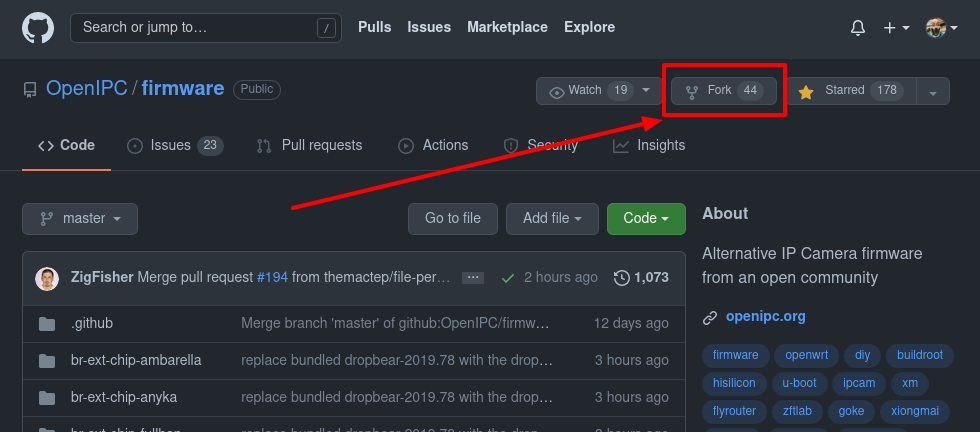
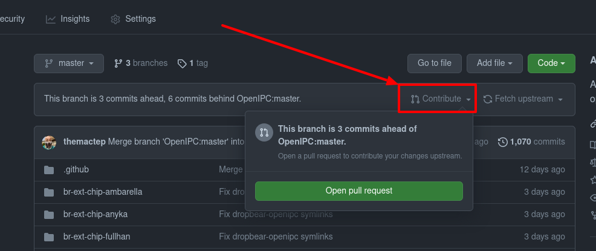
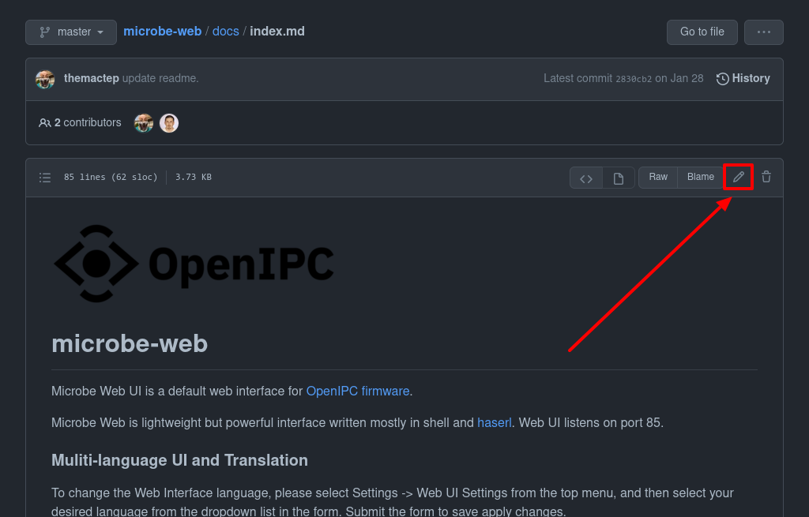

# OpenIPC Wiki
[Table of Content](index.md)

How to contribute.
------------------

Sign in into your GitHub account, or [get yourself one][gh-signup] if you don't
have it yet. It's free.

Go to [the wiki repository](https://github.com/openIPC/wiki/) and fork it.

Make changes (correct a typo, add another record into a table, or write a new
article) and commit them to your own fork of the repository.

From your repository, create a pull request, so we could review and incorporate
your changes into our version of the wiki.

### Small corrections, typos.

It is even easier to deal with small corrections while using GitHub. Spotted a
typo? Have an idea of a better wording? Noticed a broken link? Just hit this
pencil-looking button and make corrections.

[gh-signup]: https://github.com/signup
