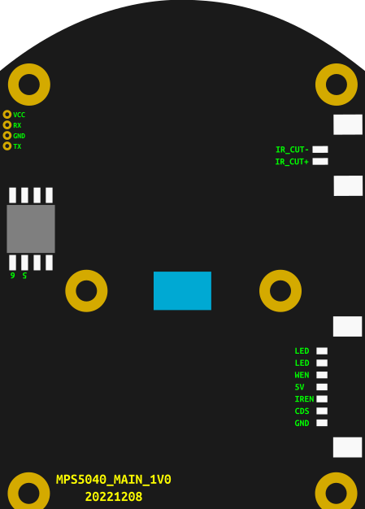

# OpenIPC Wiki
[Table of Content](../../../README.md)

Acculenz R5
-----------
- Product page: https://acculenz.com/en-ca/products/acculenz-5mp-hd-pet-camera-indoor
- ODM: [Foscam R3](https://foscam.com/X3R3.html
- FCCID: [ZDER3](https://fccid.io/ZDER3)
- Mobile App: [AccuLenz](https://play.google.com/store/apps/details?id=com.acculenz.acculenz)
- Cloud: [Foscam Smart Cloud Service](https://www.myfoscam.com/) built with [IVY CLOUD](https://www.ivyiot.io/)

- SoC: SigmaStar SSC337DE
- Sensor: GC4023
- Flash: MD25Q128SIG [c8 40 18 c8 40] (aka GD25Q128CSIG)
- WiFi: RTL8188FTV USB (0bda:f179)

### Ports

```bash
$ nmap -p1-65535 192.168.1.10
Starting Nmap 7.94SVN ( https://nmap.org ) at 2023-11-03 18:06 EDT
Nmap scan report for 192.168.1.10
Host is up (0.015s latency).
Not shown: 65530 closed tcp ports (conn-refused)
PORT      STATE SERVICE
88/tcp    open  kerberos-sec
443/tcp   open  https
888/tcp   open  accessbuilder
43293/tcp open  unknown
65534/tcp open  unknown
```

### Web UI port 88


### PCB




### GPIO

- GPIO_3: IRCUT
