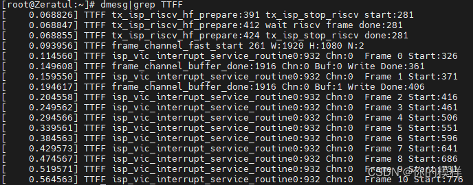
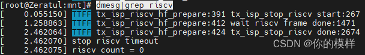
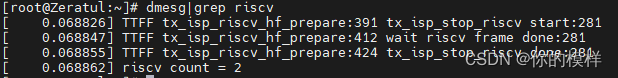

Some common debugging instructions of Ingenic T-series (t31 t40 t41)
--------------------------------------------------------------------
https://blog.csdn.net/weixin_43295247/article/details/133301997

### T31 part command

#### IMP debugging command

Check whether the number of vic interrupts increases according to the frame rate
and determine whether the sensor outflow is normal;

```
while true; do cat /proc/jz/isp/isp-w02; sleep 1; done
```

Normal single shot outflow:


Check the number of frames processed by ISP to determine whether the ISP is disconnected.

```
while true; do cat /proc/jz/isp/isp-m0 | grep debug; sleep 1; done
```

You can view the frame rate statistics of the actual upper layer of the current encoding.
If the lost frames are not removed in time, the frame rate here is the same as that of your upper layer.
The statistics have the same effect;

```
impdbg --enc_i | grep Fps
```

See the statistics of the number of frames processed by each data module.

```
impdbg --system_i; sleep 1; impdbg --system_i
```

#### (T41 support)

```
dmesg|grep TTFF
```

failure status


success status



```
dmesg|grep riscv
```

failure status



and success status.



When the stream cannot be streamed, you can check the firmware that has passed the test 
in the SDK to eliminate hardware problems.

### System related instructions

Check the system clock
```
cat /proc/jz/clock/clocks
```

Check the rmem usage
```
cat /tmp/continuous_mem_info
```
