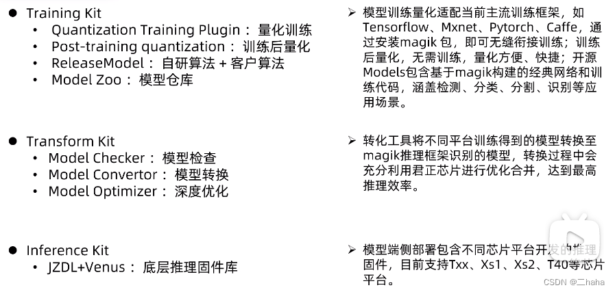
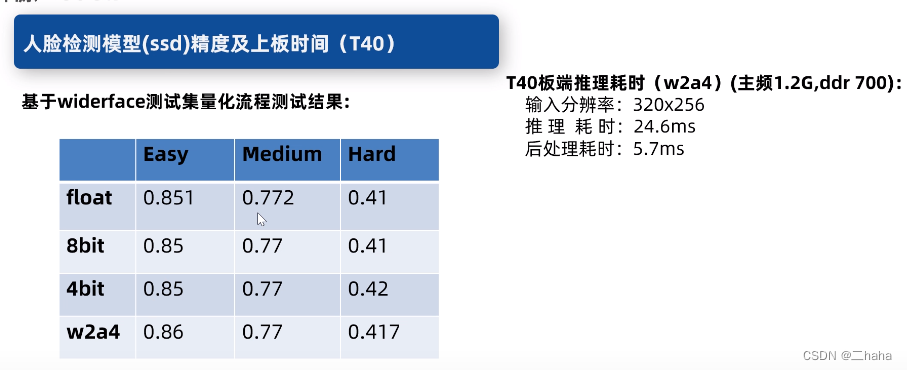

Ingenic Magik Algorithm Platform Introduction
---------------------------------------------
https://blog.csdn.net/gzn_1234/article/details/126514268

_Excerpted from Ingenic's official introduction of Magik_

### 00. Introduction

[Introduction of Ingenic "chip + AI computing power + AI development platform" plan][1] 
landed, announced full-stack low-power AI technology.

### 01. Magik overview

Magik is a full-stack deep learning open platform that integrates model training,
optimization conversion, deployment and reasoning for end-to-side AI application
scenarios.

Magik supports major machine learning frameworks such as
[PyTorch](https://pytorch.org/),
[TensorFlow](https://www.tensorflow.org/),
[Apache MXNet](https://mxnet.apache.org/),
[Caffe](https://caffe.berkeleyvision.org/),
[ONNX](https://onnx.ai/).

Magik provides a full-stack training kit allowing users to generate models 
using their own data.


Specifically :



### 02. Magik training quantization and post-training quantization

2.1. Models are binary in nature.

2.2. The quantization method is divided into two types according to the
     quantization position: Quantization-Aware Training (QAT) and
     Post-Training Quantization (PTQ).

#### QAT (Quantization-Aware Training)

Simulate quantization behavior during training, save fixed-point parameters
with floating point during training, and use fixed-point parameters for
inference at the end.

__Pros:__
  - High precision, quantizable to low bit widths (2, 4, 8).

__Cons:__
  - Time-consuming, need to train `float`->`8-bit`->`4-bit`->`2-bit` first. 
  - Requires model training experience and a powerful graphics card.

#### PTQ (Post-Training Quantization)

Quantize the model parameters of the directly trained floating-point model.

__Pros:__
  - Convenient and fast.

__Cons:__
  - In order to maintain lossless conversion, it can only be quantized to 8-bit.

__Quantization method selection__:
  Training quantization can get smaller model parameters and faster inference speed.

__Board support issues__:
  - Post-quantization (T40);
  - Training quantization (Txx, Xs1, T40), eg T30 is not an option, haha.

2.3 Training Quantization Hardware Requirements
    Needs a GPU.
    Magik currently only supports training quantization on the GPU.

2.4 Software requirements.

Compiling the Magik package requires the following environment (PyTorch as an example):
```
Environment:
- pytorch
- python
- os system
- cuda and cudnn
- gcc

Installation reference steps:
# anaconda installation commands
# (with torch 1.5, python3.6, cuda10.2, cudnn7.6, ubuntu for example)

conda creat -n python python=3.6
pip install torch==1.5.0 torchvision==0.6.0 -i http://pypi.douban.com/simple --trusted-host pypi.douban.com
pip install magik_trainingkit_torch_150-1.0.2-py3-none-any.why

from ingenic_magic_trainingkit.QuantizationTrainingPlugin.python import ops
```

2.5 Specific content of training quantization and supporting operators


Activation types currently supported by convolution and fully connected operators:
- `ops.Relu6`
- `ops.Linear`
- `ops.Hisgmoid`
- `ops.PReLU`
- `ops.LeakyReLU`

Note: To activate, `activation_fn` needs to be set on the corresponding interface
of the convolutional or fully connected layer, such as 
`activation_fn=ops.Linear();`

### 03. Magik conversion tool

### 04. Magik board-side reasoning

### 05. Magik open source models

5.1 Open source models

Txx is based on the magik open source training model:

1. SSD-based face detection (facedet), lightweight.
2. YOLO-based humanoid detection (persondet), lightweight YOLOv3 tiny.

T40 is based on the magik open source training model:

1. SSD-based face detection (facedet), middleweight.
2. Human figure detection based on YOLO (YOLOv3), middleweight.
3. Resnet classification network based on Magik.
4. Post-quantization model based on YOLOv5s.

Note: Each corresponding open source training code has a synchronous board test
`venus_sample` (including pre-processing and post-processing related codes),
if the open source code is released.

5.2 Official sample performance
1. Txx-SSD-based face detection (facedet), lightweight


2. Txx-YOLO-based humanoid detection (persondet), lightweight YOLOv3 tiny


3. T40-SSD-based face detection (facedet), middleweight


4. T40-YOLO-based humanoid detection (YOLOv3), middleweight


5. T40-post-quantization model based on YOLOv5s


---

Note: No official SDK and released samples were found.

Attachment: A well-summarized [post][2] about Ingenic T41, T40, and T31 version selection references.

The knowledge points of the article are matched with the official knowledge files,
and relevant knowledge can be further learned.

[1]: https://www.ithome.com/0/574/118.htm
[2]: https://blog.csdn.net/qq_50123515/article/details/125833284?spm=1001.2014.3001.5506
