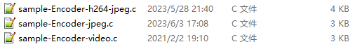

# [Ingenic T31 Application Development][toc]

The basics of video
-------------------

### Common encoding formats for video

Major video encoding formats for audio and video streams are __H.264__ and __H.265__.
Between those two, H.265 has a better compression, so most of the modern cameras and NVR 
devices prefer H.265 encoding format. But many open-source projects support only H.264, 
so it is crucial to have the ability to select the encoding format.

### Ingenic's video encoding module

The video encoding module provides functions for creating and destroying video encoding
channels, starting and stopping the reception of images, setting and reading the properties
of encoding channels, and obtaining and releasing streams, etc. 

This module supports multichannel real-time encoding, where each channel is independent, 
and you can set up different encoding protocols and profiles. Ingenic supports the encoding
module of JPEG, H.264 and H.265 formats.

In addition to these three formats, we also can get the YUV stream.

Samples of encoding data into these three formats are provided in Ingenic's demo code.

The encoding module consists of encoder groups; each encoder group consists of an encoder channels
and output stream buffers, which consist of multiple buffers.

### Basic concepts related to video

__CBR__ (Constant Bit Rate) - the encoding bit rate is constant during the bit rate statistics time.
Take H.264 encoding as an example, users can set `maxQp`, `minQp`, `bitrate`, etc.
`maxQp`, `minQp` are used to control the image quality range.

__VBR__ (Variable Bit Rate) - We usually use CBR more in practical application.

__VPS__ (Video Parameter Set).

__SPS__ (Sequence Parameter Set).

__PPS__ - the set of image parameters.

### Some of the Ingenic image encoding module APIs.

### Video Source Module

#### Function Description

`VideoSource` is an image data source for the IMP system, which allows you to set the image resolution, 
crop, scale, and other attributes, as well as the back-end noise reduction function.

`FrameSource` is a data stream related concept, which can set the image resolution, format, etc. and
provide the original image to the backend.

The structure of FrameSource is shown in the figure below:

Generally, we use the primary stream and the secondary stream.

Channel0 is generally used as HD video stream

Channel1 is generally used as SD video stream, or the data source of IVS intelligent algorithm.

Channel2 is an extended channel, used in special applications, and is generally not recommended.

#### Module Operation Flow

Init - initialization process:

1. Create channel
2. Set the channel
3. Enable channel

Exit - exit process:

1. Disable channel
2. Logout channel

#### FrameSource module partial API:

[toc]: index.md
