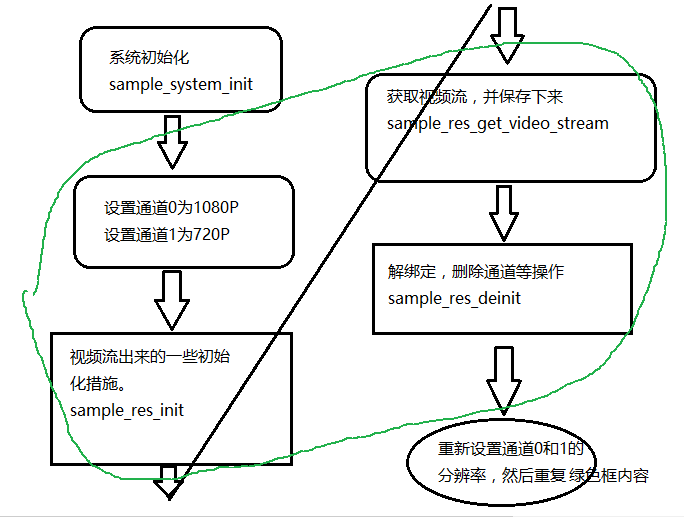

# [Ingenic T31 Application Development][toc]

Switching Resolutions
---------------------

### What the hell is video resolution?

When you buy a cell phone, computer, or anything with a screen, you can clearly see the resolution parameter.

For example, my recent phone Redmi K40 has the resolution of 2400 by 1080 pixels, meaning there are 2592000 pixels
or a 2.5-megapixel screen.

Video is an industrialized product, so naturally video resolution has its own format. The most common formats
are 1080P, 720P, 2K, 4K and so on.

__4K__: 4K video has resolution of 4096 x 2160 (native), or 4096 x 3112 (full aperture) resolution.

The resolution reaches 8 million pixels or more pixels to see every detail clearly.
Video is also not necessarily the larger the resolution is also better.

The general resolution of 8 million devices used in the network above the device transmission,
need great bandwidth, and the chip's arithmetic is also much stronger than the usual some of the
entry-level arithmetic.

__2K__: 2K resolution refers to the horizontal direction of the pixels to reach more than 2000 resolution,
the mainstream 2K resolutions are 2560 x 1440 and 2048 x 1080, a lot of digital cinema projectors mainly 
use the 2K resolution. 2K is an equivalent to 4-megapixel devices.

__1080P__: Resolution of 1920 x 1080, an equivalent to 2-megapixel devices.

__720P__: Resolution of 1280 x 720, an equivalent to 1-megapixel devices. This is also the mainstream resolution of early IPC.


### Ingenic T31's switching resolution demo

The purpose of this example is to switch the output stream from 1080p + 720p to 720p + 360p, 
and then to 360p + 320x240. The primary and secondary streams can switch the resolution by destroying
and recreating the encoder and framesource.




#### Setting the initial resolution

System initialization function + the initialization resolution we set.

```
/* Step.1 System init */
ret = sample_system_init();
if (ret < 0) {
    IMP_LOG_ERR(TAG, "IMP_System_Init() failed\n");
    return -1;
}

//init original resolution 1920x1080 & 1280x720
chn[0].fs_chn_attr.scaler.enable = 0;
chn[0].fs_chn_attr.crop.enable = 1;
chn[0].fs_chn_attr.crop.top = 0;
chn[0].fs_chn_attr.crop.left = 0;
chn[0].fs_chn_attr.crop.width = 1920;
chn[0].fs_chn_attr.crop.height = 1080;
chn[0].fs_chn_attr.picWidth = 1920;
chn[0].fs_chn_attr.picHeight = 1080;

chn[1].fs_chn_attr.scaler.enable = 1;
chn[1].fs_chn_attr.scaler.outwidth = 1280;
chn[1].fs_chn_attr.scaler.outheight = 720;
chn[1].fs_chn_attr.crop.enable = 0;
chn[1].fs_chn_attr.picWidth = 1280;
chn[1].fs_chn_attr.picHeight = 720;
```

#### Initialize the video source with `sample_res_init`

With the original H265 encoding is the same, mainly do the following things:

1. Initialize the video source function
2. Create encoding groups
3. Initialize the encoder
4. Bind the video source to the encoder.
5. Open the video stream

```
int sample_res_init()
{
    int ret, i;

    /* Step.2 FrameSource init */
    ret = sample_framesource_init();
    if (ret < 0) {
        IMP_LOG_ERR(TAG, "FrameSource init failed\n");
        return -1;
    }

    /* Step.3 Encoder init */
    for (i = 0; i < FS_CHN_NUM; i++) {
        if (chn[i].enable) {
            ret = IMP_Encoder_CreateGroup(chn[i].index);
            if (ret < 0) {
                IMP_LOG_ERR(TAG, "IMP_Encoder_CreateGroup(%d) error !\n", chn[i].index);
                return -1;
            }
        }
    }

    ret = sample_encoder_init();
    if (ret < 0) {
        IMP_LOG_ERR(TAG, "Encoder init failed\n");
        return -1;
    }

    /* Step.4 Bind */
    for (i = 0; i < FS_CHN_NUM; i++) {
        if (chn[i].enable) {
            ret = IMP_System_Bind(&chn[i].framesource_chn, &chn[i].imp_encoder);
            if (ret < 0) {
                IMP_LOG_ERR(TAG, "Bind FrameSource channel%d and Encoder failed\n",i);
                return -1;
            }
        }
    }

    /* Step.5 Stream On */
    ret = sample_framesource_streamon();
    if (ret < 0) {
        IMP_LOG_ERR(TAG, "ImpStreamOn failed\n");
        return -1;
    }
    return 0;
}
```

#### Get the video stream and destroy the originally created channel data with `sample_res_deinit`

1. Turn off the video streaming switch
2. Unbind the video source data and encoding data just bound
3. Encoding exit function
4. Video source exit function

```
int sample_res_deinit()
{
    int ret, i;
    /* Step.a Stream Off */
    ret = sample_framesource_streamoff();
    if (ret < 0) {
        IMP_LOG_ERR(TAG, "FrameSource StreamOff failed\n");
        return -1;
    }

    /* Step.b UnBind */
    for (i = 0; i < FS_CHN_NUM; i++) {
        if (chn[i].enable) {
            ret = IMP_System_UnBind(&chn[i].framesource_chn, &chn[i].imp_encoder);
            if (ret < 0) {
                IMP_LOG_ERR(TAG, "UnBind FrameSource channel%d and Encoder failed\n",i);
                return -1;
            }
        }
    }

    /* Step.c Encoder exit */
    ret = sample_encoder_exit();
    if (ret < 0) {
        IMP_LOG_ERR(TAG, "Encoder exit failed\n");
        return -1;
    }

    /* Step.d FrameSource exit */
    ret = sample_framesource_exit();
    if (ret < 0) {
        IMP_LOG_ERR(TAG, "FrameSource exit failed\n");
        return -1;
    }
    return 0;
}
```

```
ret = sample_res_get_video_stream();
if (ret < 0) {
    IMP_LOG_ERR(TAG, "Get video stream failed\n");
    return -1;
}

ret = sample_res_deinit();
if (ret < 0) {
    IMP_LOG_ERR(TAG, "sample_res_deinit failed\n");
    return -1;
}
```

#### Repeat the above process for this part to reconfigure your resolution parameters

```
//change resolution to 1280x720 & 640x360
chn[0].fs_chn_attr.scaler.enable = 1;
chn[0].fs_chn_attr.scaler.outwidth = 1280;
chn[0].fs_chn_attr.scaler.outheight = 720;
chn[0].fs_chn_attr.crop.enable = 1;
chn[0].fs_chn_attr.crop.top = 0;
chn[0].fs_chn_attr.crop.left = 0;
chn[0].fs_chn_attr.crop.width = 1280;
chn[0].fs_chn_attr.crop.height = 720;
chn[0].fs_chn_attr.picWidth = 1280;
chn[0].fs_chn_attr.picHeight = 720;

chn[1].fs_chn_attr.scaler.enable = 1;
chn[1].fs_chn_attr.scaler.outwidth = 640;
chn[1].fs_chn_attr.scaler.outheight = 360;
chn[1].fs_chn_attr.crop.enable = 0;
chn[1].fs_chn_attr.picWidth = 640;
chn[1].fs_chn_attr.picHeight = 360;
```

```
ret = sample_res_init();
if (ret < 0) {
    IMP_LOG_ERR(TAG, "sample_res_init failed\n");
    return -1;
}

ret = sample_res_get_video_stream();
if (ret < 0) {
    IMP_LOG_ERR(TAG, "Get video stream failed\n");
    return -1;
}

ret = sample_res_deinit();
if (ret < 0) {
    IMP_LOG_ERR(TAG, "sample_res_deinit failed\n");
    return -1;
}
```


### Experimental phenomena

We're going to change the resolution as following:

- Step 1: Channel 0 is 1080P, channel 1 is 720P
- Step 2: Channel 0 is 720P, channel 1 is 320P
- Step 3: channel 0 is 320P, channel 1 is 320 x 240.

This shows that we have successfully realized the function of resolution 
switching in the process of running the program.


[toc]: index.md
