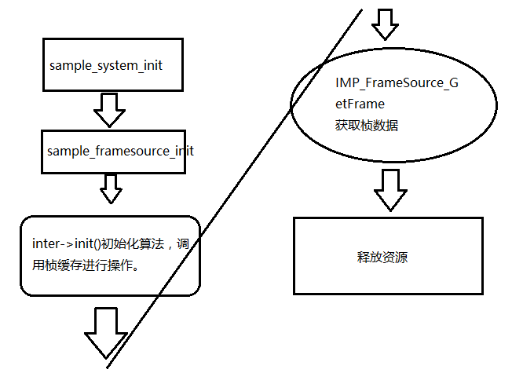

# 君正T31应用开发10：智能算法检测

## 君正T31应用开发10：智能算法检测

原创

**发布于** **2023-06-18 11:18:50**

**320**0

**举报**

# 1：什么是智能算法检测？

我们在淘宝上会看到各种各样的摄像头（IPC），有些99元包邮，有些1000元一台，比如云天励飞的摄像头。

同样都是摄像头，为什么价格差别会如此巨大？答案：智能算法集成导致芯片价格不一样，于是导致产品价格天差地别。

比如前段时间，XX通发布的一个车形检测算法，他标价是一个一分钱，他出货量估计一年上千万可能是有的，这里就有十万块钱。实际上这个算法是芯片自带的，至少T41是自带免费的，只不过芯片价格比T31贵了很多。

大部分的智能算法检测主要有几个部分组成：

移动侦测算法。

声音检测算法。

哭声检测算法。

车型检测算法。

人形检测算法。

[人脸检测](https://cloud.tencent.com/product/facerecognition?from_column=20065&from=20065)算法。

火焰检测算法等等。

T31芯片属于入门级别的芯片，所以并没有集成那么多的算法，目前可以做的算法只有三种。

移动侦测算法，人形侦测算法，声音检测算法。

下面以T31的sample来讲述一下，君正平台是怎么调用IVS智能检测平台的。

# 2：君正的智能算法检测平台

### 2.1：使用步奏：

IMP 通过IVS的通用接口API调用实例化的IMPIVSInterface将智能化分析算法嵌入到SDK中来分析SDK中的frame图像。

IMPIVSInterface为通用算法接口，具体算法通过实现此接口并将其传给IMP IVS达到在SDK运行具体算法的目的。

一个channel有且仅为单个算法示例的载体，必须将具体实现的算法接口传给具体的channel才能在SDK中运行算法。

IMPIVSInterface 成员 param 为成员函数 init 的参数。

IMP_IVS 会在传给成员函数 ProcessAsync 参数的 frame 时对其进行外部加锁， ProcessAsync 必须在使用完 frame 后调用 IMP_IVS_ReleaseData 释放 frame，以免死锁。

除上述通过绑定在数据流中的 IMP IVS 实现算法调用之外，还提供一种非绑定的方式实现算法 调 用 ， 即 获 取 framesouce channel 的 frame 图 像 ， 直 接 调 用 IMPIVSInterface 的成员函数实现算法处理。

大部分情况下，我们使用的都是不绑定的方式进行移动侦测算法的获取的。

### 2.2：绑定模式的算法使用方法：

​​

### 2.3非绑定模式调用IVS平台

​​

# 3：智能算法的有关API

​​

# 4：关键代码分析

### 4.1：sample_ivs_move_init

创建IVS具体算法通道组，多个算法可以共用一个通道组，也可以分别使用通道组sample_ivs_move_init();

```
static int sample_ivs_move_init(int grp_num)
{
    int ret = 0;

    ret = IMP_IVS_CreateGroup(grp_num);
    if (ret < 0) {
        IMP_LOG_ERR(TAG, "IMP_IVS_CreateGroup(%d) failed\n", grp_num);
        return -1;
    }
    return 0;
}
```

复制

### 4.2:sample_ivs_move_start

这里面我们传递进去的组的值是0,也就是刚才初始化的IVS的组的值，然后我们输入的编码通道是2，也就是我们使用子码流进行分析，因为T31的算力不太行，所以我们使用子码流进行分析，不然我们分配的内存会不够，记住，嵌入式设备跟电脑PC端的软件最大的不同就是嵌入式设备的资源大部分是不够用的。

里面最主要的函数：

IMP_IVS_CreateMoveInterface

如何设置移动侦测的参数？

```
/**
 * @file
 * IMP IVS 移动侦测模块
 */

/**
 * @defgroup MoveDetection
 * @ingroup IMP_IVS
 * @brief 移动侦测接口
 * @{
 */

/**
 * 移动侦测算法的输入结构体
 */
typedef struct {
    int             sense[IMP_IVS_MOVE_MAX_ROI_CNT];   /**< 移动侦测的灵敏度, 对正常摄像机范围是0-4，对全景摄像机范围是0-8 */
    int             skipFrameCnt;                      /*< 隔帧检测的个数 */
    IMPFrameInfo    frameInfo;                         /**< 帧尺寸信息,只需要配置width和height */
    IMPRect         roiRect[IMP_IVS_MOVE_MAX_ROI_CNT]; /*< 需要检测的roi区域坐标信息 */
    int             roiRectCnt;                        /*< 需要检测的roi区域数量，范围为0-51，若为0：则不检测，1：检测roiRect 0
                                                         区域，2、检测roiRect 0,1区域，3、检测roiRect 0,1,2区域，依次类推 */
} IMP_IVS_MoveParam;
```

复制

设置移动侦测参数：

```
    IMP_IVS_MoveParam param;
    int i = 0, j = 0;

    memset(&param, 0, sizeof(IMP_IVS_MoveParam));
    //设置桢的检测间隔是5
    param.skipFrameCnt = 5;
    param.frameInfo.width = SENSOR_WIDTH_SECOND;
    param.frameInfo.height = SENSOR_HEIGHT_SECOND;
    //设置检测区域为1个区域  
    param.roiRectCnt = 1;
    //设置检测的所有区域的灵敏度为4，最高的灵敏度 
    for(i=0; i<param.roiRectCnt; i++){
      param.sense[i] = 4;
    }

    //设置移动侦测的范围，和人形侦测应该是一样的，都是拥有区域检测的功能。
    /* printf("param.sense=%d, param.skipFrameCnt=%d, param.frameInfo.width=%d, param.frameInfo.height=%d\n", param.sense, param.skipFrameCnt, param.frameInfo.width, param.frameInfo.height); */
    for (j = 0; j < 2; j++) {
        for (i = 0; i < 2; i++) {
          if((i==0)&&(j==0))
          {
            param.roiRect[j * 2 + i].p0.x = i * param.frameInfo.width /* / 2 */;
            param.roiRect[j * 2 + i].p0.y = j * param.frameInfo.height /* / 2 */;
            param.roiRect[j * 2 + i].p1.x = (i + 1) * param.frameInfo.width /* / 2 */ - 1;
            param.roiRect[j * 2 + i].p1.y = (j + 1) * param.frameInfo.height /* / 2 */ - 1;
            printf("(%d,%d) = ((%d,%d)-(%d,%d))\n", i, j, param.roiRect[j * 2 + i].p0.x, param.roiRect[j * 2 + i].p0.y,param.roiRect[j * 2 + i].p1.x, param.roiRect[j * 2 + i].p1.y);
          }
          else
          {
            param.roiRect[j * 2 + i].p0.x = param.roiRect[0].p0.x;
            param.roiRect[j * 2 + i].p0.y = param.roiRect[0].p0.y;
            param.roiRect[j * 2 + i].p1.x = param.roiRect[0].p1.x;;
            param.roiRect[j * 2 + i].p1.y = param.roiRect[0].p1.y;;
            printf("(%d,%d) = ((%d,%d)-(%d,%d))\n", i, j, param.roiRect[j * 2 + i].p0.x, param.roiRect[j * 2 + i].p0.y,param.roiRect[j * 2 + i].p1.x, param.roiRect[j * 2 + i].p1.y);
          }
        }
    }
```

复制

```
static int sample_ivs_move_start(int grp_num, int chn_num, IMPIVSInterface **interface)
{
    int ret = 0;
    IMP_IVS_MoveParam param;
    int i = 0, j = 0;

    memset(&param, 0, sizeof(IMP_IVS_MoveParam));
    param.skipFrameCnt = 5;
    param.frameInfo.width = SENSOR_WIDTH_SECOND;
    param.frameInfo.height = SENSOR_HEIGHT_SECOND;
    param.roiRectCnt = 1;

    for(i=0; i<param.roiRectCnt; i++){
      param.sense[i] = 4;
    }

    /* printf("param.sense=%d, param.skipFrameCnt=%d, param.frameInfo.width=%d, param.frameInfo.height=%d\n", param.sense, param.skipFrameCnt, param.frameInfo.width, param.frameInfo.height); */
    for (j = 0; j < 2; j++) {
        for (i = 0; i < 2; i++) {
          if((i==0)&&(j==0)){
            param.roiRect[j * 2 + i].p0.x = i * param.frameInfo.width /* / 2 */;
            param.roiRect[j * 2 + i].p0.y = j * param.frameInfo.height /* / 2 */;
            param.roiRect[j * 2 + i].p1.x = (i + 1) * param.frameInfo.width /* / 2 */ - 1;
            param.roiRect[j * 2 + i].p1.y = (j + 1) * param.frameInfo.height /* / 2 */ - 1;
            printf("(%d,%d) = ((%d,%d)-(%d,%d))\n", i, j, param.roiRect[j * 2 + i].p0.x, param.roiRect[j * 2 + i].p0.y,param.roiRect[j * 2 + i].p1.x, param.roiRect[j * 2 + i].p1.y);
          }
          else
            {
                  param.roiRect[j * 2 + i].p0.x = param.roiRect[0].p0.x;
            param.roiRect[j * 2 + i].p0.y = param.roiRect[0].p0.y;
            param.roiRect[j * 2 + i].p1.x = param.roiRect[0].p1.x;;
            param.roiRect[j * 2 + i].p1.y = param.roiRect[0].p1.y;;
            printf("(%d,%d) = ((%d,%d)-(%d,%d))\n", i, j, param.roiRect[j * 2 + i].p0.x, param.roiRect[j * 2 + i].p0.y,param.roiRect[j * 2 + i].p1.x, param.roiRect[j * 2 + i].p1.y);
            }
        }
    }
    *interface = IMP_IVS_CreateMoveInterface(&param);
    if (*interface == NULL) {
        IMP_LOG_ERR(TAG, "IMP_IVS_CreateGroup(%d) failed\n", grp_num);
        return -1;
    }

    ret = IMP_IVS_CreateChn(chn_num, *interface);
    if (ret < 0) {
        IMP_LOG_ERR(TAG, "IMP_IVS_CreateChn(%d) failed\n", chn_num);
        return -1;
    }

    ret = IMP_IVS_RegisterChn(grp_num, chn_num);
    if (ret < 0) {
        IMP_LOG_ERR(TAG, "IMP_IVS_RegisterChn(%d, %d) failed\n", grp_num, chn_num);
        return -1;
    }

    ret = IMP_IVS_StartRecvPic(chn_num);
    if (ret < 0) {
        IMP_LOG_ERR(TAG, "IMP_IVS_StartRecvPic(%d) failed\n", chn_num);
        return -1;
    }

    return 0;
}
```

复制

### 4.3：sample_ivs_move_get_result_start获取移动侦测结果。

最主要的几个函数：

```
/**
 * 阻塞判断是否可以获得IVS功能已计算出的智能分析结果
 *
 * @fn int IMP_IVS_PollingResult(int ChnNum, int timeoutMs);
 *
 * @param[in] ChnNum IVS功能对应的通道号
 *
 * @param[in] timeout 最大等待时间，单位ms; IMP_IVS_DEFAULT_TIMEOUTMS:库内部默认的等待时间,0:不等待,>0:用户设定的等待时间
 *
 * @retval 0 成功
 * @retval -1 失败
 *
 * @remark 只有该通道创建时参数IMPIVSInterface结构体中ProcessAsync函数成员返回0时，即实际检测正常返回时，此Polling函数才返回成功
 *
 * @attention 无
 */
int IMP_IVS_PollingResult(int ChnNum, int timeoutMs);
```

复制

```
/**
 * 获得IVS功能计算出的智能分析结果
 *
 * @fn int IMP_IVS_GetResult(int ChnNum, void **result);
 *
 * @param[in] ChnNum IVS功能对应的通道号
 *
 * @param[in] result IVS功能对应的通道号输出的结果，返回此通道对应的智能分析算法的结果指针，外部客户无需分配空间。
 *
 * @retval 0 成功
 * @retval -1 失败
 *
 * @remark 根据不同IVS功能绑定的通道,输出其对应的结果.
 *
 * @attention 无
 */
int IMP_IVS_GetResult(int ChnNum, void **result);
```

复制

```
/**
 * 释放IVS功能计算出的结果资源
 *
 * @fn int IMP_IVS_ReleaseResult(int ChnNum, void *result);
 *
 * @param[in] GrpNum 通道组号
 *
 * @param[in] ChnNum IVS功能对应的通道号
 *
 * @param[in] result IVS功能对应的通道号输出的结果
 *
 * @retval 0 成功
 * @retval -1 失败
 *
 * @remark 根据不同IVS功能绑定的通道,释放其输出的结果资源.
 *
 * @attention 无
 */
int IMP_IVS_ReleaseResult(int ChnNum, void *result);
```

复制

最后可以写出获取移动侦测的代码：

```
static void *sample_ivs_move_get_result_process(void *arg)
{
    int i = 0, ret = 0;
    int chn_num = (int)arg;
    IMP_IVS_MoveOutput *result = NULL;

    for (i = 0; i < NR_FRAMES_TO_SAVE; i++) {
        ret = IMP_IVS_PollingResult(chn_num, IMP_IVS_DEFAULT_TIMEOUTMS);
        if (ret < 0) {
            IMP_LOG_ERR(TAG, "IMP_IVS_PollingResult(%d, %d) failed\n", chn_num, IMP_IVS_DEFAULT_TIMEOUTMS);
            return (void *)-1;
        }
        ret = IMP_IVS_GetResult(chn_num, (void **)&result);
        if (ret < 0) {
            IMP_LOG_ERR(TAG, "IMP_IVS_GetResult(%d) failed\n", chn_num);
            return (void *)-1;
        }
        IMP_LOG_INFO(TAG, "frame[%d], result->retRoi(%d,%d,%d,%d)\n", i, result->retRoi[0], result->retRoi[1], result->retRoi[2], result->retRoi[3]);

        ret = IMP_IVS_ReleaseResult(chn_num, (void *)result);
        if (ret < 0) {
            IMP_LOG_ERR(TAG, "IMP_IVS_ReleaseResult(%d) failed\n", chn_num);
            return (void *)-1;
        }
}
```

复制

### 4.4：释放移动侦测需要的资源：

```
    /* Exit sequence as follow */
    /* Step.10 stop to get ivs move result */
    ret = sample_ivs_move_get_result_stop(ivs_tid);
    if (ret < 0) {
        IMP_LOG_ERR(TAG, "sample_ivs_move_get_result_stop failed\n");
        return -1;
    }

    /* Step.11 ivs move stop */
    ret = sample_ivs_move_stop(2, inteface);
    if (ret < 0) {
        IMP_LOG_ERR(TAG, "sample_ivs_move_stop(0) failed\n");
        return -1;
    }
    /* Step.12 Stream Off */
    ret = sample_framesource_streamoff();
    if (ret < 0) {
        IMP_LOG_ERR(TAG, "FrameSource StreamOff failed\n");
        return -1;
    }
```

复制

# 5：实验现象：

我们使用下面的函数获取移动侦测数据信息，可以从函数的返回值那边得到我们需要的数值。

因为我们的数值是通过第一个区域得到的，所以我们只需要关注第一个打印的数据就可以了。

如果是1证明是移动侦测触发，如果是0证明没有移动侦测。实验结果也证明，当我把手放过去的时候，就是1，如果没有放过去就是0，实验完美成功验证。

```
        ret = IMP_IVS_GetResult(chn_num, (void **)&result);
        if (ret < 0) {
            IMP_LOG_ERR(TAG, "IMP_IVS_GetResult(%d) failed\n", chn_num);
            return (void *)-1;
        }
        IMP_LOG_INFO(TAG, "frame[%d], result->retRoi(%d,%d,%d,%d)\n", i, result->retRoi[0], result->retRoi[1], result->retRoi[2], result->retRoi[3]);
```

复制

​​

原创声明：本文系作者授权腾讯云开发者社区发表，未经许可，不得转载。

如有侵权，请联系 [cloudcommunity@tencent.com](mailto:cloudcommunity@tencent.com) 删除。
