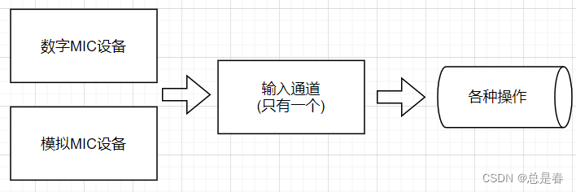
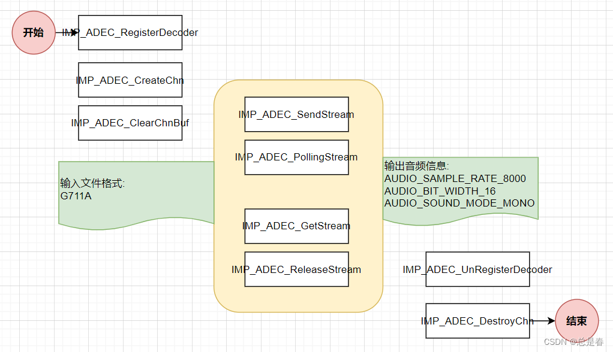

Ingenic T31: Audio
------------------

### Basic playback of a PCM file

Key components: 
- output device (you need to know in advance what the format of the input data is.)
- output channel

### Basic recording process

Record microphone input signal into an audio file for further storage or
transmitting over network.

Recording is the foundation, providing material for later storage or network
transmission of audio data.

### Convert G711A to PCM

Related API interfaces used:
- `IMP_ADEC_RegisterDecoder`
- `IMP_ADEC_CreateChn`
- `IMP_ADEC_ClearChnBuf`
- `IMP_ADEC_SendFrame`
- `IMP_ADEC_PollingStream`
- `IMP_ADEC_GetStream`
- `IMP_ADEC_ReleaseStream`
- `IMP_ADEC_UnRegisterEncoder`
- `IMP_ADEC_DestroyChn`

Key components:
- decoder
- decoding channel
- One of the uses of the decoded raw stream is playback.

### Convert PCM to G711A

Process of inputting PCM files and outputting G711A encoding

analyze:

Key components:
- encoder
- encoding channel
- After the original encoded audio data is encoded, it can be stored or sent to the Internet.

### Troubleshooting

If you got an error that the dynamic library cannot be found, please make sure
that file `libaudioProcess.so` is in `/lib` or `/usr/lib` path.

If you put the file in your own path, you need to set the environment variable
`LD_LIBRARY_PATH` accordingly.

---

Based on
- https://blog.csdn.net/code2481632/article/details/129417614
- https://blog.csdn.net/code2481632/article/details/129420503
- https://blog.csdn.net/code2481632/article/details/129420699
- https://blog.csdn.net/code2481632/article/details/129420891
- https://blog.csdn.net/code2481632/article/details/129672574
