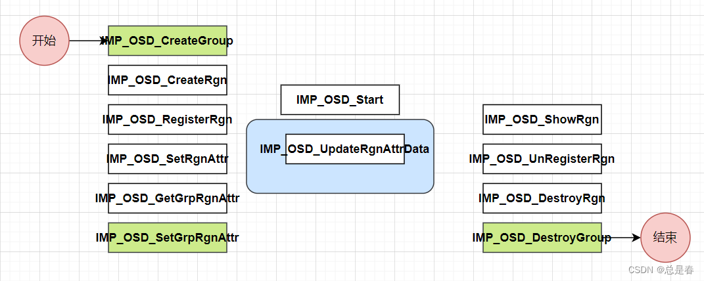

Ingenic T31 SDK: OSD
--------------------

### Application process and related knowledge points

analyze:

Key components:

Group area

Notice:

What is more difficult to understand is: the same group can set different areas,
not all the group properties of the areas in the group are the same.

There is also the concept of layers in the group, which feels a bit complicated.

---
original： https://blog.csdn.net/code2481632/article/details/129440448
