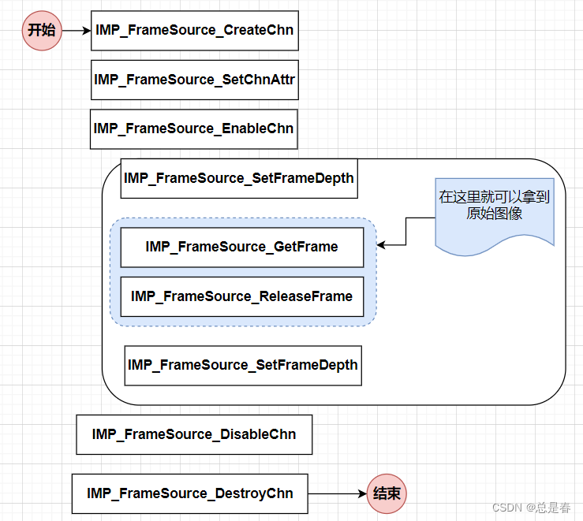
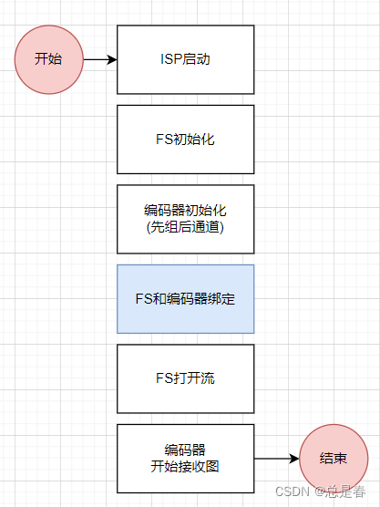
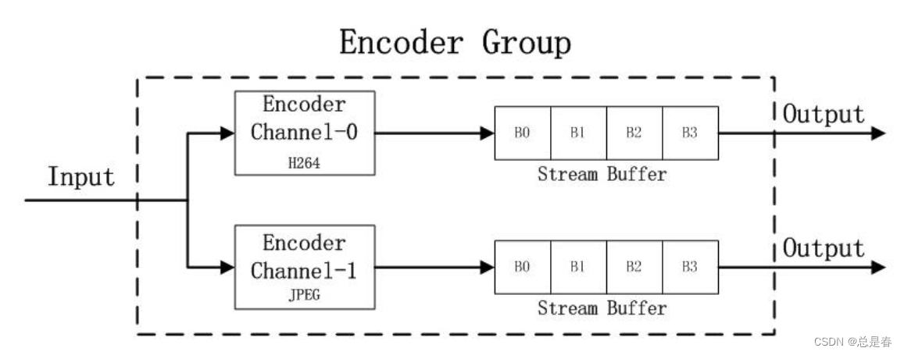
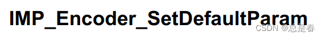
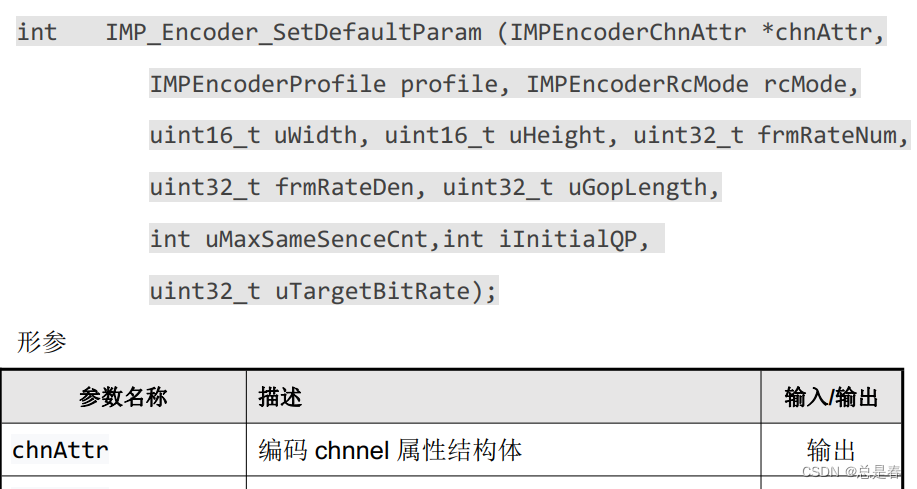
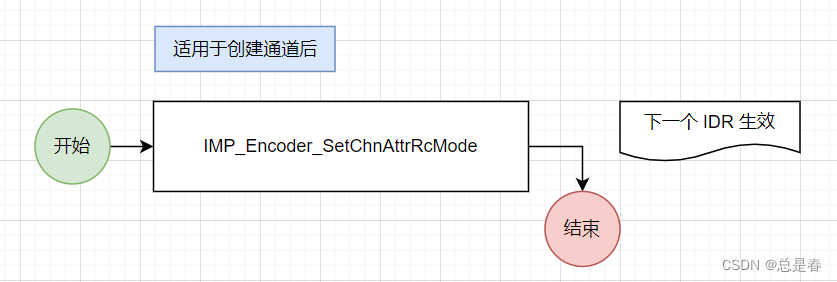

Ingenic T31: Video encoding
---------------------------

### What operations does the video source module perform on the source image?
https://blog.csdn.net/code2481632/article/details/129344878

The original image collected by the ISP needs to be further processed, so what has been done?


Corresponding to the SDK package, there will be a series of interfaces to realize the above functions.

---

### ISP. How to get started, and some thoughts.
https://blog.csdn.net/code2481632/article/details/129225326

Ingenic T31 video processing chip has so many SDK API interfaces, where to start?

The first step is to understand and master the API related to initialization.
In order to be more intuitive and read more aspects, I will post the flow chart later:


analyze:

Among others, the blue part is the ISP module. Let the camera work first, and 
then talk about how to collect, process, display, and encode. It is reasonable.
Some multimedia processors, such as those related to vehicles (realizing multi-
camera functions), do not have integrated cameras. To expand the AD processor, 
the design will be much more logical.

In addition, the flow chart above feels clear, but how to use software for architecture,
how to achieve flexibility, scalability, easy configuration, and dynamic adjustment is
the most interesting.

---

### How to collect camera video data for further processing?
https://blog.csdn.net/code2481632/article/details/129226537

The camera sensor, through A/D conversion, will eventually form a frame of
the original image, so how to get these frames of data?

(The premise is that the ISP is working normally, you can refer to:
"Ingenic T31 SDK API interface so many, how to get started, and some thoughts"

Corresponding website: [Ingenic T31 SDK has so many API interfaces, how to get started,
and some thoughts](https://blog.csdn.net/code2481632/article/details/129225326))

It is not difficult in practice, as long as the following key API interfaces can
be realized, now post the flow chart:



process:

1. Initialize Framesource module
2. Hand it over to the program and collect it continuously (you can create a new thread)
3. The End.

think:

Framesource is equivalent to the source of data. With the source, you can do many things.
Then, you will usually face several related management problems, which is also the focus
of software design.

- source initialization
- source restart
- source of exception
- The impact of the source on the front and back ends
- ISP parameter update, how the source should fit, how to operate
- Various business operations of the user, such as wanting to get an original picture, etc.

---

### Collection to coding process (every step is important)
https://blog.csdn.net/code2481632/article/details/129344028

When doing secondary development, you must not only understand the API of the
SDK package, but also master the process of each step, as well as the context
of API function calls, etc. But you can't go too deep all at once, otherwise
you will see the trees but not the forest. Here Sort out the overall steps of
"acquisition to coding process".

process:



analyze:

ISP: partly the basics.

FS initialization: establish the channel and set the corresponding properties.

Encoder: also prepare first.

Binding: Now it's time to wire them together.

Finally, open the FS stream first, then start the encoder to receive the video stream.

notice:

ISP and FS are not bound.

---

### Why video encoders need to be grouped
https://blog.csdn.net/code2481632/article/details/129295973

Many encoding operations are done in the corresponding encoding channel, but
there is a concept of group. At first glance, it is possible to have no group,
but why do groups exist?



analyze:

Each group is a container, which can hold several channels, and each group is
different, and the channels with common characteristics are grouped into one
group. From the user's point of view, this design is easier to understand and
also more friendly;

The design of the group starts from the perspective of the framework, and the
idea of layering can be seen, and the scalability will be better.

When we do secondary development, we must reflect the characteristics of groups
and channels.

---

### Understanding of `IMP_Encoder_SetDefaultParam`
https://blog.csdn.net/code2481632/article/details/129298279

First look (IMP_Encoder_SetDefaultParam()):



From the caller's point of view: It is considered that the attributes
of the corresponding encoding channel are set through a series of input
parameters. But it is found that there is no corresponding channel number.

analyze:

After thinking about it again, it turns out that a channel attribute is
returned through a series of parameters.



It can be seen from the above that chnAttr is an output parameter. After
obtaining the channel attribute, set the channel attribute through the
corresponding API interface.

---

### Steps to adjust CBR bit rate
https://blog.csdn.net/code2481632/article/details/129661603

For some applications, encoding-related parameters need to be adjusted,
such as reducing the bit rate. The corresponding process is given below:




---

### Capture an image from the original video stream, it may be blocked, how to deal with it?
https://blog.csdn.net/code2481632/article/details/129263329

describe:

top pick up

Ingenic T31: How to collect camera video data for further processing?

When grabbing an original image, the API interface provided by the SDK:
```
IMP_FrameSource_GetFrame()
```

There is a possibility of blocking.

analyze:

At this time, you can create a thread dedicated to fetching images:


---
