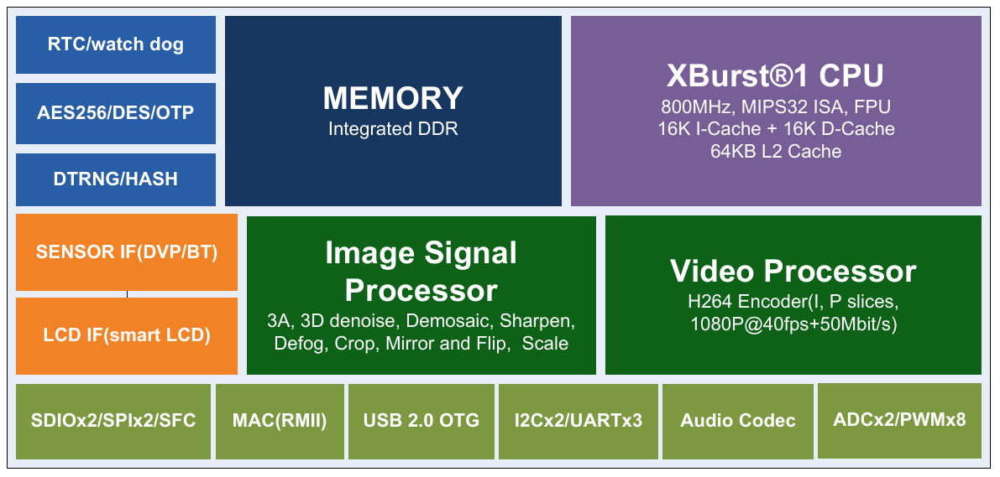
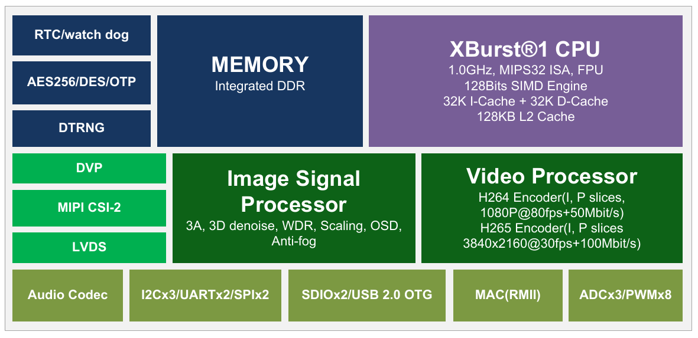
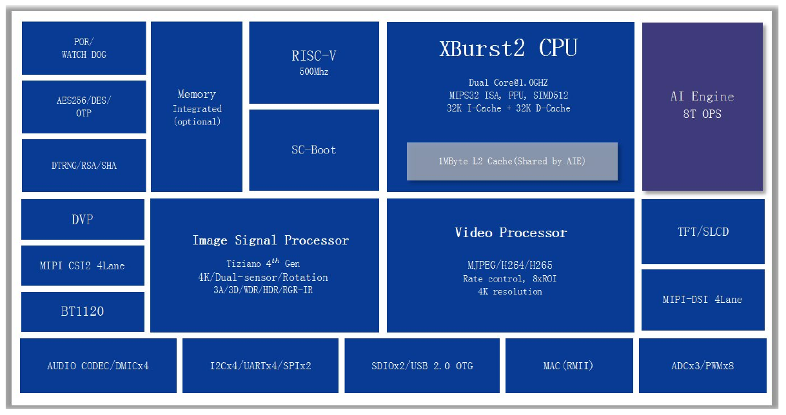

Ingenic T-series SoC
--------------------

Allegedly, "T" in the name of the series stands for "Tomahawk".

Xburst http://www.ingenic.com.cn/en/?xburst.html

### T10 Family (Mango)


* H.264 encoding @ 960P
* High-performance CPU with intelligent analysis (>1G CPU, 128-bit SIMD engine)
* MIPS CPU operating at 1.0Ghz
* 128KB L2-cache
* MXU2.0 (SIMD128)
* Intelligent video and audio analysis
* High Level ISP, support 3D denoise, WDR
* H.264 baseline, main profile, up to 960P resolution
* Package with 64MB DDR2
* Typical power consumption: less than 400mW including DDR2

SoC UART pins:
- P11 - UART0_TX
- P12 - UART0_RTS
- R11 - UART0_RX
- R12 - UART0_CTS

|             | T10L      | T10N      |
|-------------|-----------|-----------|
| Core        | Xburst1   | Xburst1   |
| SoC Freq.   | 860MHz    | 860MHz    |
| RAM Size    | 512Mbit   | 512Mbit   |
| RAM Type    | DDR2-800  | DDR2-800  |
| RAM Speed   | 400Mhz    | 400Mhz    |
| RAM Voltage | 1.8V      | 1.8V      |
| RAM bus     | 16bit     | 16bit     |
| L1 I-Cache  | 32KB      | 32KB      |
| L1 D-Cache  | 32KB      | 32KB      |
| L2 Cache    | 128KB     | 128KB     |
| SIMD        |           | 128bit    |
| Resolution  | 1280x960  | 1280x960  |
| Video Main  | 1280x960  | 1280x960  |
| Video Sub   | 640x640   | 640x640   |
| Package     | BGA181    | BGA181    |


### T15 Family (?)


### T20 Family (Bull)


* Surveillance level ISP engine, LLL night vision
* Smart H.264 Encoder engine, ultra-low bitstream control
* The leading low-power technology
* CPU operating at 1.0Ghz, based on MIPS
* 128KB L2-cache
* MXU2.0 (SIMD128)
* Intelligent video and audio analysis
* High Level ISP, support 3D denoise, WDR
* Smart H.264, high profile, maximum 2048x2048 resolution
* Package with 64MB/128MB DDR2
* Typical power consumption: less than 600mW 
* Fast boot and quick stream 

|             | T20L      | T20N      | T20X      |
|-------------|-----------|-----------|-----------|
| Core        | Xburst1   | Xburst1   | Xburst1   |
| SoC Freq.   | 800MHz    | 800MHz    | 800MHz    |
| RAM Size    | 512Mbit   | 512Mbit   | 1Gbit     |
| RAM Type    | DDR2      | DDR2      | DDR2      |
| RAM Voltage | 1.8V      | 1.8V      | 1.8V      |
| L1 I-Cache  | 32KB      | 32KB      | 32KB      |
| L1 D-Cache  | 32KB      | 32KB      | 32KB      |
| L2 Cache    | 128KB     | 128KB     | 128KB     |
| SIMD        |           | 128bit    | 128bit    |
| Resolution  | 2048x1536 | 2048x1536 | 2048x1536 |
| Video Main  | 2048x1536 | 2048x1536 | 2048x1536 |
| Video Sub   | 800x800   | 800x800   | 800x800   |
| Package     | BGA181    | BGA181    | BGA181    |

### T21 Family (Turkey)



* Professional level imaging ISP, night vision enhancement
* Smart H.264 coding engine, ultra-low code flow control
* Extreme BOM cost control
* Leading low-power technology
* Built-in Ethernet PHY 

|              | T21L      | T21N      | T21X      | T21ZL     | 
|--------------|-----------|-----------|-----------|-----------|
| Core         | Xburst1   | Xburst1   | Xburst1   | Xburst1   |
| SoC Freq.    | 800MHz    | 800MHz    | 800MHz    | 800MHz    |
| RAM Size     | 512Mbit   | 512Mbit   | 1Gbit     | 512Mbit   | 
| RAM Type     | DDR2      | DDR2      | DDR2      | DDR2      | 
| RAM Voltage  | 1.8V      | 1.8V      | 1.8V      | 1.5V      |
| L1 I-Cache   | 16KB      | 16KB      | 16KB      | 16KB      |
| L1 D-Cache   | 16KB      | 16KB      | 16KB      | 16KB      |
| L2 Cache     | 64KB      | 64KB      | 64KB      | 64KB      |
| Resolution   | 2560x2048 | 2560x2048 | 2560x2048 | 2560x2048 |
| Package      | BGA152    | BGA152    | BGA152    | BGA152    |
| Process tech | 28nm      | 28nm      | 28nm      | 28nm      |


### T23 Family (Pike)

* Extremely cost-effective
* Support dual camera, support dual camera 1080P application under 64MB memory
* Up to 300W resolution
* XBurst®-1core CPU:1.2~1.4GHz
* H.264 Encoder: 3MP (2308x*2048)
* Security-grade ISP imaging, IQ is better than T31
* Support memory-saving technology
* Low power consumption optimization, about 300mW
* Startup time optimized, startup time is faster than T31
* Hardware and software design are basically compatible with T31


### T30 Family (Monkey)



* Smart H.265/H.264 encoding engine, full real-time performance
* Starlight-level ISP, multiple noise reduction
* HD resolution, 5M/4M/3M/2M/1M simultaneous support
* Support microphone arrays, activate audio and video applications
* Built-in vector acceleration engine to support end-level lightweight AI applications
* CPU operating at 1.0 GHZ, based on MIPS
* 64KB L1-Cache/128KB L2-Cache
* MXU2.0 (SIMD128)
* Video and audio intelligent analysis
* High Level ISP, Support AE, AWB, AF, 3D De-noise, WDR, DRC
* Smart H.265, high profile, maximum 2688x2048 resolution
* Internal integration 64MB/128MB DDR2
* Typical Power: 500mW including DDR2 (1080P@25fps H.265)
* Fast boot and quick stream

|             | T30L      | T30N      | T30X      | T30A      | 
|-------------|-----------|-----------|-----------|-----------|
| Core        | Xburst1   | Xburst1   | Xburst1   | Xburst1   |
| SoC Freq.   | 1.0GHz    | 1.0GHz    | 1.0GHz    | 1.0GHz    |
| RAM Size    | 512Mbit   | 512Mbit   | 1Gbit     | 1Gbit     | 
| RAM Type    | DDR2      | DDR2      | DDR2      | DDR2      | 
| L1 I-Cache  | 32KB      | 32KB      | 32KB      | 32KB      |
| L1 D-Cache  | 32KB      | 32KB      | 32KB      | 32KB      |
| L2 Cache    | 128KB     | 128KB     | 128KB     | 128KB     |
| SIMD        |           | 128bit    | 128bit    | 128bit    |
| Quick start |           | +         | +         | +         |
| Resolution  | 2592x2048 | 2592x2048 | 2592x2048 | 2592x2048 |
| Package     | BGA223    | BGA223    | BGA223    | BGA223    |


### T31 Family (Swan)


* Smart H.265/H.264 encoding engine, full real-time performance
* Starlight-level ISP, multiple noise reduction
* HD resolution, 5M/4M/3M/2M/1M simultaneous support
* Support microphone arrays, activate audio and video applications
* Built-in vector acceleration engine to support end-level lightweight AI applications
* CPU operating at 1.0 GHZ, based on MIPS
* 64KB L1-Cache/128KB L2-Cache
* MXU2.0 (SIMD128)
* Video and audio intelligent analysis
* High Level ISP, Support AE, AWB, AF, 3D De-noise, WDR, DRC
* Smart H.265, high profile, maximum 2688x2048 resolution
* Internal integration 64MB/128MB DDR2
* Typical power consumption: 500mW including DDR2 (1080P@25fps H.265)
* Fast boot and quick stream

> The main difference between T31 and T30/T21 are:
> 1. FrameSource module adds `fcrop` parameter to realize pre-crop function.
> The process for T30/T21 is Scale->Crop, and the process for T31 is Crop->Scale->Crop.
> 2. The image encoding parameters are different. The T31 encoding channel parameters are
> different from T30/T21 parameters, adding the gop attribute (`gopAttr`) to the original
> encoder attribute (`encAttr`) and the code rate controller attribute (`rcAttr`).

|             | T31L      | T31N      | T31X      | T31ZL     | T31ZX     | T31A      | T31AL     |
|-------------|-----------|-----------|-----------|-----------|-----------|-----------|-----------|
| Core        | Xburst1   | Xburst1   | Xburst1   | Xburst1   | Xburst1   | Xburst1   | Xburst1   |
| SoC Freq.   | 1.0GHz    | 1.4GHz    | 1.4GHz    | 1.4GHz    | 1.4GHz    | 1.5GHz    | 1.5GHz    |
| RAM Size    | 512Mbit   | 512Mbit   | 1Gbit     | 512Mbit   | 1Gbit     | 1Gbit     | 1Gbit     |
| RAM Type    | DDR2      | DDR2      | DDR2      | DDR2      | DDR2      | DDR3L     | DDR2      |
| RAM Voltage | 1.8V      | 1.8V      | 1.8V      | 1.5V      | 1.5V      | 1.35V     | ?         |
| L1 I-Cache  | 32KB      | 32KB      | 32KB      | 32KB      | 32KB      | 32KB      | 32KB      |
| L1 D-Cache  | 32KB      | 32KB      | 32KB      | 32KB      | 32KB      | 32KB      | 32KB      |
| L2 Cache    | 128KB     | 128KB     | 128KB     | 128KB     | 128KB     | 128KB     | 128KB     |
| SIMD        |           | 128bit    | 128bit    | 128bit    | 128bit    | 128bit    | ?         |
| Quick start |           | +         | +         | +         | +         | +         | ?         |
| DNN         |           | +         | +         | +         | +         | +         | ?         |
| DVP/MIPI    | DVP/MIPI  | DVP/MIPI  | DVP/MIPI  | DVP/MIPI  | DVP/MIPI  | DVP/MIPI  | DVP/MIPI  |
| Resolution  | 2592x2048 | 2592x2048 | 2592x2048 | 2592x2048 | 2592x2048 | 2592x2048 | 2592x2048 |
| Battery pwr |           |           |           | +         | +         | +         | ?         |
| 4 Mic Array |           |           |           |           |           | +         | ?         |
| I2S         |           |           |           |           |           | +         | ?         |
| Package     | QFN88     | QFN88     | QFN88     | QFN88     | QFN88     | BGA       | BGA       |


### T40 Family (Shark)



|              | T40N      | T40XP     | T40A      |
|--------------|-----------|-----------|-----------|
| Core         | Xburst2   | Xburst2   | Xburst2   |
| SoC Freq.    | 1.0GHz    | 1.2GHz    | 1.0GHz    |
| RAM Size     | 1Gbit     | 2Gbit     | external  |
| RAM Type     | DDR2      | DDR3      | DDR3L     |
| RAM Bus      | 32bit     | 32bit     | 32bit     |
| RAM Voltage  | 1.8V      | 1.8V      | 1.8V      |
| L1 I-Cache   | 32KB      | 32KB      | 32KB      |
| L1 D-Cache   | 32KB      | 32KB      | 32KB      |
| L2 Cache     | 128KB~1MB | 128KB~1MB | 128KB~1MB |
| SIMD         | 512bit    | 512bit    | 512bit    |
| Quick start  | +         | +         | +         |
| DNN          | 2TOPS     | 4TOPS     | 8TOPS     |
|              |           |           |           |
| Resolution   | 4K        | 4K        | 4K        |
| Max Sensors  | 8         | 3         | 3         |
| Battery pwr  | +         | +         | +         |
| Magick ISP   | +         | +         | +         |
| RTC          | +         | +         | +         |
| MAC PHY      |           |           |           |
| 4 Mic Array  | +         | +         | +         |
| Echo cancel. | +         | +         | +         |
| Fast stream  | +         | +         | +         |
| Package      | BGA356    | BGA356    | BGA356    |

### T41 Family

|             | T41LQ      | T41NQ      | T41ZL      | T41ZN      | T41ZX      | T41A       |
|-------------|------------|------------|------------|------------|------------|------------|
| Core        | Xburst2    | Xburst2    | Xburst2    | Xburst2    | Xburst2    | Xburst2    |
| SoC Freq.   | 1.0-1.4GHz | 1.0-1.4GHz | 1.0-1.4GHz | 1.0-1.4GHz | 1.0-1.4GHz | 1.0-1.4GHz |
| RAM Size    | 512Mbit    | 1Gbit      | 512Mbit    | 1Gbit      | 2Gbit      | ext. 4Gbit |
| RAM Type    | DDR2       | DDR3       |            |            |            |            |
| RAM Voltage |            |            |            |            |            |            |
| L1 I-Cache  | 32KB       | 32KB       | 32KB       | 32KB       | 32KB       | 32KB       |
| L1 D-Cache  | 32KB       | 32KB       | 32KB       | 32KB       | 32KB       | 32KB       |
| L2 Cache    | 128KB      | 128KB      | 128KB      | 128KB      | 128KB      | 128KB      |
| SIMD        | 512bit     | 512bit     | 512bit     | 512bit     | 512bit     | 512bit     |
| Quick start |            |            | +          | +          |            | +          |
| DNN         | 1.2T@int8  | 1.2T@int8  | 1.2T@int8  | 1.2T@int8  | 1.2T@int8  | 1.2T@int8  |
|             | 4.8T@int4  | 4.8T@int4  | 4.8T@int4  | 4.8T@int4  | 4.8T@int4  | 4.8T@int4  |
| Resolution  | 4K         | 4K         | 4K         | 4K         | 4K         | 4K         |
| Max Sensors |            |            |            |            |            |            |
| Battery pwr |            |            |            | +          | +          | +          |
| Magick ISP  | 2.0        | 2.0        | 2.0        | 2.0        | 2.0        | 2.0        |
| RTC         |            |            | +          | +          | +          | +          |
| MAC PHY     | external   | external   | external   | external   | built-in   | external   |
| Package     | QFN96      | QFN96      | BGA232     | BGA232     | BGA232     | BGA232     |
| Pins        | Pin2Pin LQ | Pin2Pin NQ | Package 2  | Package 2  | Package 1  | Package 2  |

* Package 1 and Package 2 differ only in MAC/PHY, the rest is the same.

### Data Sheets

- [T10](../../docs/T10_Smart_Video_Processor_Data_Sheet_20160614.pdf)
- [T21](../../docs/T21_Smart_Video_Application_Processor_Data_Sheet_20180807.pdf)
- [T23](../../docs/T23_Series_Dual_Camera_Low_Power_Video_Processor_Product_Brief_v1.1.pdf)
- [T30](../../docs/T30_Smart_Video_Application_Processor_Data_Sheet_20180416.pdf)
- [T31N](../../docs/T31N_Smart_Video_Application_Processor_Data_Sheet_v1_4.pdf)
- [T31X](../../docs/T31X_Smart_Video_Application_Processor_Data_Sheet_v1_4.pdf)
- [T31ZL](../../docs/T31ZL_Smart_Video_Application_Processor_Data_Sheet_v1_4.pdf)
- [T31ZX](../../docs/T31ZX_Smart_Video_Application_Processor_Data_Sheet_v1_4.pdf)
- [T40A](../../docs/T40A_Smart_Video_Application_Processor_Data_Sheet_v1_0.pdf)
- [T40N](../../docs/T40N_Smart_Video_Application_Processor_Data_Sheet_v1_0.pdf)
- [T40XP](../../docs/T40XP_Smart_Video_Application_Processor_Data_Sheet_v1_0.pdf)

### Software

- [Linux port of Ingenic USB boot tools](https://github.com/gcwnow/ingenic-boot)

### Security

Known passwords for accessing U-Boot:
- _HI2105CHIP_ (CamHi cameras)
- _hdt2020t31_
- _gvqrs*&_ (Galayou G7 camera)

### Tools

#### Cloner

The latest version of the cloner is available from <ftp://ftp.ingenic.com.cn/> FTP server.
- [cloner for Ubuntu Linux](ftp://ftp.ingenic.com.cn/DevSupport/Tools/USBBurner/loner-latest-ubuntu.tar.gz)
- [cloner for Windows](ftp://ftp.ingenic.com.cn/DevSupport/Tools/USBBurner/loner-latest-windows.zip)

Connect the camera to a PC with a trusted USB cable. Some USB cables are used only for supplying power, 
so they lack data lines. Invalidate bootloader in flash memory chip by shorting pins 5 and 6 on that chip,
then power on the camera.

##### Troubleshooting

For _ZB25VQ128_ flash chip, add these lines to `configs/spiflashinfo.cfg`:
```
[norkey47]
value="DS_ZB25VQ128ASIG,0x5e4018,16777216,256,32768,0x60,1,0,800,5,7,100,50,0x03,0,3,0,0x6B,8,3,5,0x02,0,3,0,0x32,0,3,5,0x52,0,3,0,0x06,0,0,0,-1,-1,-1,-1,0x31,1,1,1,1,0,0x35,1,1,1,1,0,0x05,0,1,0,1,0"
```

### Troubleshooting

Some boards with low-voltage Ingenic SoC freeze on boot if connected to an UART adapter before booting due 
to power backfeeding from UART to the SoC. Either unplug the adapter from USB port or disconnect TX line 
on the adapter before booting.

### Zeratul

#### 君正Zeratul开发 (Ingenic Zeratul Development)
- [序言及目录](https://caibiao-lee.blog.csdn.net/article/details/115302346)
- [分区启动分析](https://caibiao-lee.blog.csdn.net/article/details/114748921)
- [uboot启动分析](https://caibiao-lee.blog.csdn.net/article/details/115245258)
- [升级回滚](https://caibiao-lee.blog.csdn.net/article/details/115303900)
- [图像效果调试](https://caibiao-lee.blog.csdn.net/article/details/115308705)
- [快速启动优化](https://caibiao-lee.blog.csdn.net/article/details/115327992)
- [为什么禁止使用system](https://caibiao-lee.blog.csdn.net/article/details/114757327)

#### Ingenic Zeratul Development (English translation by Deepl)
- [Part 0. Preface and Table of Contents](csdn/caibiao-lee/zeratul-0.md)
- [Part 1. Partition Boot Analysis](csdn/caibiao-lee/zeratul-1.md)
- [Part 2. U-Boot Boot Analysis](csdn/caibiao-lee/zeratul-2.md) 
- [Part 3. Upgrade and Rollback](csdn/caibiao-lee/zeratul-3.md)
- [Part 4. Image Effects Debugging](csdn/caibiao-lee/zeratul-4.md)
- [Part 5. Quick Start Optimization](csdn/caibiao-lee/zeratul-5.md)
- [Part 6. Why disable the use of system_system function to disable the reason](csdn/caibiao-lee/zeratul-6.md)
