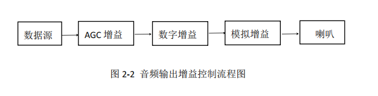

# [Ingenic T31 Application Development][toc]

Audio Outputs
-------------

### What is audio output?

In fact, cell phones, any device has the concept of audio output. For example, if you play the song 
"Just because you are too beautiful" on the computer, the computer through Netease cloud music, or other music,
call the underlying driver of the computer, and finally convert the digital signal into an analog signal in the
device inside the speaker hardware playback.

Ingenic T31 chip also provides such an interface, Ingenic chip also has two pins, connected to the docking speakers,
hardware, through the specific API for control, and then to achieve the Ingenic chip microphone captured sound, 
transmitted to the Ingenic T31 chip speakers play.


### Audio output system block diagram




### Code details for audio output


#### Audio output test thread_ao_test_play_thread: this is the demo program given by Junzheng.

Basic algorithm: 

we need to apply a temporary memory, because we need to transfer the audio file from the chip to the chip's memory,
because the chip can't manipulate the flash fast enough, we will give the task of calculating the memory.

Calculate the method of memory:

`AO_TEST_BUF_SIZE = (AO_TEST_SAMPLE_RATE*sizeof(short)*AO_TEST_SAMPLE_TIME/1000)`

Where Hz (Hertz) is the unit of frequency, its meaning is the number of times per second, 
which we sample rate is 16000, that is, we sample 16000 times per second.

This buffer means, the size of our audio data in 20 ho seconds, which is the size of the audio file cache we read.

```
#define AO_TEST_SAMPLE_RATE 16000
#define AO_TEST_SAMPLE_TIME 20
#define AO_TEST_BUF_SIZE (AO_TEST_SAMPLE_RATE * sizeof(short) * AO_TEST_SAMPLE_TIME / 1000)
#define AO_BASIC_TEST_PLAY_FILE  "./ao_paly.pcm"

buf = (unsigned char *)malloc(AO_TEST_BUF_SIZE);
if (buf == NULL) {
    IMP_LOG_ERR(TAG, "[ERROR] %s: malloc audio buf error\n", __func__);
    return NULL;
}
```

#### IMP_AO_SetPubAttr

```
/* Step 1: set public attribute of AO device. */

/*
 * AI is very similar, but there's one point that the user manual doesn't make clear,
 * the devID is not spelled out, and the test cases use 0, which we use on our side as well.
 */

int devID = 0;
IMPAudioIOAttr attr;
attr.samplerate = AUDIO_SAMPLE_RATE_16000;
attr.bitwidth = AUDIO_BIT_WIDTH_16;
attr.soundmode = AUDIO_SOUND_MODE_MONO;
attr.frmNum = 20;
attr.numPerFrm = 640;
attr.chnCnt = 1;
ret = IMP_AO_SetPubAttr(devID, &attr);
if (ret != 0) {
    IMP_LOG_ERR(TAG, "set ao %d attr err: %d\n", devID, ret);
    return NULL;
}
```

#### IMP_AO_SendFrame, IMP_AO_QueryChnStat

The concept of blocking and non-blocking:

Blocking is the process of waiting, when to wait, for example, when you pass to the AO data, 
we need to wait for the last time to send all the data sent before we continue to send the 
next frame of audio data, otherwise it will produce the feeling of audio breakage.

Because blocking is the only way to ensure that the data we pass is complete, with a small number of cases.

For example, in the case of RTMP protocol, there are times when we black out due to network
fluctuations because we are pursuing live real-time audio and video, but at this time, due
to the network instability, retransmission is not possible when using the UDP protocol 
because we want to ensure the real-time nature of our live broadcast.

```
/**
 * Audio stream blocking type
 */

typedef enum {
    BLOCK = 0,                /**< blocking */
    NOBLOCK = 1,            /**< non-blocking */
} IMPBlock;

/* Step 5: send frame data. We use blocking mode for */
IMPAudioFrame frm;
frm.virAddr = (uint32_t *)buf;
frm.len = size;
ret = IMP_AO_SendFrame(devID, chnID, &frm, BLOCK);
if (ret != 0) {
    IMP_LOG_ERR(TAG, "send Frame Data error\n");
    return NULL;
}

/* Queries the current audio data cache status in the audio output channels */
IMPAudioOChnState play_status;
ret = IMP_AO_QueryChnStat(devID, chnID, &play_status);
if (ret != 0) {
    IMP_LOG_ERR(TAG, "IMP_AO_QueryChnStat error\n");
    return NULL;
}
```

#### IMP_AO_PauseChn, IMP_AO_ClearChnBuf, IMP_AO_ResumeChn

When it reaches 40 frames, pause the interface that plays the audio, 
then type any character inside the linux command line and resume the
interface that plays the audio file.

```
if (++i == 40) {
    ret = IMP_AO_PauseChn(devID, chnID);
    if (ret != 0) {
        IMP_LOG_ERR(TAG, "IMP_AO_PauseChn error\n");
        return NULL;
    }

    printf("[INFO] Test : Audio Play Pause test.\n");
    printf("[INFO]      : Please input any key to continue.\n");
    getchar();

    ret = IMP_AO_ClearChnBuf(devID, chnID);
    if (ret != 0) {
        IMP_LOG_ERR(TAG, "IMP_AO_ClearChnBuf error\n");
        return NULL;
    }

    ret = IMP_AO_ResumeChn(devID, chnID);
    if (ret != 0) {
        IMP_LOG_ERR(TAG, "IMP_AO_ResumeChn error\n");
        return NULL;
    }
}
```

### Ingenic audio output demo

```
static void *_ao_test_play_thread(void *argv)
{
    unsigned char *buf = NULL;
    int size = 0;
    int ret = -1;

    buf = (unsigned char *)malloc(AO_TEST_BUF_SIZE);
    if (buf == NULL) {
        IMP_LOG_ERR(TAG, "[ERROR] %s: malloc audio buf error\n", __func__);
        return NULL;
    }

    FILE *play_file = fopen(AO_BASIC_TEST_PLAY_FILE, "rb");
    if (play_file == NULL) {
        IMP_LOG_ERR(TAG, "[ERROR] %s: fopen %s failed\n", __func__, AO_BASIC_TEST_PLAY_FILE);
        return NULL;
    }

    /* Step 1: set public attribute of AO device. */
    int devID = 0;
    IMPAudioIOAttr attr;
    attr.samplerate = AUDIO_SAMPLE_RATE_16000;
    attr.bitwidth = AUDIO_BIT_WIDTH_16;
    attr.soundmode = AUDIO_SOUND_MODE_MONO;
    attr.frmNum = 20;
    attr.numPerFrm = 640;
    attr.chnCnt = 1;
    ret = IMP_AO_SetPubAttr(devID, &attr);
    if (ret != 0) {
        IMP_LOG_ERR(TAG, "set ao %d attr err: %d\n", devID, ret);
        return NULL;
    }

    memset(&attr, 0x0, sizeof(attr));
    ret = IMP_AO_GetPubAttr(devID, &attr);
    if (ret != 0) {
        IMP_LOG_ERR(TAG, "get ao %d attr err: %d\n", devID, ret);
        return NULL;
    }

    IMP_LOG_INFO(TAG, "Audio Out GetPubAttr samplerate:%d\n", attr.samplerate);
    IMP_LOG_INFO(TAG, "Audio Out GetPubAttr   bitwidth:%d\n", attr.bitwidth);
    IMP_LOG_INFO(TAG, "Audio Out GetPubAttr  soundmode:%d\n", attr.soundmode);
    IMP_LOG_INFO(TAG, "Audio Out GetPubAttr     frmNum:%d\n", attr.frmNum);
    IMP_LOG_INFO(TAG, "Audio Out GetPubAttr  numPerFrm:%d\n", attr.numPerFrm);
    IMP_LOG_INFO(TAG, "Audio Out GetPubAttr     chnCnt:%d\n", attr.chnCnt);

    /* Step 2: enable AO device. */
    ret = IMP_AO_Enable(devID);
    if (ret != 0) {
        IMP_LOG_ERR(TAG, "enable ao %d err\n", devID);
        return NULL;
    }

    /* Step 3: enable AI channel. */
    int chnID = 0;
    ret = IMP_AO_EnableChn(devID, chnID);
    if (ret != 0) {
        IMP_LOG_ERR(TAG, "Audio play enable channel failed\n");
        return NULL;
    }

    /* Step 4: Set audio channel volume. */
    int chnVol = 80;
    ret = IMP_AO_SetVol(devID, chnID, chnVol);
    if (ret != 0) {
        IMP_LOG_ERR(TAG, "Audio Play set volume failed\n");
        return NULL;
    }

    ret = IMP_AO_GetVol(devID, chnID, &chnVol);
    if (ret != 0) {
        IMP_LOG_ERR(TAG, "Audio Play get volume failed\n");
        return NULL;
    }
    IMP_LOG_INFO(TAG, "Audio Out GetVol    vol:%d\n", chnVol);

    int aogain = 28;
    ret = IMP_AO_SetGain(devID, chnID, aogain);
    if (ret != 0) {
        IMP_LOG_ERR(TAG, "Audio Record Set Gain failed\n");
        return NULL;
    }

    ret = IMP_AO_GetGain(devID, chnID, &aogain);
    if (ret != 0) {
        IMP_LOG_ERR(TAG, "Audio Record Get Gain failed\n");
        return NULL;
    }
    IMP_LOG_INFO(TAG, "Audio Out GetGain    gain : %d\n", aogain);

    int i = 0;
    while (1) {
        size = fread(buf, 1, AO_TEST_BUF_SIZE, play_file);
        if (size < AO_TEST_BUF_SIZE)
            break;

        /* Step 5: send frame data. */
        IMPAudioFrame frm;
        frm.virAddr = (uint32_t *)buf;
        frm.len = size;
        ret = IMP_AO_SendFrame(devID, chnID, &frm, BLOCK);
        if (ret != 0) {
            IMP_LOG_ERR(TAG, "send Frame Data error\n");
            return NULL;
        }

        IMPAudioOChnState play_status;
        ret = IMP_AO_QueryChnStat(devID, chnID, &play_status);
        if (ret != 0) {
            IMP_LOG_ERR(TAG, "IMP_AO_QueryChnStat error\n");
            return NULL;
        }

        IMP_LOG_INFO(TAG, "Play: TotalNum %d, FreeNum %d, BusyNum %d\n",
                play_status.chnTotalNum, play_status.chnFreeNum, play_status.chnBusyNum);

        if (++i == 40) {
            ret = IMP_AO_PauseChn(devID, chnID);
            if (ret != 0) {
                IMP_LOG_ERR(TAG, "IMP_AO_PauseChn error\n");
                return NULL;
            }

            printf("[INFO] Test : Audio Play Pause test.\n");
            printf("[INFO]      : Please input any key to continue.\n");
            getchar();

            ret = IMP_AO_ClearChnBuf(devID, chnID);
            if (ret != 0) {
                IMP_LOG_ERR(TAG, "IMP_AO_ClearChnBuf error\n");
                return NULL;
            }

            ret = IMP_AO_ResumeChn(devID, chnID);
            if (ret != 0) {
                IMP_LOG_ERR(TAG, "IMP_AO_ResumeChn error\n");
                return NULL;
            }
        }
    }
    ret = IMP_AO_FlushChnBuf(devID, chnID);
    if (ret != 0) {
        IMP_LOG_ERR(TAG, "IMP_AO_FlushChnBuf error\n");
        return NULL;
    }
    /* Step 6: disable the audio channel. */
    ret = IMP_AO_DisableChn(devID, chnID);
    if (ret != 0) {
        IMP_LOG_ERR(TAG, "Audio channel disable error\n");
        return NULL;
    }

    /* Step 7: disable the audio devices. */
    ret = IMP_AO_Disable(devID);
    if (ret != 0) {
        IMP_LOG_ERR(TAG, "Audio device disable error\n");
        return NULL;
    }

    fclose(play_file);
    free(buf);
    pthread_exit(0);
}
```

[toc]: index.md
