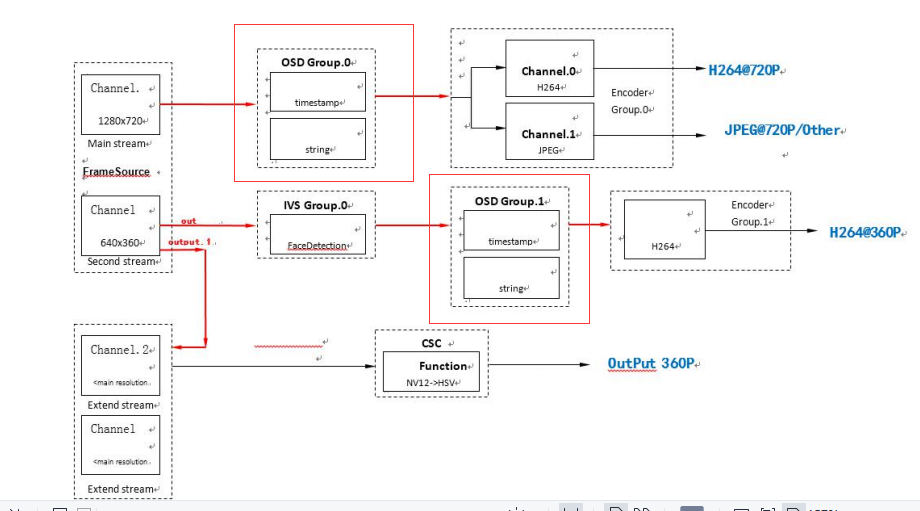
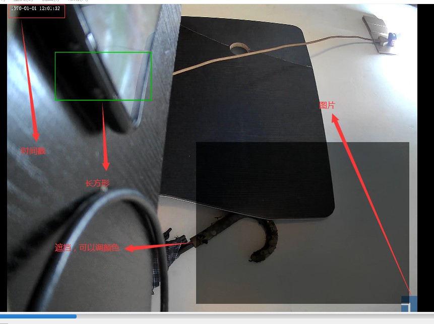

# [Ingenic T31 Application Development][toc]

OSD Application
---------------

### Introduction to OSD Application

Overlay specific information into the video, such as dot matrix data, straight line, 
rectangle box, rectangle mask, picture data, etc. The IPU module operates on the image
mainly including OSD module and CSC module.

The operation of IPU module on image mainly includes OSD module and CSC module.

The OSD module mainly superimposes frame lines, rectangle masks, pictures and other 
data on top of the video frame.

The CSC module converts the input video frames into hardware-supported images, 
such as HSV, NV12, NV21, RGB32, ARGB or any other formats.

#### What is OSD?

The data information superimposed on the video data is called OSD region (Region), 
the system uses the OSD device module to manage these OSD regions, the OSD device 
module supports region creation, supports the type of region configured through 
the region attribute setting interface.

(OSD device module supports the creation of regions and the configuration of the 
type of region through the region attribute setting interface (such as the configuration 
of the region display attributes, location coordinates, foreground and background
colors, etc.) to support the destruction of the region of the action, etc.

After the OSD region has been created, registered, and properties have been set, 
the OSD region will call the IPU for drawing.

#### The position of the OSD in the whole system.



#### Sequence of OSD module calls:

First is the initialization process:

1. create OSD group, use IMP_OSD_CreateGroup to create an OSD group;
2. create an OSD region, use IMP_OSD_CreateRgn to create a region. 3. register an OSD region to an OSD group;
3. register the OSD region to the OSD group, using IMP_OSD_RegisterRgn to register the created region to the OSD group.

Register the created region to the OSD group via IMP_OSD_RegisterRgn;

4. set OSD group region attributes and region attributes, set region attributes via IMP_OSD_SetRgnAttr.

Set the area group attributes via IMP_OSD_SetGrpRgnAttr;

5. set the OSD function display switch, enable the osd display through IMP_OSD_ShowRgn. 6. bind the OSD group to the OSD group;
6. bind the OSD group to the system, bind the OSD module to other modules through IMP_System_Bind.

Bind the OSD module to the system by IMP_System_Bind.

Next is the exit process:

1. unbind, by IMP_System_UnBind;
2. disable the OSD function display switch, IMP_OSD_ShowRgn disable osd display;
3. cancel the OSD area in the OSD group, cancel the area by IMP_OSD_UnRegisterRgn
4. destroy the OSD area, via IMP_OSD_DestroyRgn destroy the area
5. destroy the OSD group and finally destroy the group via IMP_OSD_DestroyGroup


#### Functions called by the API


### Detailed analysis of Ingenic's demo:

#### Initialize OSD Function with `sample_osd_init`

The demo mainly initializes four different OSD handles, each handle is 
actually the type of each OSD.

They are time, picture, occlusion, rectangle type image, which also 
corresponds to the four types supported by our Ingenic chip.

```
int ret;
IMPRgnHandle *prHander;
IMPRgnHandle rHanderFont;
IMPRgnHandle rHanderLogo;
IMPRgnHandle rHanderCover;
IMPRgnHandle rHanderRect;

prHander = malloc(4 * sizeof(IMPRgnHandle));
if (prHander <= 0) {
    IMP_LOG_ERR(TAG, "malloc() error !\n");
    return NULL;
}
```

###### Create region of OSD: IMP_OSD_CreateRgn

This function is used to create our OSD region.

For example, if you want to add some OSD information on top of the video stream, 
then you have to call this function to allocate some resources to it, and if it 
allocates successfully, the return value is the handle of the OSD region you created.

```
/**
 * @fn IMPRgnHandle IMP_OSD_CreateRgn(IMPOSDRgnAttr *prAttr)
 *
 * Creating an OSD area
 *
 * @param[in] prAttr OSD Regional Properties
 *
 * @retval >= 0  Success
 * @retval < 0   Failure
 *
 * @remarks    None.
 *
 * @attention  None.
 */
IMPRgnHandle IMP_OSD_CreateRgn(IMPOSDRgnAttr *prAttr);
```

##### Register OSD's region function with `IMP_OSD_RegisterRgn`

Register the handle of the OSD group we just created above into this function to notify
the Ingenic T31 chip that we have just registered the OSD area information into it.

```
/**
 * @fn int IMP_OSD_RegisterRgn(IMPRgnHandle handle, int grpNum, IMPOSDGrpRgnAttr *pgrAttr)
 *
 * Registered OSD area
 *
 * @param[in] handle Area handle, return value of IMP_OSD_CreateRgn
 * @param[in] grpNum OSD group number
 * @param[in] pgrAttr OSD Group Display Properties
 *
 * @retval 0         Success
 * @retval non-zero  Failure
 *
 * @remarks    Calling this API requires that the corresponding OSD group has been created.
 *
 * @attention  none.
 */
int IMP_OSD_RegisterRgn(IMPRgnHandle handle, int grpNum, IMPOSDGrpRgnAttr *pgrAttr);
```

##### Sets the region attribute with `IMP_OSD_SetRgnAttr`

This is the area property of the timestamp we want to display, first we set it to the picture `OSD_REG_PIC`

Then we set the size information of this OSD area, the starting point of the coordinates is `(10,10)`.

Then we need how much space? For example, `1970-02-20:13-23-23`, this needs about 19 digital units.

So we used `OSD_REGION_WIDTH` multiplied by 20 times.

The exact size is defined according to the file provided to us by our demo.

```
    IMPOSDRgnAttr rAttrFont;
    memset(&rAttrFont, 0, sizeof(IMPOSDRgnAttr));
    rAttrFont.type = OSD_REG_PIC;
    rAttrFont.rect.p0.x = 10;
    rAttrFont.rect.p0.y = 10;
    rAttrFont.rect.p1.x = rAttrFont.rect.p0.x + 20 * OSD_REGION_WIDTH- 1;   //p0 is start，and p1 well be epual p0+width(or heigth)-1
    rAttrFont.rect.p1.y = rAttrFont.rect.p0.y + OSD_REGION_HEIGHT - 1;
#ifdef SUPPORT_RGB555LE
    rAttrFont.fmt = PIX_FMT_RGB555LE;
#else
    rAttrFont.fmt = PIX_FMT_BGRA;
#endif
    rAttrFont.data.picData.pData = NULL;
    ret = IMP_OSD_SetRgnAttr(rHanderFont, &rAttrFont);
    if (ret < 0) {
        IMP_LOG_ERR(TAG, "IMP_OSD_SetRgnAttr TimeStamp error !\n");
        return NULL;
    }
```

##### Sets the region characteristic of the group with `IMP_OSD_SetGrpRgnAttr`

```
/**
 * OSD Group Area Attributes
 */
typedef struct {
    int        show;         /**< Display switch */
    IMPPoint   offPos;       /**< Display start coordinates */
    float      scalex;       /**< Scaling x parameter */
    float      scaley;       /**< Scaling y parameter */
    int        gAlphaEn;     /**< Alpha enabled */
    int        fgAlhpa;      /**< Foreground Alpha */
    int        bgAlhpa;      /**< Background Alpha */
    int        layer;        /**< Display layer */
} IMPOSDGrpRgnAttr;
```

```
IMPOSDGrpRgnAttr grAttrFont;
if (IMP_OSD_GetGrpRgnAttr(rHanderFont, grpNum, &grAttrFont) < 0) {
    IMP_LOG_ERR(TAG, "IMP_OSD_GetGrpRgnAttr Logo error !\n");
    return NULL;
}
memset(&grAttrFont, 0, sizeof(IMPOSDGrpRgnAttr));
grAttrFont.show = 0;

/* Disable Font global alpha, only use pixel alpha. */
grAttrFont.gAlphaEn = 1;
grAttrFont.fgAlhpa = 0xff;
grAttrFont.layer = 3;
if (IMP_OSD_SetGrpRgnAttr(rHanderFont, grpNum, &grAttrFont) < 0) {
    IMP_LOG_ERR(TAG, "IMP_OSD_SetGrpRgnAttr Logo error !\n");
    return NULL;
}
```


##### Enables the display of the OSD group with `IMP_OSD_Start`

```
/**
 * @fn int IMP_OSD_Start(int grpNum)
 *
 * Setting the Start OSD group display
 *
 * @param[in] grpNum OSD group number
 *
 * @retval 0         Success
 * @retval non-zero  Failure
 *
 * @remarks     Calling this API requires that the corresponding OSD group has been created.
 *
 * @attention   None.
 */
int IMP_OSD_Start(int grpNum);
```

#### Binding OSD layers to our coding sequence


```
/* Step.5 Bind */
IMPCell osdcell = {DEV_ID_OSD, grpNum, 0};
ret = IMP_System_Bind(&chn[0].framesource_chn, &osdcell);
if (ret < 0) {
    IMP_LOG_ERR(TAG, "Bind FrameSource channel0 and OSD failed\n");
    return -1;
}

ret = IMP_System_Bind(&osdcell, &chn[0].imp_encoder);
if (ret < 0) {
    IMP_LOG_ERR(TAG, "Bind OSD and Encoder failed\n");
    return -1;
}
```

#### Open the video source and get the video stream and save it

```
/* Step.7 Stream On */
IMP_FrameSource_SetFrameDepth(0, 0);
ret = sample_framesource_streamon();
if (ret < 0) {
    IMP_LOG_ERR(TAG, "ImpStreamOn failed\n");
    return -1;
}

/* Step.6 Get stream */
if (byGetFd) {
    ret = sample_get_video_stream_byfd();
    if (ret < 0) {
        IMP_LOG_ERR(TAG, "Get video stream byfd failed\n");
        return -1;
    }
} else {
    ret = sample_get_video_stream();
    if (ret < 0) {
        IMP_LOG_ERR(TAG, "Get video stream failed\n");
        return -1;
    }
}
```

#### Constantly update timestamp with `thread update_thread`

If we just need to embed an image, or set a mask area, and some immobile images and so on OSD, 
then this step is not needed at all, but our timestamp needs to be changed with the time change.

So we have to dynamically display the timestamp OSD information according to the time change.

Mainly according to the localtime system function, get the current time of the system, and then
according to the current time to write the OSD need to display the content of the data.

```
static void *update_thread(void *p)
{
    int ret;

    /*generate time*/
    char DateStr[40];
    time_t currTime;
    struct tm *currDate;
    unsigned i = 0, j = 0;
    void *dateData = NULL;
    uint32_t *data = p;
    IMPOSDRgnAttrData rAttrData;

    ret = osd_show();
    if (ret < 0) {
        IMP_LOG_ERR(TAG, "OSD show error\n");
        return NULL;
    }

    while(1) {
        int penpos_t = 0;
        int fontadv = 0;

        time(&currTime);
        currDate = localtime(&currTime);
        memset(DateStr, 0, 40);
        strftime(DateStr, 40, "%Y-%m-%d %I:%M:%S", currDate);
        for (i = 0; i < OSD_LETTER_NUM; i++) {
            switch(DateStr[i]) {
                case '0' ... '9':
                    dateData = (void *)gBgramap[DateStr[i] - '0'].pdata;
                    fontadv = gBgramap[DateStr[i] - '0'].width;
                    penpos_t += gBgramap[DateStr[i] - '0'].width;
                    break;
                case '-':
                    dateData = (void *)gBgramap[10].pdata;
                    fontadv = gBgramap[10].width;
                    penpos_t += gBgramap[10].width;
                    break;
                case ' ':
                    dateData = (void *)gBgramap[11].pdata;
                    fontadv = gBgramap[11].width;
                    penpos_t += gBgramap[11].width;
                    break;
                case ':':
                    dateData = (void *)gBgramap[12].pdata;
                    fontadv = gBgramap[12].width;
                    penpos_t += gBgramap[12].width;
                    break;
                default:
                    break;
            }
#ifdef SUPPORT_RGB555LE
            for (j = 0; j < OSD_REGION_HEIGHT; j++) {
                memcpy((void *)((uint16_t *)data + j*OSD_LETTER_NUM*OSD_REGION_WIDTH + penpos_t),
                        (void *)((uint16_t *)dateData + j*fontadv), fontadv*sizeof(uint16_t));
            }
#else
            for (j = 0; j < OSD_REGION_HEIGHT; j++) {
                memcpy((void *)((uint32_t *)data + j*OSD_LETTER_NUM*OSD_REGION_WIDTH + penpos_t),
                        (void *)((uint32_t *)dateData + j*fontadv), fontadv*sizeof(uint32_t));
            }

#endif
        }
        rAttrData.picData.pData = data;
        IMP_OSD_UpdateRgnAttrData(prHander[0], &rAttrData);

        sleep(1);
    }

    return NULL;
}
```


#### Release Resource Functions

It's the same as the previous lessons, so I won't explain it again. 
It's just some anti-initialization functions and things like that.


### Experimental Phenomena




[toc]: index.md
