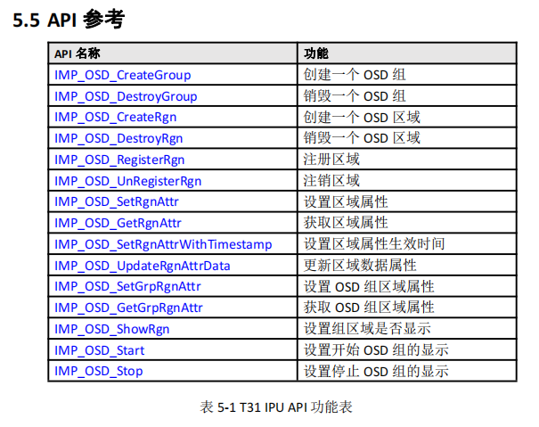
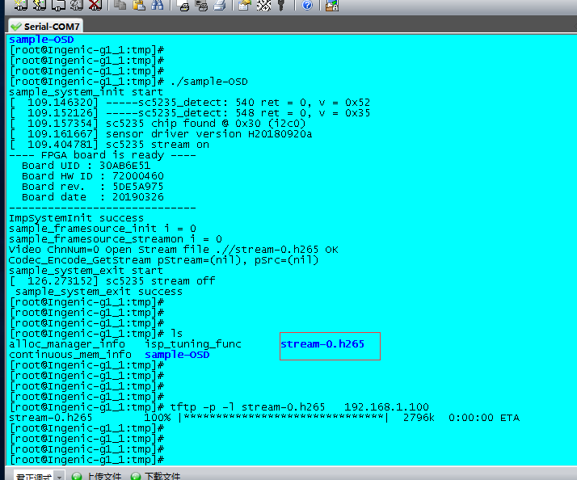

# 君正T31应用开发11：OSD应用

## 君正T31应用开发11：OSD应用

原创

**发布于** **2023-06-22 08:41:38**

**210**0

**举报**

# 1.OSD应用简介

将特定的信息叠加到视频当中，如点阵数据，直线，矩形框，矩形遮挡，图片数据等等。

IPU模块对图像的操作主要包含OSD模块和CSC模块。

OSD模块主要在视频桢上面叠加框线，矩形遮挡，图片等数据。

CSC模块主要把输入视频桢转化成硬件支持的图像，如HSV格式，NV12，NV21，RGB32，ARGB格式的任意一种格式。

## 1.1:什么是OSD？

叠加在视频数据中的数据信息称为OSD区域（Region），系统中使用OSD设备模块来管理这些OSD区域，OSD设备模块支持区域创建，支持通过区域属性设置接口配置区域的类型。

（如配置区域区域显示的属性，位置坐标，前景色和背景色等等）支持区域的销毁的动作等等。

在OSD区域完成创建，注册，设置属性等操作后，OSD区域内部会统一调用IPU进行绘制。

## 1.2：OSD在整个系统的位置

​​

## 1.3 OSD模块调用的顺序：

首先是初始化流程：

1. 创建 OSD 组，使用 IMP_OSD_CreateGroup 创建一个 OSD 组；
2. 创建 OSD 区域，使用 IMP_OSD_CreateRgn 创建一个区域；
3. 注册 OSD 区域到 OSD 组中，通过 IMP_OSD_RegisterRgn 将创建的区域注册到

OSD 组中；

4. 设置 OSD 组区域属性和区域属性，通过 IMP_OSD_SetRgnAttr 设置区域属性，

通过 IMP_OSD_SetGrpRgnAttr 设置区域组属性；

5. 设置 OSD 功能显示开关，通过 IMP_OSD_ShowRgn 开启 osd 显示；
6. 绑定 OSD 组到系统中，通过 IMP_System_Bind 将 OSD 模块和其他模块进行绑

定。

接着是退出流程：

1. 解绑，通过 IMP_System_UnBind 进行解绑；
2. 关闭 OSD 功能显示开关，IMP_OSD_ShowRgn 关闭 osd 显示；
3. 注销 OSD 组中的 OSD 区域，通过 IMP_OSD_UnRegisterRgn 注销区域
4. 销毁 OSD 区域，通过 IMP_OSD_DestroyRgn 销毁区域
5. 销毁 OSD 组，最后通过 IMP_OSD_DestroyGroup 销毁组

## 1.4：API调用的函数

​​

# 2：君正的demo详细分析：

## 2.1：sample_osd_init初始化OSD函数

demo里面主要是初始化了四种不同的OSD句柄，每种句柄实际就是每个OSD的类型

分别是时间，图片，遮挡，长方形类型的图像，也对应我们君正芯片支持的四种类型。

```
    int ret;
    IMPRgnHandle *prHander;
    IMPRgnHandle rHanderFont;
    IMPRgnHandle rHanderLogo;
    IMPRgnHandle rHanderCover;
    IMPRgnHandle rHanderRect;

    prHander = malloc(4 * sizeof(IMPRgnHandle));
    if (prHander <= 0) {
        IMP_LOG_ERR(TAG, "malloc() error !\n");
        return NULL;
    }
```

复制

### 2.1.1创建OSD的区域：IMP_OSD_CreateRgn

这个函数是用来创建我们的OSD区域的。

比如你想要在视频流上面添加一些OSD的信息的话，那么你就必须调用这个函数，分配一些资源给它，它如果分配成功的话，返回值是你创建OSD区域的句柄。

```
/**
 * @fn IMPRgnHandle IMP_OSD_CreateRgn(IMPOSDRgnAttr *prAttr)
 *
 * 创建OSD区域
 *
 * @param[in] prAttr OSD区域属性
 *
 * @retval 大于等于0 成功
 * @retval 小于0 失败
 *
 * @remarks 无。
 *
 * @attention 无。
 */
IMPRgnHandle IMP_OSD_CreateRgn(IMPOSDRgnAttr *prAttr);
```

复制

### 2.1.2:注册OSD的区域函数IMP_OSD_RegisterRgn

将我们上面刚刚创建的OSD组的句柄，注册到这个函数里面，通知君正T31芯片，我们已经把刚才的OSD区域信息注册进去了。

```
/**
 * @fn int IMP_OSD_RegisterRgn(IMPRgnHandle handle, int grpNum, IMPOSDGrpRgnAttr *pgrAttr)
 *
 * 注册OSD区域
 *
 * @param[in] handle 区域句柄，IMP_OSD_CreateRgn的返回值
 * @param[in] grpNum OSD组号
 * @param[in] pgrAttr OSD组显示属性
 *
 * @retval 0 成功
 * @retval 非0 失败
 *
 * @remarks 调用此API时要求对应的OSD组已经创建。
 *
 * @attention 无。
 */
int IMP_OSD_RegisterRgn(IMPRgnHandle handle, int grpNum, IMPOSDGrpRgnAttr *pgrAttr);
```

复制

### 2.1.3:设置区域属性IMP_OSD_SetRgnAttr：

这是我们要显示的时间戳的区域属性，首先我们设置为图片OSD_REG_PIC

然后我们设置这个OSD区域的大小信息,坐标的起点信息是(10,10)

然后我们需要多少的空间呢？比如1970-02-20：13-23-23，这个需要大概19个数字的单位。

所以我们用了OSD_REGION_WIDTH乘以20倍的数值。

具体大小是根据我们的demo提供给我们的文件来定义的。

```

    IMPOSDRgnAttr rAttrFont;
    memset(&rAttrFont, 0, sizeof(IMPOSDRgnAttr));
    rAttrFont.type = OSD_REG_PIC;
    rAttrFont.rect.p0.x = 10;
    rAttrFont.rect.p0.y = 10;
    rAttrFont.rect.p1.x = rAttrFont.rect.p0.x + 20 * OSD_REGION_WIDTH- 1;   //p0 is start，and p1 well be epual p0+width(or heigth)-1
    rAttrFont.rect.p1.y = rAttrFont.rect.p0.y + OSD_REGION_HEIGHT - 1;
#ifdef SUPPORT_RGB555LE
    rAttrFont.fmt = PIX_FMT_RGB555LE;
#else
    rAttrFont.fmt = PIX_FMT_BGRA;
#endif
    rAttrFont.data.picData.pData = NULL;
    ret = IMP_OSD_SetRgnAttr(rHanderFont, &rAttrFont);
    if (ret < 0) {
        IMP_LOG_ERR(TAG, "IMP_OSD_SetRgnAttr TimeStamp error !\n");
        return NULL;
    }
```

复制

### 2.1.4：设置组的区域特性IMP_OSD_SetGrpRgnAttr

```
/**
 * OSD组区域属性
 */
typedef struct {
    int                    show;            /**< 是否显示 */
    IMPPoint            offPos;            /**< 显示起始坐标 */
    float                scalex;            /**< 缩放x参数 */
    float                scaley;            /**< 缩放y参数 */
    int                    gAlphaEn;        /**< Alpha开关 */
    int                    fgAlhpa;        /**< 前景Alpha */
    int                    bgAlhpa;        /**< 背景Alpha */
    int                    layer;            /**< 显示层 */
} IMPOSDGrpRgnAttr;
```

复制

```
    IMPOSDGrpRgnAttr grAttrFont;
    if (IMP_OSD_GetGrpRgnAttr(rHanderFont, grpNum, &grAttrFont) < 0) {
        IMP_LOG_ERR(TAG, "IMP_OSD_GetGrpRgnAttr Logo error !\n");
        return NULL;

    }
    memset(&grAttrFont, 0, sizeof(IMPOSDGrpRgnAttr));
    grAttrFont.show = 0;

    /* Disable Font global alpha, only use pixel alpha. */
    grAttrFont.gAlphaEn = 1;
    grAttrFont.fgAlhpa = 0xff;
    grAttrFont.layer = 3;
    if (IMP_OSD_SetGrpRgnAttr(rHanderFont, grpNum, &grAttrFont) < 0) {
        IMP_LOG_ERR(TAG, "IMP_OSD_SetGrpRgnAttr Logo error !\n");
        return NULL;
    }
```

复制

### 2.1.5：开启OSD组的显示IMP_OSD_Start

```
/**
 * @fn int IMP_OSD_Start(int grpNum)
 *
 * 设置开始OSD组的显示
 *
 * @param[in] grpNum OSD组号
 *
 * @retval 0 成功
 * @retval 非0 失败
 *
 * @remarks 调用此API时要求对应的OSD组已经创建。
 *
 * @attention 无。
 */
int IMP_OSD_Start(int grpNum);
```

复制

## 2.2：绑定OSD图层到我们的编码顺序中

​​

```
    /* Step.5 Bind */
    IMPCell osdcell = {DEV_ID_OSD, grpNum, 0};
    ret = IMP_System_Bind(&chn[0].framesource_chn, &osdcell);
    if (ret < 0) {
        IMP_LOG_ERR(TAG, "Bind FrameSource channel0 and OSD failed\n");
        return -1;
    }

    ret = IMP_System_Bind(&osdcell, &chn[0].imp_encoder);
    if (ret < 0) {
        IMP_LOG_ERR(TAG, "Bind OSD and Encoder failed\n");
        return -1;
    }
```

复制

## 2.3：打开视频源，并获取视频流并保存下来

```
    /* Step.7 Stream On */
    IMP_FrameSource_SetFrameDepth(0, 0);
    ret = sample_framesource_streamon();
    if (ret < 0) {
        IMP_LOG_ERR(TAG, "ImpStreamOn failed\n");
        return -1;
    }

    /* Step.6 Get stream */
    if (byGetFd) {
        ret = sample_get_video_stream_byfd();
        if (ret < 0) {
            IMP_LOG_ERR(TAG, "Get video stream byfd failed\n");
            return -1;
        }
    } else {
        ret = sample_get_video_stream();
        if (ret < 0) {
            IMP_LOG_ERR(TAG, "Get video stream failed\n");
            return -1;
        }
    }
```

复制

## 2.4：不断更新时间戳线程update_thread

如果我们只是需要嵌入一张图片，或者设置一个遮挡区域，还有一些不动的图片之类的OSD的话，那么这个步奏是完全不需要的，但是我们的时间戳需要随着时间的改变而进行改变。

所以这个时候我们必须要根据时间的变化来动态的显示时间戳这个OSD的信息了。

主要就是根据localtime这个系统函数，获取系统当前的时间，然后按照当前的时间去写入OSD需要显示的数据内容。

```
static void *update_thread(void *p)
{
    int ret;

    /*generate time*/
    char DateStr[40];
    time_t currTime;
    struct tm *currDate;
    unsigned i = 0, j = 0;
    void *dateData = NULL;
    uint32_t *data = p;
    IMPOSDRgnAttrData rAttrData;

    ret = osd_show();
    if (ret < 0) {
        IMP_LOG_ERR(TAG, "OSD show error\n");
        return NULL;
    }

    while(1) {
            int penpos_t = 0;
            int fontadv = 0;

            time(&currTime);
            currDate = localtime(&currTime);
            memset(DateStr, 0, 40);
            strftime(DateStr, 40, "%Y-%m-%d %I:%M:%S", currDate);
            for (i = 0; i < OSD_LETTER_NUM; i++) {
                switch(DateStr[i]) {
                    case '0' ... '9':
                        dateData = (void *)gBgramap[DateStr[i] - '0'].pdata;
                        fontadv = gBgramap[DateStr[i] - '0'].width;
                        penpos_t += gBgramap[DateStr[i] - '0'].width;
                        break;
                    case '-':
                        dateData = (void *)gBgramap[10].pdata;
                        fontadv = gBgramap[10].width;
                        penpos_t += gBgramap[10].width;
                        break;
                    case ' ':
                        dateData = (void *)gBgramap[11].pdata;
                        fontadv = gBgramap[11].width;
                        penpos_t += gBgramap[11].width;
                        break;
                    case ':':
                        dateData = (void *)gBgramap[12].pdata;
                        fontadv = gBgramap[12].width;
                        penpos_t += gBgramap[12].width;
                        break;
                    default:
                        break;
                }
#ifdef SUPPORT_RGB555LE
                for (j = 0; j < OSD_REGION_HEIGHT; j++) {
                    memcpy((void *)((uint16_t *)data + j*OSD_LETTER_NUM*OSD_REGION_WIDTH + penpos_t),
                            (void *)((uint16_t *)dateData + j*fontadv), fontadv*sizeof(uint16_t));
                }
#else
                for (j = 0; j < OSD_REGION_HEIGHT; j++) {
                    memcpy((void *)((uint32_t *)data + j*OSD_LETTER_NUM*OSD_REGION_WIDTH + penpos_t),
                            (void *)((uint32_t *)dateData + j*fontadv), fontadv*sizeof(uint32_t));
                }

#endif
            }
            rAttrData.picData.pData = data;
            IMP_OSD_UpdateRgnAttrData(prHander[0], &rAttrData);

            sleep(1);
    }

    return NULL;
}
```

复制

## 2.5：释放资源函数

跟前几节课程是一样的，所以就不再说明了，就是一些反初始化函数之类的。

# 3：实验现象

​​

​​

原创声明：本文系作者授权腾讯云开发者社区发表，未经许可，不得转载。

如有侵权，请联系 [cloudcommunity@tencent.com](mailto:cloudcommunity@tencent.com) 删除。
