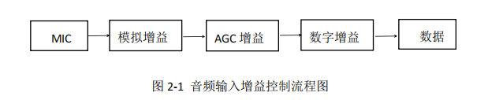

# 君正T31应用开发3-音频输入

## 君正T31应用开发3-音频输入

原创

**发布于** **2023-04-01 11:57:20**

**620**0

**举报**

# 1.T31芯片音频支持的功能

音频功能包含**音频输入，音频输出，回音消除，音频编码和音频解码** 5 个模块。

其中音频输入和音频输出存在设备和通道的概念。其中一个 MIC 认为是一个 Device，而一个 MIC 可以有多路 Channel 输入。同样的一个 SPK 认为是一个放音 Device， 而一个 SPK 也可以有多路 Channel 输出。当前版本的音频 API 一个 Device 只支持一个 Channel。 （T31只一路输入和一路输出）

回音消除位于音频输入接口中，具体说明在功能描述中体现。

# 2.主流的音频格式和T31支持的音频格式

## 2.1.主流的音频格式：（音视频常用到的音频格式）

**PCM：**大部分芯片出来的原始音频数据流。

**G711A&amp;G711U：**

G711是国际电信联盟ITU-T定制出来的一套语音压缩标准，它代表了对数PCM（logarithmic pulse-code modulation）抽样标准，主要用于电话。它主要用脉冲编码调制对音频采样，采样率为8k每秒。它利用一个 64Kbps 未压缩通道传输语音讯号。 起压缩率为1：2， 即把16位数据压缩成8位。G.711是主流的波形声音编解码器。

 G.711 标准下主要有两种压缩算法。一种是u-law algorithm （又称often u-law, ulaw, mu-law），主要运用于北美和日本；另一种是A-law algorithm，主要运用于欧洲和世界其他地区。其中，后者是特别设计用来方便计算机处理的

G711的内容是将14bit(uLaw)或者13bit(aLaw)采样的PCM数据编码成8bit的数据流，播放的时候在将此8bit的数据还原成14bit或者13bit进行播放，不同于MPEG这种对于整体或者一段数据进行考虑再进行编解码的做法，G711是波形编解码算法，就是一个sample对应一个编码，所以压缩比固定为：

8/14 = 57% (uLaw)

8/13 = 62% (aLaw)   简单理解，G.711就是语音模拟信号的一种非线性量化， bitrate 是64kbps

**AAC：**

AAC，全称Advanced Audio Coding，中文名：高级音频编码,是一种专为声音数据设计的文件压缩格式。与MP3不同，它采用了全新的算法进行编码，更加高效，具有更高的“性价比”。利用AAC格式，可使人感觉声音质量没有明显降低的前提下，更加小巧。苹果ipod、诺基亚手机支持AAC格式的音频文件。

## 2.2.T31目前支持的音频格式

音频编码当前音频 API 中支持 PT_G711A、PT_G711U 和 PT_G726 格式音频编码，

如需要增加新的编码方式，需要注册编码器。

音频解码当前音频 API 中支持 PT_G711A、PT_G711U 和 PT_G726 格式音频解码，

如需要增加新的解码方式，需要注册解码器。

# 3.代码框架流程图

以下我们画出系统的流程图：音频采集的过程图

MIC指带的东西就是咪头，用来把外界的声音采集进来，采集模拟信号进来，通过T31芯片转成数字信号，再以一定格式的内容保存成文件下来。

​​

# 4.代码实战

君正T31SDK里面提供了sample，关于如何从T31芯片获取音频裸数据，并保存到flash中的代码。

里面有几个函数需要重点讲解一下：

### 4.1：创建线程

**_ai_basic_record_test_thread：**我们所有的操作都是在这个线程里面运行的，你们可以理解为一个任务。

### 4.2：设置音频输入设备属性

**IMP_AI_SetPubAttr：**

```
	int devID = 1;                                           //devID:0:数字MIC，1：代表模拟MIC
	IMPAudioIOAttr attr;
	attr.samplerate = AUDIO_SAMPLE_RATE_16000;               //音频采样率为16000
	attr.bitwidth = AUDIO_BIT_WIDTH_16;                      //音频采样精度16位
	attr.soundmode = AUDIO_SOUND_MODE_MONO;                  //采取单声道模式
	attr.frmNum = 40;                                        //缓存帧的数目 
	attr.numPerFrm = 640;                                    //每帧的采样点个数
	attr.chnCnt = 1;                                         //支持的通道个数
	ret = IMP_AI_SetPubAttr(devID, &attr);
```

复制

### 4.3：获取音频原始桢数据

```
		/* Step 6: get audio record frame. */
		/*在使用IMP_AI_GetFrame之前使用该接口，当该接口调用成功之后表示音频
 		  数据已经准备完毕，可以使用IMP_AI_GetFrame获取音频数据*/
		ret = IMP_AI_PollingFrame(devID, chnID, 1000);
		if (ret != 0 ) {
			IMP_LOG_ERR(TAG, "Audio Polling Frame Data error\n");
		}
		/* 
		* @param[in] audioDevId 音频设备号.
 		* @param[in] aiChn 音频输入通道号.
 		* @param[out] frm 音频帧结构体指针.
 		* @param[in] block 阻塞/非阻塞标识.
 		*/
		IMPAudioFrame frm;
		ret = IMP_AI_GetFrame(devID, chnID, &frm, BLOCK);
		if(ret != 0) {
			IMP_LOG_ERR(TAG, "Audio Get Frame Data error\n");
			return NULL;
		}
		/* Step 8: release the audio record frame. */
		ret = IMP_AI_ReleaseFrame(devID, chnID, &frm);
		if(ret != 0) {
			IMP_LOG_ERR(TAG, "Audio release frame data error\n");
			return NULL;
		}
```

复制

### 4.4:君正原始SDK的DEMO程序

```
/*
 * Ingenic IMP AI implement.
 *
 * Copyright (C) 2017 Ingenic Semiconductor Co.,Ltd
 *
 */

#include <unistd.h>
#include <sys/ioctl.h>
#include <sys/prctl.h>
#include <string.h>
#include <stdio.h>
#include <stdlib.h>
#include <math.h>
#include <stdint.h>
#include <errno.h>
#include <pthread.h>
#include <semaphore.h>
#include <fcntl.h>
#include <sys/time.h>

#include <imp/imp_audio.h>
#include <imp/imp_log.h>
#define TAG "Sample-AI"


#define AI_BASIC_TEST_RECORD_FILE "ai_lbb.pcm"
#define AI_BASIC_TEST_RECORD_NUM 600

static void *_ai_basic_record_test_thread(void *argv)
{
	int ret = -1;
	int record_num = 0;

	FILE *record_file = fopen(AI_BASIC_TEST_RECORD_FILE, "wb");
	if(record_file == NULL) {
		IMP_LOG_ERR(TAG, "fopen %s failed\n", AI_BASIC_TEST_RECORD_FILE);
		return NULL;
	}

	/* Step 1: set public attribute of AI device. */
	int devID = 1;
	IMPAudioIOAttr attr;
	attr.samplerate = AUDIO_SAMPLE_RATE_16000;
	attr.bitwidth = AUDIO_BIT_WIDTH_16;
	attr.soundmode = AUDIO_SOUND_MODE_MONO;
	attr.frmNum = 40;
	attr.numPerFrm = 640;
	attr.chnCnt = 1;
	ret = IMP_AI_SetPubAttr(devID, &attr);
	if(ret != 0) {
		IMP_LOG_ERR(TAG, "set ai %d attr err: %d\n", devID, ret);
		return NULL;
	}

	memset(&attr, 0x0, sizeof(attr));
	ret = IMP_AI_GetPubAttr(devID, &attr);
	if(ret != 0) {
		IMP_LOG_ERR(TAG, "get ai %d attr err: %d\n", devID, ret);
		return NULL;
	}

	IMP_LOG_INFO(TAG, "Audio In GetPubAttr samplerate : %d\n", attr.samplerate);
	IMP_LOG_INFO(TAG, "Audio In GetPubAttr   bitwidth : %d\n", attr.bitwidth);
	IMP_LOG_INFO(TAG, "Audio In GetPubAttr  soundmode : %d\n", attr.soundmode);
	IMP_LOG_INFO(TAG, "Audio In GetPubAttr     frmNum : %d\n", attr.frmNum);
	IMP_LOG_INFO(TAG, "Audio In GetPubAttr  numPerFrm : %d\n", attr.numPerFrm);
	IMP_LOG_INFO(TAG, "Audio In GetPubAttr     chnCnt : %d\n", attr.chnCnt);

	/* Step 2: enable AI device. */
	ret = IMP_AI_Enable(devID);
	if(ret != 0) {
		IMP_LOG_ERR(TAG, "enable ai %d err\n", devID);
		return NULL;
	}

	/* Step 3: set audio channel attribute of AI device. */
	int chnID = 0;
	IMPAudioIChnParam chnParam;
	chnParam.usrFrmDepth = 40;
	ret = IMP_AI_SetChnParam(devID, chnID, &chnParam);
	if(ret != 0) {
		IMP_LOG_ERR(TAG, "set ai %d channel %d attr err: %d\n", devID, chnID, ret);
		return NULL;
	}

	memset(&chnParam, 0x0, sizeof(chnParam));
	ret = IMP_AI_GetChnParam(devID, chnID, &chnParam);
	if(ret != 0) {
		IMP_LOG_ERR(TAG, "get ai %d channel %d attr err: %d\n", devID, chnID, ret);
		return NULL;
	}

	IMP_LOG_INFO(TAG, "Audio In GetChnParam usrFrmDepth : %d\n", chnParam.usrFrmDepth);

	/* Step 4: enable AI channel. */
	ret = IMP_AI_EnableChn(devID, chnID);
	if(ret != 0) {
		IMP_LOG_ERR(TAG, "Audio Record enable channel failed\n");
		return NULL;
	}

	/* Step 5: Set audio channel volume. */
	int chnVol = 60;
	ret = IMP_AI_SetVol(devID, chnID, chnVol);
	if(ret != 0) {
		IMP_LOG_ERR(TAG, "Audio Record set volume failed\n");
		return NULL;
	}

	ret = IMP_AI_GetVol(devID, chnID, &chnVol);
	if(ret != 0) {
		IMP_LOG_ERR(TAG, "Audio Record get volume failed\n");
		return NULL;
	}
	IMP_LOG_INFO(TAG, "Audio In GetVol    vol : %d\n", chnVol);

	int aigain = 28;
	ret = IMP_AI_SetGain(devID, chnID, aigain);
	if(ret != 0) {
		IMP_LOG_ERR(TAG, "Audio Record Set Gain failed\n");
		return NULL;
	}

	ret = IMP_AI_GetGain(devID, chnID, &aigain);
	if(ret != 0) {
		IMP_LOG_ERR(TAG, "Audio Record Get Gain failed\n");
		return NULL;
	}
	IMP_LOG_INFO(TAG, "Audio In GetGain    gain : %d\n", aigain);

	while(1) {
		/* Step 6: get audio record frame. */

		ret = IMP_AI_PollingFrame(devID, chnID, 1000);
		if (ret != 0 ) {
			IMP_LOG_ERR(TAG, "Audio Polling Frame Data error\n");
		}
		IMPAudioFrame frm;
		ret = IMP_AI_GetFrame(devID, chnID, &frm, BLOCK);
		if(ret != 0) {
			IMP_LOG_ERR(TAG, "Audio Get Frame Data error\n");
			return NULL;
		}

		printf("seq = %d,timeStamp = %lld\n",frm.seq,frm.timeStamp);

		/* Step 7: Save the recording data to a file. */
		fwrite(frm.virAddr, 1, frm.len, record_file);

		/* Step 8: release the audio record frame. */
		ret = IMP_AI_ReleaseFrame(devID, chnID, &frm);
		if(ret != 0) {
			IMP_LOG_ERR(TAG, "Audio release frame data error\n");
			return NULL;
		}

		if(++record_num >= AI_BASIC_TEST_RECORD_NUM)
			break;
	}
	sleep(3);
	/* Step 9: disable the audio channel. */
	ret = IMP_AI_DisableChn(devID, chnID);
	if(ret != 0) {
		IMP_LOG_ERR(TAG, "Audio channel disable error\n");
		return NULL;
	}

	/* Step 10: disable the audio devices. */
	ret = IMP_AI_Disable(devID);
	if(ret != 0) {
		IMP_LOG_ERR(TAG, "Audio device disable error\n");
		return NULL;
	}

	fclose(record_file);
	pthread_exit(0);
}

int main(void)
{
	int ret = -1;
	pthread_t record_thread_id;
	printf("[INFO] Test 1: Start audio record test.\n");
	printf("[INFO]        : Can create the %s file.\n", AI_BASIC_TEST_RECORD_FILE);
	printf("[INFO]        : Please input any key to continue.\n");
	getchar();

	/* Step 1: Start audio recording thread. */
	ret = pthread_create(&record_thread_id, NULL, _ai_basic_record_test_thread, NULL);
	if(ret != 0) {
		IMP_LOG_ERR(TAG, "[ERROR] %s: pthread_create Audio Record failed\n", __func__);
		return -1;
	}
	pthread_join(record_thread_id, NULL);
	return 0;
}
```

复制

原创声明：本文系作者授权腾讯云开发者社区发表，未经许可，不得转载。

如有侵权，请联系 [cloudcommunity@tencent.com](mailto:cloudcommunity@tencent.com) 删除。
