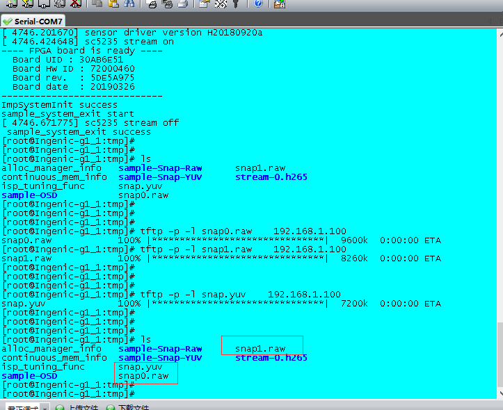

# 君正T31开发应用12：YUV和RAW数据

## 君正T31开发应用12：YUV和RAW数据

原创

**发布于** **2023-06-22 11:27:38**

**170**0

**举报**

# 1.什么是YUV数据和RAW数据？

## 1.1RAW数据

RAW数据是sensor出来的最原始的数据。

是没有办法直接使用的，还要在host端做ISP，做色彩纠正，增强，HDR，插值成RGB，转成YUV，最后再使用。

## 1.2：RGB数据

三原色数据，红绿蓝数据，常用的数据格式有

RGB888，真彩色，RGB565，RGB555等等格式，其中RGB888为真彩色，占用24位数据，而RGB565占用16位数据，大部分人体眼睛不会对色彩如此敏感，所以一般只需要使用RGB565格式即可。

## 1.3：YUV数据：

虽然所有的图像都可以选择RGB格式去表示，但是RGB图像对黑白图像的支持并不是很好。

因此大多数情况下，我们需要把RGB转成YUV格式。

YUV中的Y表示明亮度，就是灰度图，U和V分别对应Cb和Cr,代表色度，作用是描述影像色彩以及饱和度，用于指定像素的颜色。

* **NV12**

 NV12和NV21相比，差别只在于UVpalne里，两者UV的交替顺序是反的，NV12是VU交替。其余的和NV21是一样的，也是4个Y分量对应同一组UV分量；实际上就是我们常说的YUV：4:2:0   4个Y分量的数据，2个U和V分量的数据。大概占的空间是12位的数据。

​​

# 2：君正T31如何获取YUV和RAW数据

## 2.1：关键属性：设置通道属性为YUV属性或者RAW属性

RAW数据

```javascript
    fs_chn_attr[0].pixFmt = PIX_FMT_RAW;
    ret = IMP_FrameSource_SetChnAttr(0, &fs_chn_attr[0]);
    if (ret < 0) {
        IMP_LOG_ERR(TAG, "%s(%d):IMP_FrameSource_SetChnAttr failed\n", __func__, __LINE__);
        return -1;
    }
```

复制

YUV数据

```
    /* Step.3 Snap raw config */
    ret = IMP_FrameSource_GetChnAttr(0, &fs_chn_attr[0]);
    if (ret < 0) {
        IMP_LOG_ERR(TAG, "%s(%d):IMP_FrameSource_GetChnAttr failed\n", __func__, __LINE__);
        return -1;
    }
    fs_chn_attr[0].pixFmt = PIX_FMT_NV12;//PIX_FMT_YUYV422;
    ret = IMP_FrameSource_SetChnAttr(0, &fs_chn_attr[0]);
    if (ret < 0) {
        IMP_LOG_ERR(TAG, "%s(%d):IMP_FrameSource_SetChnAttr failed\n", __func__, __LINE__);
        return -1;
    }

    /* Step.3 config sensor reg to output colrbar raw data*/
    /* to do */

    /* Step.4 Stream On */
    if (chn[0].enable){
        ret = IMP_FrameSource_EnableChn(chn[0].index);
        if (ret < 0) {
            IMP_LOG_ERR(TAG, "IMP_FrameSource_EnableChn(%d) error: %d\n", ret, chn[0].index);
            return -1;
        }
    }
```

复制

## 2.2：获取YUV图像数据&RAW数据

```
    int m = 0;
    for (m=1;m<=51;m++) {
        ret = IMP_FrameSource_GetFrame(0, &frame_bak);
        if (ret < 0) {
            IMP_LOG_ERR(TAG, "%s(%d):IMP_FrameSource_GetFrame failed\n", __func__, __LINE__);
            return -1;
        }
        if(m%50==0) {
            fwrite((void *)frame_bak->virAddr, frame_bak->size, 1, fp);
            fclose(fp);
        }
        IMP_FrameSource_ReleaseFrame(0, frame_bak);
        if (ret < 0) {
            IMP_LOG_ERR(TAG, "%s(%d):IMP_FrameSource_ReleaseFrame failed\n", __func__, __LINE__);
            return -1;
        }
    }
```

复制

## 2.3：释放资源

跟原来的反初始化是一样的，不再赘述。

# 3：实验现象

​​

在没有进行压缩的情况下RAW数据是及其大的，远远比JPEG要大太多了，所以我们一般网络传输的过程中都是使用JPEG格式的图片进行传输，节省带宽。

在图像质量不达标的时候，我们才会去保存RAW数据和YUV数据去分析图像质量的问题。

大小对比。一般是五百万的像素的照片：

JPEG:105KB

YUV:7200KB

RAW:9600KB

下面是YUV图像实际的效果图。

​​

附录：截图YUV完整代码：

```
/*
 * sample-snap-raw.c
 *
 * Copyright (C) 2018 Ingenic Semiconductor Co.,Ltd
 */

#include <imp/imp_log.h>
#include <imp/imp_common.h>
#include <imp/imp_system.h>
#include <imp/imp_framesource.h>
#include <imp/imp_encoder.h>

#include "sample-common.h"

#define TAG "Sample-Snap-RAW"
extern struct chn_conf chn[];

int main(int argc, char *argv[])
{
    int ret;

    IMPFrameInfo *frame_bak;
    IMPFSChnAttr fs_chn_attr[2];
    FILE *fp;

    fp = fopen("/tmp/snap.yuv", "wb");
    if(fp == NULL) {
        IMP_LOG_ERR(TAG, "%s(%d):open error !\n", __func__, __LINE__);
        return -1;
    }

    /* Step.1 System init */
    ret = sample_system_init();
    if (ret < 0) {
        IMP_LOG_ERR(TAG, "IMP_System_Init() failed\n");
        return -1;
    }

    /* Step.2 FrameSource init */
    if (chn[0].enable) {
        ret = IMP_FrameSource_CreateChn(chn[0].index, &chn[0].fs_chn_attr);
        if(ret < 0){
            IMP_LOG_ERR(TAG, "IMP_FrameSource_CreateChn(chn%d) error !\n", chn[0].index);
            return -1;
        }

        ret = IMP_FrameSource_SetChnAttr(chn[0].index, &chn[0].fs_chn_attr);
        if (ret < 0) {
            IMP_LOG_ERR(TAG, "IMP_FrameSource_SetChnAttr(chn%d) error !\n",  chn[0].index);
            return -1;
        }
    }

    /* Step.3 Snap raw config */
    ret = IMP_FrameSource_GetChnAttr(0, &fs_chn_attr[0]);
    if (ret < 0) {
        IMP_LOG_ERR(TAG, "%s(%d):IMP_FrameSource_GetChnAttr failed\n", __func__, __LINE__);
        return -1;
    }
#if 0
    ret = IMP_ISP_Tuning_SetISPBypass(IMPISP_TUNING_OPS_MODE_DISABLE);
    if (ret < 0) {
        IMP_LOG_ERR(TAG, "%s(%d):IMP_ISP_Tuning_SetISPBpass failed\n", __func__, __LINE__);
        return -1;
    }
#endif
    fs_chn_attr[0].pixFmt = PIX_FMT_NV12;//PIX_FMT_YUYV422;
    ret = IMP_FrameSource_SetChnAttr(0, &fs_chn_attr[0]);
    if (ret < 0) {
        IMP_LOG_ERR(TAG, "%s(%d):IMP_FrameSource_SetChnAttr failed\n", __func__, __LINE__);
        return -1;
    }

    /* Step.3 config sensor reg to output colrbar raw data*/
    /* to do */

    /* Step.4 Stream On */
    if (chn[0].enable){
        ret = IMP_FrameSource_EnableChn(chn[0].index);
        if (ret < 0) {
            IMP_LOG_ERR(TAG, "IMP_FrameSource_EnableChn(%d) error: %d\n", ret, chn[0].index);
            return -1;
        }
    }

    /* Step.4 Snap raw */
    ret = IMP_FrameSource_SetFrameDepth(0, 1);
    if (ret < 0) {
        IMP_LOG_ERR(TAG, "%s(%d):IMP_FrameSource_SetFrameDepth failed\n", __func__, __LINE__);
        return -1;
    }

    int m = 0;

    for (m=1;m<=51;m++) {
        ret = IMP_FrameSource_GetFrame(0, &frame_bak);
        if (ret < 0) {
            IMP_LOG_ERR(TAG, "%s(%d):IMP_FrameSource_GetFrame failed\n", __func__, __LINE__);
            return -1;
        }
        if(m%50==0) {
            fwrite((void *)frame_bak->virAddr, frame_bak->size, 1, fp);
            fclose(fp);
        }
        IMP_FrameSource_ReleaseFrame(0, frame_bak);
        if (ret < 0) {
            IMP_LOG_ERR(TAG, "%s(%d):IMP_FrameSource_ReleaseFrame failed\n", __func__, __LINE__);
            return -1;
        }
    }
    ret = IMP_FrameSource_SetFrameDepth(0, 0);
    if (ret < 0) {
        IMP_LOG_ERR(TAG, "%s(%d):IMP_FrameSource_SetFrameDepth failed\n", __func__, __LINE__);
        return -1;
    }
    /* end */

#if 0
    ret = IMP_ISP_Tuning_SetISPBypass(IMPISP_TUNING_OPS_MODE_ENABLE);
    if (ret < 0) {
        IMP_LOG_ERR(TAG, "error:(%s,%d),IMP_ISP_Tuning_SetISPBypass failed.\n",__func__,__LINE__);
        return -1;

    }
#endif
    /* Step.5 Stream Off */
    if (chn[0].enable){
        ret = IMP_FrameSource_DisableChn(chn[0].index);
        if (ret < 0) {
            IMP_LOG_ERR(TAG, "IMP_FrameSource_DisableChn(%d) error: %d\n", ret, chn[0].index);
            return -1;
        }
    }

    /* Step.6 FrameSource exit */
    if (chn[0].enable) {
        /*Destroy channel i*/
        ret = IMP_FrameSource_DestroyChn(0);
        if (ret < 0) {
            IMP_LOG_ERR(TAG, "IMP_FrameSource_DestroyChn() error: %d\n", ret);
            return -1;
        }
    }

    /* Step.7 recover sensor reg to output normal image*/
    /* to do */

    /* Step.8 System exit */
    ret = sample_system_exit();
    if (ret < 0) {
        IMP_LOG_ERR(TAG, "sample_system_exit() failed\n");
        return -1;
    }

    return 0;
}
```

复制

原创声明：本文系作者授权腾讯云开发者社区发表，未经许可，不得转载。

如有侵权，请联系 [cloudcommunity@tencent.com](mailto:cloudcommunity@tencent.com) 删除。
