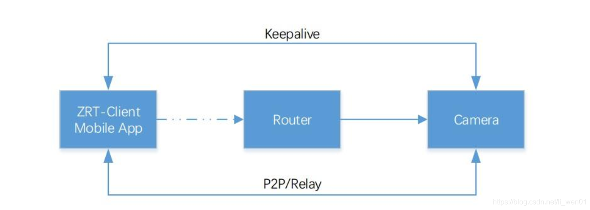
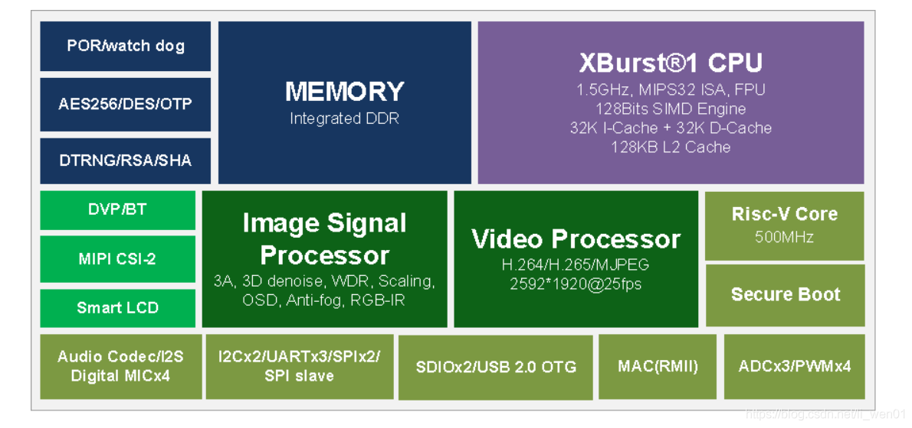

君正Zeratul开发(0)——序言及目录  
Ingenic Zeratul Development (0) - Preface and Table of Contents
----------------------------
li_wen01, 已于 2022-08-30 22:11:17 修改

### 前言

2020年疫情加上海思供货紧缺，导致很多方案开始找相应的替代方案。对于海思低功耗视频
方案，君正T31 Zeratul 是一个比较理想的替代方案。君正低功耗方案，因为向前的使用量
并不算大，所以整个方案并不算是非常成熟。开发文档和资料跟海思相比还是有些差距，在
使用的过程中，也依然还有不少问题需要持续优化。 我就自己在使用君正T31 Zeratul 
中 遇到的问题及一些知识点整理成文章，以便日后自己查看，也可供大家参考。

### Zeratul 与ISVP的区别

Zeratul 是基于君正 T 系列芯片的电池类 IPC 开发平台， 通过 Zeratul，
开发者可以快速开展电池类产品开发。

Zeratul 基于 ISVP（Ingenic Smart Video Platform 君正 T 系列智能视频开发平台），
并封装了电池类 IPC 特殊的功能接口， 比如 WIFI 连接、 电源管理、 关机唤醒等等功能。

ISVP 与 Zeratul 的关系： ISVP 中包含了 toolchain， 基础操作文档（如 TF 启动卡制
作教程），以及 libimp 的 API（IPC 产品音视频业务） 及 doc 等等基础资源。 
ZeratulSDK 在此之上，拓展了电池类 IPC 所需的功能和应用， 例如开关机控制， WIFI 
操作等等 。

#### 产品架构

电池类 IPC 产品一般分为两种形态:

套装： 产品由一个 Station+若干 Camera 组成

单品： 产品为一个 Camera， 直接链接路由器

### Ingenic T31

从官方的资料我们可以看到：

芯片框图：

芯片规格：

| 模块     | 描述                                            |
|--------|-----------------------------------------------|
| CPU    | 超高主频，可达1.5GHz .                               |
|        | 1.5GHz SIMD128 AI加速引擎                         |
|        | 64KB + 128KB L1 / L2 Cache                    |
|        | Risc V 独立小核                                   |
| 视频编码器  | H.264/H.265/MJPEG 编码器                         |
|        | 分辨率最高可达2592*1920@30fps                        |
|        | 国际一流的编码引擎                                     |
|        | 支持多种码流和多参数设置                                  |
| 星光级ISP | 针对低照度视频监控场景的特殊优化                              |
|        | 新一代2D/3D降噪                                    |
|        | 锐化增强，ROI-AE                                   |
|        | 先进的WDR，DRC                                    |
|        | 畸变校正                                          |
| 内存     | 内置DDR:512Mb/1Gb                               |
| 安全性    | AES/RSA/SHA/TRNG/OTP                          |
|        | 支持安全启动                                        |
| AI快速实现 | 支持深度学习算法，精度高，灵活性好                             |
|        | 支持人形检测、人脸检测和人脸识别                              |
|        | 支持哭声侦测、车辆检测和宠物检测                              |
| 封装     | 22nm制程工艺                                      |
|        | 封装：QFN88/BGA192                               |
| 快速启动   | 支持快速启动                                        |
|        | 双启动                                           |
|        | 快速自动曝光/自动白平衡                                  |
|        | 约200ms稳定图像输出                                  |
| 扩展电路   | 支持4通道数字MIC阵列                                  |
|        | 支持IoT-WIFI / BT / 4                           |
|        | 支持SLCD显示                                      |
|        | 支持UVC/UAC                                     |
| 音频     | 内部集成音频编解码器                                    |
|        | 支持多种采样率：8K/12K/16K/24K/32K/44.1K/48K/96K      |
|        | 支持I2S                                         |
|        | 支持回声消除                                        |
| 外围电路   | 支持WDT，ADC，UART，I2C，SPI，GPIO，SDIO，PWM，USB，GMAC |

说明：

上面的那些参数是官方给出的，应该是官方在他们开发板中测试的数据，在实际产品使用过
程中会发现，很多参数是比较难达到非常好的效果，也许这个官方会在后面发布的SK中慢慢
的优化好。

### (三)系列文章目录

- 君正Zeratul开发(0)——序言及目录
- 君正Zeratul开发(1)——分区启动分析
- 君正Zeratul开发(2)——uboot启动分析
- 君正Zeratul开发(3)——升级回滚
- 君正Zeratul开发(4)——图像效果调试
- 君正Zeratul开发(5)——快速启动优化
- 君正Zeratul开发(6)——为什么禁止使用system

######################2022.08.28######################
该博客将停止更新
新的文章内容和附件工程文件
请到 liwen01 博客首页信息查询
liwen01 2022.08.28 日更新
######################2022.08.28######################
————————————————
版权声明：本文为CSDN博主「li_wen01」的原创文章，遵循CC 4.0 BY-SA版权协议，转载请附上原文出处链接及本声明。
原文链接：https://blog.csdn.net/li_wen01/article/details/115302346
