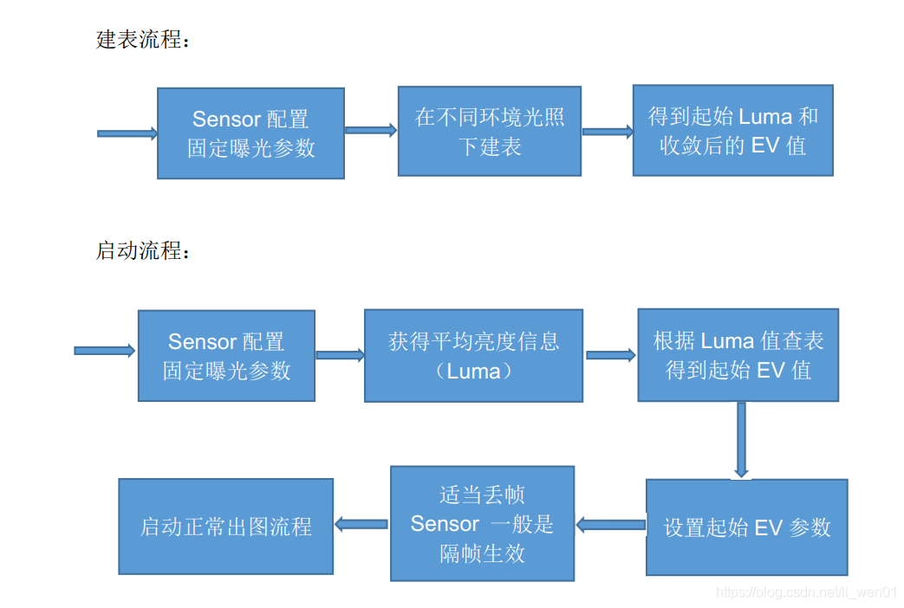

Ingenic Zeratul development
===========================

Image Effects Debugging
-----------------------

### Preface

At present, the isp image effect of Ingenic devices or Ingenic engineers are
responsible for the development of debugging, if you need to add a new camera,
generally is also the new camera driver, from the ISVP version ported to the
Zeratul platform. Here is the main introduction: (1) camera driver porting;
(2) fast start image effect optimization; (3) wide dynamic effect

### (1) Sensor driver porting

Zeratul platform is optimized for ISVP platform, so many sensor drivers need
to be ported from the ISVP platform to the Zeratul platform.

This can be done in two steps. Take the gc2053 sensor as an example.

1. Add `sensor.hex`
2. Add tag content:
  - Kernel sensor driver part:
    - The driver source code of sensor under gc2053 file and the Makefile file required to compile.
  - tag required files: `libz_gc2053.hex`
    - `libz_gc2053.c` - Definition of starting AE and other contents.
    - `gc2053_t31_init.c` - Initialize the sensor register list.
    - `riscv_fw_gc2053.bin` - RISC-V firmware.
    - `gc2053_t31.bin` - sensor effect file.

### (2) Photosensitive parameter adjustment

#### (1) Hardware photosensitive

##### 1.1 What is meant by starting EV

When a normal IPC is turned on, the screen has a process of changing from dark
to light, which is called AE convergence process. Since the battery IPC is 
cold-started every time, if no special treatment is done, there is bound to be
such a convergence process, which is extremely bad for the user's physical examination.

In order to shorten this process, we provide a way to set a starting exposure
parameter at boot time, and the convergence will start from the set starting
exposure parameter, which will shorten the AE convergence process. Set this
exposure parameter, we call the starting EV parameter.

##### 1.2 T31 RISC-V

T31 platform includes RISC-V kernel, which can provide some auxiliary processing.
Currently, we port the AE and AWB functions of ISP to RISC-V. When the ISP driver
is registered during the kernel, the image effect can be ramped from RISC-V, so
that the image data obtained by the kernel is basically stable and available.

##### 1.3 Start EV parameter code location

The starting EV parameter is stored in the TAG partition. During the bootloader
phase, the ADC gets the photosensitive information and matches it with the EV
parameter in the TAG to get the starting EV value, which will be used by RISC-V
as the starting point for RISC-V.

The starting AE information is stored in the `tools/make_tag/sensor_start_ae_table` directory:
- `libz_sensor.c` - is the daytime ADC and EV relationship table.
  - `struct vol_start_value_table table_day[]` - is the daytime mode correspondence table
  - `struct vol_start_value_table table_night[]` - for the night vision mode.

##### 1.4 How to create the start EV parameter table

We need to get the ADC value in the bootloader to match the EV value, because
the bootloader starts up very fast from power on, some of the photosensitive
is not very stable at this time, so we follow the way of T20 and T30 to get
the ADC and EV correspondence through tools after the system is up, in fact,
it is not accurate with the actual use, in order to achieve a more accurate
result, we need to use the ADC value read from the bootloader as the starting
AE parameter when we create the table again. Consistent with the real environment.

To open the print information in the software, we need to save the ADC value
from the BootLoader and the stabilized EV value from the `dmesg` to the starting
EV table.

##### 1.5 Daylight Mode

Take a uniform light source and place it in a dark room without outside light
interference, as shown in the figure below, with the lens as close as possible.
Then adjust the brightness of the light source, use the illuminance meter to
record the corresponding illuminance value, from dark to light, gradually
adjust, after the adjustment, after the brightness is stable, switch on the
device, read the ADC and EV value through the serial port and save it.

##### 1.6 Night vision environment

Because the general photosensitive to infrared light is not sensitive, that is,
infrared light on or off, the ADC value of the photosensitive basic unchanged,
so the night vision for different scenarios, the effect will be different. In
the case of night vision, it is impossible to achieve uniformity. So generally,
we will choose a more moderate situation to measure.

Select a scene in the dark room, the device and the target reference placed at
a certain distance, such as 5 meters. Then cut the device to night vision mode,
turn on the infrared and IRCUT, and then place the uniform light source to a
corner to avoid direct light into the photosensitive, or direct into the lens,
resulting in inaccurate sampling.

In this case, adjust the light intensity of the uniform light source, and then
record the ADC and EV values.

#### (2) Soft photosensitive

##### 2.1 The advantages and disadvantages of soft photosensitivity

The advantages of using soft photosensitivity are: it can save one hardware
photosensitive component, no need to open holes and add lenses to the product
case, and for products with certain waterproof properties, there is no need to
consider the waterproof treatment at the openings. Overall, it can save some
hardware cost.

Disadvantages of using soft photosensitive:

- Because soft photosensitive need to rely on image information to determine
  the day and night, it needs to use about 2~4 frames to count luma information,
  sensor configuration is generally effective every other frame, so it takes
  2~4 frames to set the new exposure parameters really take effect. Therefore,
  the first 4 to 8 frames are not available, which has a certain impact on the
  output speed.

- Since soft photosensitive is based on ISP statistics for day/night switching,
  and ISP statistics have a certain dependency on Sensor effect parameters, so
  soft photosensitive parameters need to be retuned for each version of IQ
  effect, and the whole soft photosensitive debugging may run through the whole
  project cycle.

- Because of the difference between the day and night judgment of the fast start
  and the day and night judgment of the application after starting, the debugging
  of the threshold value of the day and night judgment is relatively troublesome,
  and the main problem is that the inconsistent threshold value of the fast start
  and the application leads to the problem of frequent switching after starting
  certain critical scenes.
 
- In summary, low-power products are recommended to increase the hardware
  photosensitive. The development difficulty and user experience will be better.

##### 2.2 Principle

Soft photosensitivity is based on the principle of quick-start system implementation:

Sensor fixes a set of exposure parameters, starts and completes convergence
under different ambient light, at which time the starting average luminance
information and the converged EV parameters can be obtained. These two
parameters are collected under different lighting conditions to obtain
a mapping table of the starting EV. While building the table, the illuminance
of the current ambient light can be recorded using an illuminance meter.

In the startup process, the Sensor also needs to fix the exposure parameters
and obtain a starting average luma value for a given scene, which is then
used to find the corresponding EV value in the mapping table and to reconfigure
the exposure parameters.

Day and night switching is also judged by the luma value, in the construction
of the table, the illumination information has been recorded and corresponds
to the luma value, so you can choose a luma value based on illumination
information as the day and night switching threshold.

Soft photosensitive application layer switching principle:

- Application layer switching is different from the fast start method, daytime
  cut night vision, mainly dependent on the screen brightness information.
  Night vision cuts daytime, the brightness can not be used as a judgment
  criterion, because the infrared light is turned on, the bgain value will be
  relatively large, so night vision cuts daytime, relying on the brightness
  and `bgain` parameters as a basis for judgment.

- It is suggested that the day/night switching threshold of the fast start and
  application layer can be based on the illuminance meter, so that different
  parameters can be configured under the same illuminance. This prevents the
  problem of frequent day/night switching.

##### 2.3 Processes

Table building process and startup process.



### (3) Wide Dynamic

The wide dynamic function (wdr) of Ingenic Zeratul platform was developed
relatively late, and the WDR function of gc2093 is currently available, but the
effect is not optimized to the best.

The WDR function is actually developed by Ingenic's own engineers.
If you need to use the WDR function, you need to replace their `imp-t31-wdr`
and `tx-isp-t31-wdr` files.

#### Applications:

You can check whether the wide dynamic function has been activated by using
the following command:
```
cat /proc/jz/isp/isp-m0
```

The current wide dynamic function works very poorly at night, you need to turn
off the wide dynamic function at nighttime. You can use the `IMP_ISP_WDR_ENABLE`
interface to turn it off.

Wide dynamic is suitable for strong light and low light alternating scenes, it
will be strong light to suppress, and then enhance the soft light in addition
to the exposure, it is an optimization effect on the image, if you are using
wide dynamic for photography, strong and low light alternating places, easy to
produce ripple like effect.

######################2022.08.28######################  
This blog will stop updating  
New article content and attached project files  
Please go to liwen01 blog home page for information  
liwen01 2022.08.28 Updated on  
######################2022.08.28######################
