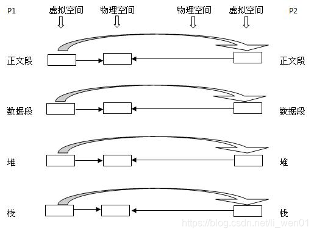

Ingenic Zeratul Development
===========================

Why disable the use of system_system function to disable the reason
-------------------------------------------------------------------

### (I) Preface

Ingenic Zeratul T31 Development Guide Specification clearly prohibits the
use of system and other system call interface functions in the main program.
You need to go in a separate daemon to implement the system function.

Here are two questions:
1. What is unsafe about system functions?
2. Why is it not possible to execute `system` in the main process,
   but it is possible in the daemon?

### (II) Why is it dangerous?

System source code implementation:
```
int system(const char * cmdstring)
{
    pid_t pid.
    int status.

if(cmdstring == NULL)
{
    return (1); //if cmdstring is null, return a non-zero value, usually 1
}

if((pid = fork())<0)
{
    status = -1; //fork failed, return -1
}
else if(pid == 0)
{
    execl("/bin/sh", "sh", "-c", cmdstring, (char *)0).
    _exit(127); // exec fails to return 127, note that exec only returns the current process when it fails, if it succeeds, the current process does not exist ~~
}
else // parent process
{
    while(waitpid(pid, &status, 0) < 0)
    {
        if(errno ! = EINTR)
        {
            status = -1; //if waitpid is interrupted by signal, return -1
            break.
        }
    }
}
    return status; //if waitpid is successful, return the return status of the child process
}
```

#### (1) Implementation

The `system()` function actually performs three steps.
1. forks a child process;
2. calls the `exec` function in the child process to execute the command;
3. calls `wait` in the parent process to wait for the child process to finish.

#### (2) Execute

> `system()` executes a command specified in command by calling `/bin/sh -c command`, 
> and returns after the command has been completed. During execution of the command,
> `SIGCHLD` will be blocked, and `SIGINT` and `SIGQUIT` will be ignored.

The `system()` function calls `/bin/sh` to execute the command specified by the
argument, `/bin/sh` is generally a softlink to a specific shell, such as `bash`,
and the `-`c option tells the shell to read the command from the string command;

During the execution of that command, `SIGCHLD` is blocked, as if to say:
"Hey, kernel, do not send me the `SIGCHLD` signal, wait until I'm done".

During the execution of this command, SIGINT and SIGQUIT are ignored, meaning 
that the process receives these two signals and does not do anything.

#### (3) Return value:

> The value returned is -1 on error (e.g. `fork(2)` failed), and the return
> status of the command otherwise. This latter return status in the format
> specified in `wait(2)`. Thus, the exit code of the command will be
> `WEXITSTATUS(status)`. In case `/bin/sh` could not be executed, the exit status
> will be that of a command that does `exit(127)`. If the value of command is
> `NULL`, `system()` returns nonzero if the shell is available, and zero if not.

If the value of command is `NULL`, `system()` returns _non-zero_ if the shell is
available, and _zero_ if not. For a fork failure, the `system()` function 
returns _-1_.

If the `exec` execution is successful, i.e., the command completes successfully,
the value of the command returned by exit or return is returned. (Note that the
smooth execution of the command does not mean that the execution was successful,
such as the command: `rm debuglog.txt`, regardless of whether the file exists the
command was successfully executed)

If the execution of `exec` fails, that is, the command is not executed smoothly,
such as interrupted by a signal, or the command does not exist, the `system()`
function returns _127_.

If the command is `NULL`, the `system()` function returns a non-zero value, 
generally _1_.

#### (4) Reasons for danger

`system()` function is easy to use, too many return values, and the return value
can be easily confused with the return value of command. Here we recommend using
the `popen()` function instead.

`popen()` function compared to `system()` function is the advantage of simple use.
`popen()` function returns only two values: 
- success returns the status of the child process, using `WIFEXITED` related
  macros can get the return result of the command;
- failure returns `-1`
- we can use the `perro()` or `strerror()` functions to get useful error information.

## (iii) Why is it not recommended to execute in the master process

Why is it impossible to execute `system()` in the main process, but not in the daemon?

The main reason is that the stack space of the main process is generally large, 
and executing the system function will call fork to create a child process,
which is a copy of the memory space of the main process, but when it needs to
actually write data, it will make a copy of the actual memory address. In
embedded devices, memory is limited, and when there is not enough memory, the
program execution will be slow and error-prone.

About what the fork function does, Linux Programming explains it this way:

> We can create a new process by calling `fork`. This system call copies the
current process and creates a new table entry in the process table, which has
many of the same properties as the current process. The new process is almost
identical to the metaprocess and executes the exact same code, but the new
process has its own data space, environment, and file descriptors.

This explanation is actually too general, and many details are left out. The
following is a brief description of some details of what happens when `fork` is
called. Or the characteristics of the fork function:

First, UNIX systems and Linux systems nowadays use _copy-on-write_. With this
technique, when the `fork` function is called, the new process simply has its
own virtual memory space, and not its own physical memory space. The new process
shares the physical memory space of the source process. And the virtual memory
space of the new memory is almost a copy of the virtual memory space of the 
source process.

As we know, the process space can be simply divided into four parts: program
segment (body segment), data segment, heap and stack (simply understood as such).
Using the `fork` function with _copy-on-write_, when the `fork` is executed for a
certain period of time, the process space of the new process (child process) and
the source process are related as follows:



As shown above, when `fork` is executed, the Linux kernel creates a virtual memory
space for the new process _P2_, and the contents of the new virtual space is a copy
of the contents of the _P1_ virtual memory space. _P2_ and _P1_ share the physical
memory space of _P1_.

Of course, to understand the _copy-on-write_, the state shown in the above diagram
is subject to change. When does it change? When either of the two processes writes
to the data segment, stack or heap area, the state in the above diagram is broken
and a copy of the physical memory occurs, which is why it is called _copy-on-write_.
The state transition occurs as follows:


We see that _P2_ has its own physical memory space. It is worth noting that the 
changes that occur between segments should be independent, i.e. if only the data
segment undergoes a write operation then only the data segment is copied on write.
The heap and stack areas are still shared between parent and child processes.
Another thing to note is that the body segment (program segment) is not copied on
write, because usually the program segment is read-only. After forking, the child
process and the parent process are basically running independently of each other.

In addition, it is important to note that the file descriptor tables of the parent
and child processes are also copied on write.

### Quote:

- ["Comparison of the three process-related functions system(), exec(), and fork()"](https://my.oschina.net/renhc/blog/53580)
- [The use of system() function under Linux must be careful"](https://www.cnblogs.com/qingergege/p/6601807.html)

######################2022.08.28######################  
This blog will stop updating  
New article content and attached project files  
Please go to liwen01 blog home page for information  
liwen01 updated on 2022.08.28  
######################2022.08.28######################
