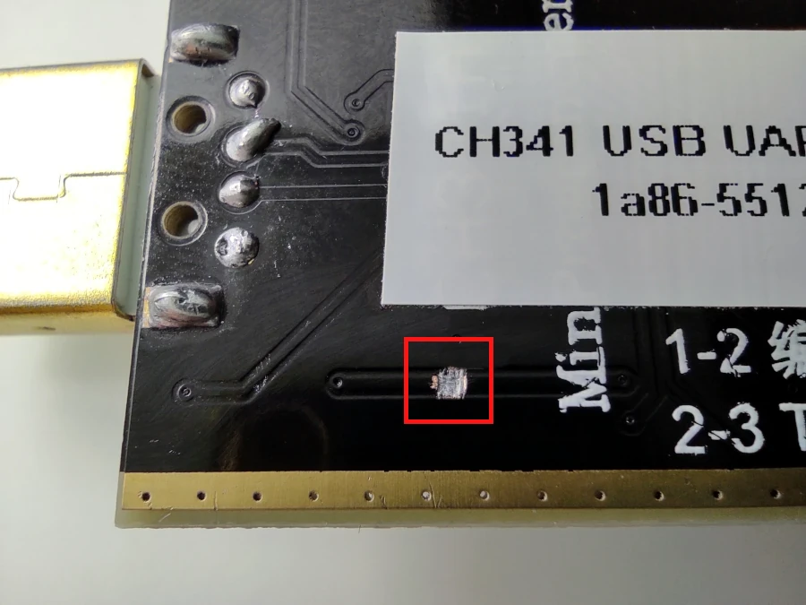
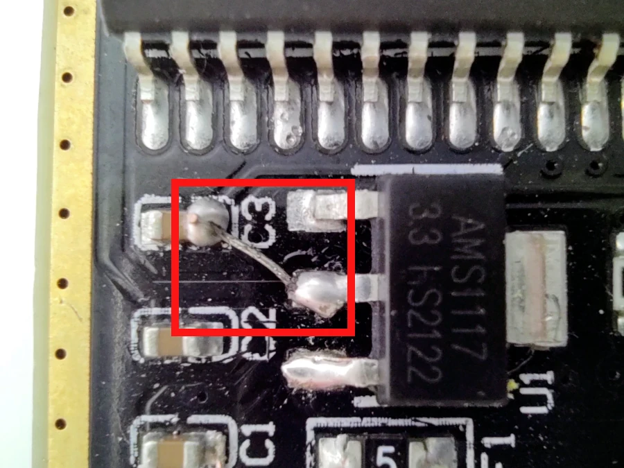
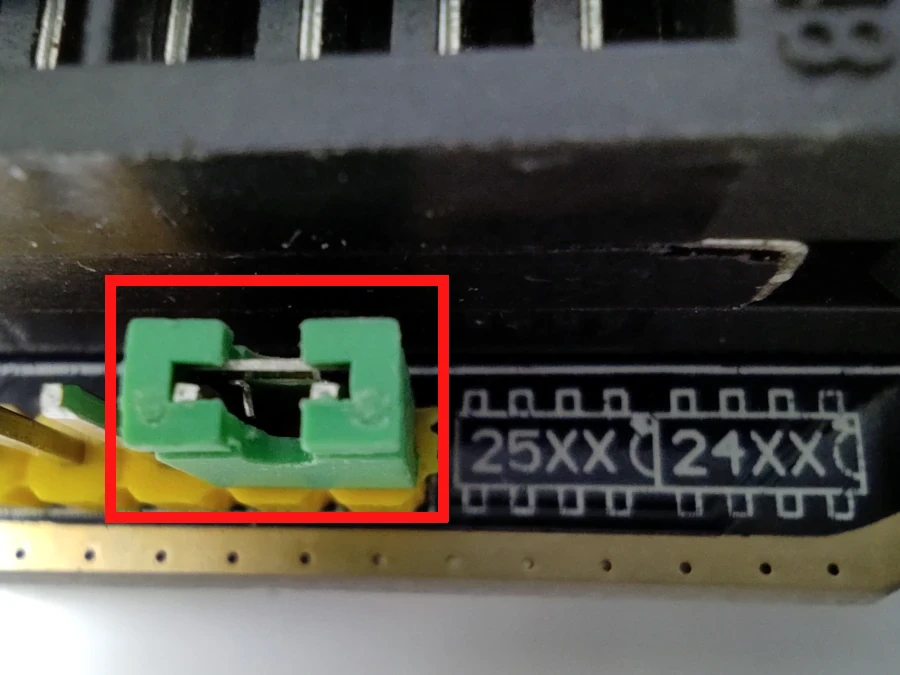

CH341A Programmer
-----------------

### Fixing higher than needed dataline voltage bug

Early versions, prior to version 1.7, of the cheap and popular CH341A mini
programmer have a nasty bug where the voltage levels on the data lines remain
at 5V even though the programmer is jumpered to 3.3V.

[@ddemos1963](https://github.com/ddemos1963) came up with an interesting hack 
to solve the problem in an efficient and artistic way.


Here's what you need to do.


Sever the connection between the 5V power line and the CH341A chip. Use a sharp
utility knife to cut the trace on the backside of the programmer board.



Connect the 3.3V output leg of the voltage regulator to pin 9 of the CH341A IC
by bridging it to a corresponding trace at the capacitor located nearby.



Restore power to the chip by re-routing the 3.3V voltage from the 3v3 pin to 
pin 28 of the CH341A IC through the 5V pin connector on the header.



### Troubleshooting

To make the CH341A work on a Raspberry PI, you must add these to `/boot/cmdline.txt`:
```
dwc_otg.fiq_enable=0 dwc_otg.fiq_fsm_enable=0
```
