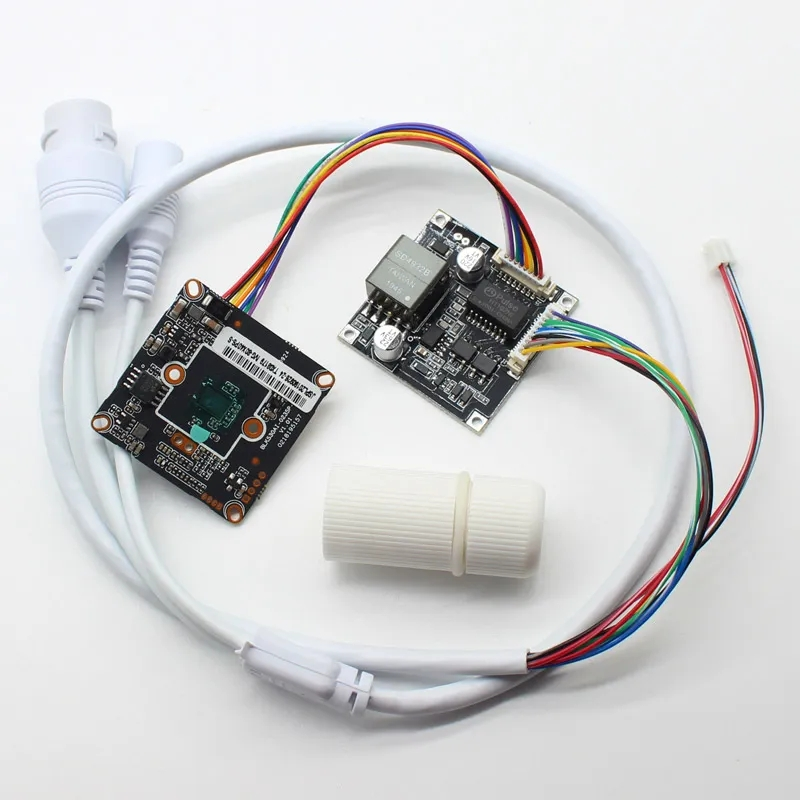
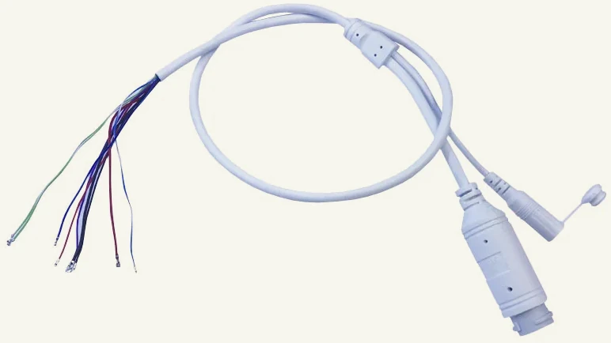

IP Camera Cables
----------------

### 9-core RJ45 + DC-jack

##### 1.25 mm pitch headers

| color of wire | function                 |
|---------------|--------------------------|
| green         | Ethernet Rx-, RJ45 pin 1 |
| green/white   | Ethernet Rx+, RJ45 pin 2 |
| blue          | Ethernet Tx-, RJ45 pin 3 |
| blue/white    | Ethernet Tx+, RJ45 pin 6 |
| purple        | Ethernet status LED      |
| red           | Power +12V               |
| black         | Power GND                |

##### 2.0 mm pitch header

| color of wire | function   |
|---------------|------------|
| red           | Power +12V |
| black         | Power GND  |

### 9-core with built-in 48V to 12V/1A POE

IEEE802.3af, 15.4W, Endspan: 1/2(+), 3/6(-) or Midspan: 4/5(+), 7/8(-)

##### 1.25 mm pitch headers

| color of wire | function                 |
|---------------|--------------------------|
| green         | Ethernet Rx-, RJ45 pin 1 |
| green/white   | Ethernet Rx+, RJ45 pin 2 |
| blue          | Ethernet Tx-, RJ45 pin 3 |
| blue/white    | Ethernet Tx+, RJ45 pin 6 |
| purple        | Ethernet status LED      |
| red           | Power +12V               |
| black         | Power GND                |

##### 2.0 mm pitch header

| color of wire | function   |
|---------------|------------|
| red           | Power +12V |
| black         | Power GND  |

### 11-core RJ45 + DC-jack

##### 1.25 mm pitch headers

| color of wire | function                    | alt. color   |
|---------------|-----------------------------|--------------|
| green         | Ethernet Rx-, RJ45 pin 1    |              |
| green/white   | Ethernet Rx+, RJ45 pin 2    |              |
| blue          | Ethernet Tx-, RJ45 pin 3    | orange       |
| blue/white    | Ethernet Tx+, RJ45 pin 6    | orange/white |
| purple        | Ethernet status LED         |              |
| red           | Power +12V                  |              |
| black         | Power GND                   |              |
| yellow        | RJ45 pins 7/8, Midspan POE- |              |
| gray          | RJ45 pins 4/5, Midspan POE+ |              |

##### 2.0 mm pitch header

| color of wire | function   |
|---------------|------------|
| red           | Power +12V |
| black         | Power GND  |

### PoE (Power-over-Ethernet)

Power for the camera can be supplied by the same ethernet cable that 
connects the camera to a computer network.

There are standard 38x38 PoE modules that mount on top of the camera module,
and they both go into the camera housing.

There are PoE cables that have a tiny SmartPoE module molded inside the 
cable along with an Ethernet connector.

And there are PoE splitters that connect between the PoE cable and the camera,
and split the signal to a separate Ethernet line and a power line converting
PoE voltage to the camera voltage along the way.
