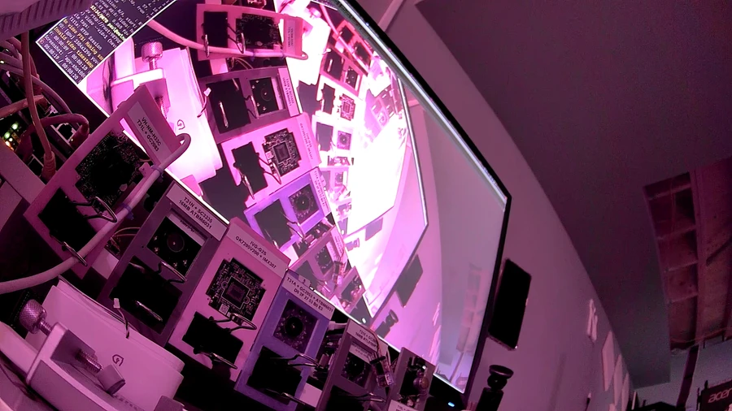
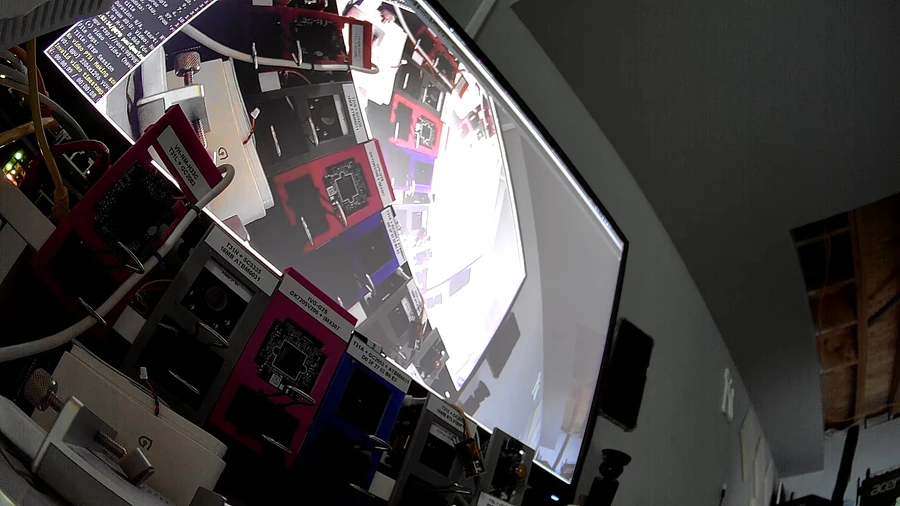
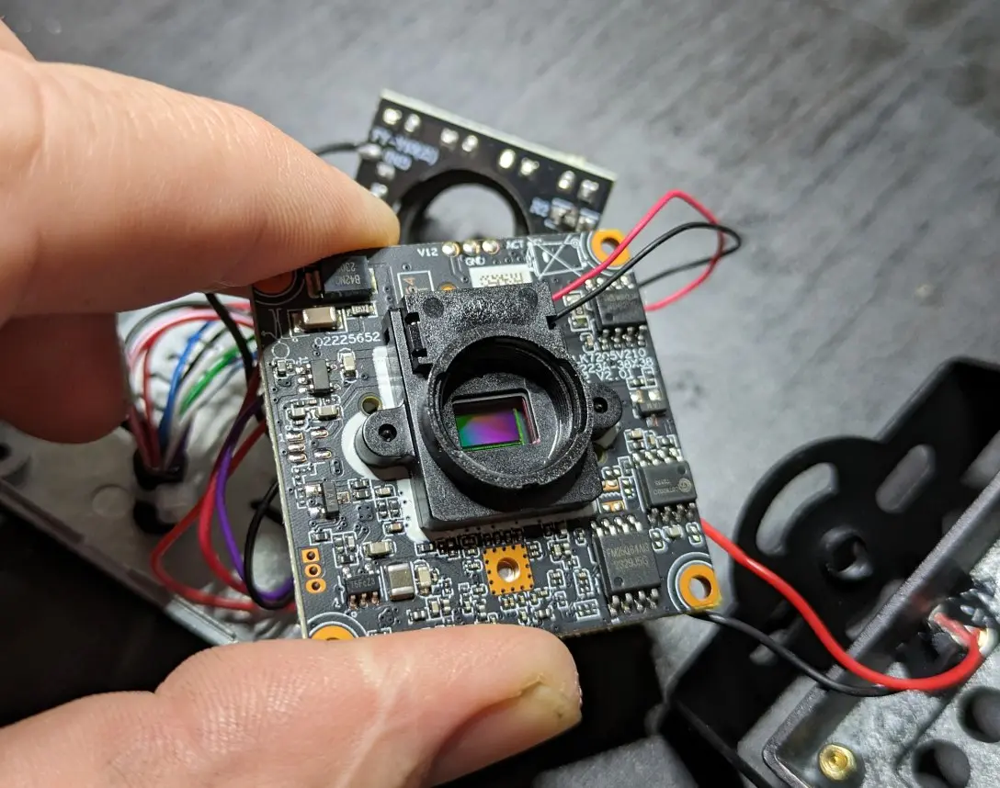

IR-cut (Infrared Ray Filter Switcher)
-------------------------------------

### Theory

An infrared filter is placed between the camera lens and image sensor to
eliminate light waves that are invisible to the naked eye but can otherwise
interfere with the image captured.

The rays cause the image to take on a reddish-purple tint. The filter blocks
a specific light wavelength passing through the lens, resulting in an image
that closely resembles what we perceive with our eyes.

  
_IR-cut filter open_

  
_IR-cut filter closed_

Although infrared rays are abundant and inconvenient during the day, they are
still present at night when reflected from the moon, and they can help the
camera capture better images in low-light conditions. To facilitate this,
infrared rays need to pass through the sensor when the amount of visible light
is insufficient. An infrared filter switcher, a mechanical device that utilizes
electromagnetic force to move the filter in front of or away from the image
sensor, can accomplish this.

### Control mechanics

There are at least two types of sliding mechanism for moving the filter: a 
drawer type where the filter moves front and back, and swing type where the
filter rotates around a pivoting point.

A standard IR-cut filter switcher designed for an IP camera operates on a 
voltage range of 3.3V to 12V DC, sending brief pulses lasting from 50 to 100 ms.

The switcher connects to the board via two wires and reverses its direction
based on the polarity. GPIO pins regulate the polarity, making it crucial to
configure the correct ones in the camera settings.

An example of controlling the direction of a switcher with two GPIO pins. 

     ------------- ------ ------ ------ ------ 
    | GPIO 25     | LOW  | HIGH | HIGH | LOW  |
    | GPIO 26     | LOW  | LOW  | HIGH | HIGH |
    |-------------+------+------+------+------|
    | IRCUT PINS  |  0V  | +12V |   0V | -12V |
     ------------- ------ ------ ------ ------ 

The supplied voltage to the switcher is dependent on the opposite states of
GPIO pins. The driver solenoid is a robust but fragile component that converts
energy into movement. If the solenoid fails to convert energy into motion, 
it generates heat and may overheat or even burn. It is crucial to discontinue
power supply to the solenoid once it has completed its task by setting both 
GPIO pins to either a HIGH or LOW state. 

### Types of filters

Often, an infrared filter (IR) is combined with an anti-reflection filter (AR),
which reduces the amount of reflected light and increases the sensitivity of the
sensor. Sometimes both filters are combined into one and permanently attached to
the housing.

### Lens mount

The infrared ray filter housings can have different mounting hole spacing 
distances (22mm, 20mm, 18mm, 16.4mm) and different types of lens mounts 
(S-mount, C-mount, SC-mount).

Most typical is a housing with 20mm hole spacing distance and M12x0.5mm S-type
lens mount.

### Links

- <http://zonhen.com/>
- <http://solenoid.cn/>
