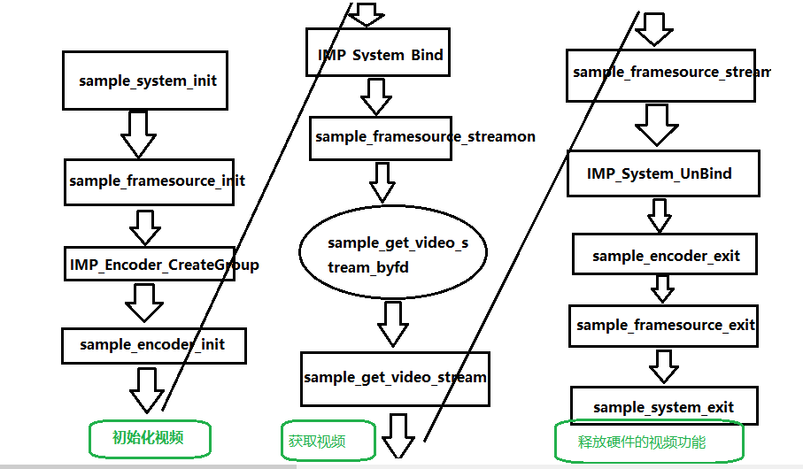

# 君正T31应用开发9：获取H265码流

## 君正T31应用开发9：获取H265码流

原创

**发布于** **2023-06-13 21:56:18**

**251**0

**举报**

# 1.君正T31获取H264的系统框图

和JPEG获取的码流是类似的，都是先初始化视频相关的接口，然后调用获取视频码流，最后释放视频的资源。

​​

# 2.初始化编码器：sample_encoder_init

其中有个结构体需要注意一下，我们的编码参数是用一个结构体fs_chn_attr 保存的；

```
struct chn_conf chn[FS_CHN_NUM] = {
    {
        .index = CH0_INDEX,
        .enable = CHN0_EN,
    .payloadType = IMP_ENC_PROFILE_HEVC_MAIN,
        .fs_chn_attr = {
            .pixFmt = PIX_FMT_NV12,
            .outFrmRateNum = SENSOR_FRAME_RATE_NUM,
            .outFrmRateDen = SENSOR_FRAME_RATE_DEN,
            .nrVBs = 2,
            .type = FS_PHY_CHANNEL,

            .scaler.enable = 0,

            .crop.enable = CROP_EN,
            .crop.top = 0,
            .crop.left = 0,
            .crop.width = SENSOR_WIDTH,
            .crop.height = SENSOR_HEIGHT,

            .picWidth = SENSOR_WIDTH,
            .picHeight = SENSOR_HEIGHT,
           },
```

复制

最主要的函数是IMP_Encoder_SetDefaultParam设置默认的编码函数，上节课的时候，我们使用的JPEG的编码方式，这节课我们主要使用的是payloadType这个枚举类型：

```
typedef enum {
  IMP_ENC_PROFILE_AVC_BASELINE  = ((IMP_ENC_TYPE_AVC << 24) | (IMP_ENC_AVC_PROFILE_IDC_BASELINE)),
  IMP_ENC_PROFILE_AVC_MAIN      = ((IMP_ENC_TYPE_AVC << 24) | (IMP_ENC_AVC_PROFILE_IDC_MAIN)),
  IMP_ENC_PROFILE_AVC_HIGH      = ((IMP_ENC_TYPE_AVC << 24) | (IMP_ENC_AVC_PROFILE_IDC_HIGH)),
  IMP_ENC_PROFILE_HEVC_MAIN     = ((IMP_ENC_TYPE_HEVC << 24) | (IMP_ENC_HEVC_PROFILE_IDC_MAIN)),
  IMP_ENC_PROFILE_JPEG          = (IMP_ENC_TYPE_JPEG << 24),
} IMPEncoderProfile;
```

复制

```
int sample_encoder_init()
{
    int i, ret, chnNum = 0;
    IMPFSChnAttr *imp_chn_attr_tmp;
    IMPEncoderChnAttr channel_attr;

    for (i = 0; i <  FS_CHN_NUM; i++) {
        if (chn[i].enable) {
            imp_chn_attr_tmp = &chn[i].fs_chn_attr;
            chnNum = chn[i].index;

            memset(&channel_attr, 0, sizeof(IMPEncoderChnAttr));

            float ratio = 1;
            if (((uint64_t)imp_chn_attr_tmp->picWidth * imp_chn_attr_tmp->picHeight) > (1280 * 720)) {
                ratio = log10f(((uint64_t)imp_chn_attr_tmp->picWidth * imp_chn_attr_tmp->picHeight) / (1280 * 720.0)) + 1;
            } else {
                ratio = 1.0 / (log10f((1280 * 720.0) / ((uint64_t)imp_chn_attr_tmp->picWidth * imp_chn_attr_tmp->picHeight)) + 1);
            }
            ratio = ratio > 0.1 ? ratio : 0.1;
            unsigned int uTargetBitRate = BITRATE_720P_Kbs * ratio;

            ret = IMP_Encoder_SetDefaultParam(&channel_attr, chn[i].payloadType, S_RC_METHOD,
                    imp_chn_attr_tmp->picWidth, imp_chn_attr_tmp->picHeight,
                    imp_chn_attr_tmp->outFrmRateNum, imp_chn_attr_tmp->outFrmRateDen,
                    imp_chn_attr_tmp->outFrmRateNum * 2 / imp_chn_attr_tmp->outFrmRateDen, 2,
                    (S_RC_METHOD == IMP_ENC_RC_MODE_FIXQP) ? 35 : -1,
                    uTargetBitRate);
            if (ret < 0) {
                IMP_LOG_ERR(TAG, "IMP_Encoder_SetDefaultParam(%d) error !\n", chnNum);
                return -1;
            }
            ret = IMP_Encoder_CreateChn(chnNum, &channel_attr);
            if (ret < 0) {
                IMP_LOG_ERR(TAG, "IMP_Encoder_CreateChn(%d) error !\n", chnNum);
                return -1;
            }

            ret = IMP_Encoder_RegisterChn(chn[i].index, chnNum);
            if (ret < 0) {
                IMP_LOG_ERR(TAG, "IMP_Encoder_RegisterChn(%d, %d) error: %d\n", chn[i].index, chnNum, ret);
                return -1;
            }
        }
    }

    return 0;
}
```

复制

# 3.获取视频码流：sample_get_video_stream

```
int sample_get_video_stream()
{
    unsigned int i;
    int ret;
    pthread_t tid[FS_CHN_NUM];

    for (i = 0; i < FS_CHN_NUM; i++) {
        if (chn[i].enable) {
            int arg = 0;
            if (chn[i].payloadType == IMP_ENC_PROFILE_JPEG) {
                arg = (((chn[i].payloadType >> 24) << 16) | (4 + chn[i].index));
            } else {
                arg = (((chn[i].payloadType >> 24) << 16) | chn[i].index);
            }
            ret = pthread_create(&tid[i], NULL, get_video_stream, (void *)arg);
            if (ret < 0) {
                IMP_LOG_ERR(TAG, "Create ChnNum%d get_video_stream failed\n", (chn[i].payloadType == IMP_ENC_PROFILE_JPEG) ? (4 + chn[i].index) : chn[i].index);
            }
        }
    }

    for (i = 0; i < FS_CHN_NUM; i++) {
        if (chn[i].enable) {
            pthread_join(tid[i],NULL);
        }
    }

    return 0;
}
```

复制

里面最主要的函数：get_video_stream

这里面也最后调用了库函数：IMP_Encoder_GetStream

还有一些保存文件IO的操作，这里面就不再继续说明。

最后使用save_stream这个函数把视频流保存到本地上面，也可以指定目录，比如挂载TF卡的目录上面。

```
static void *get_video_stream(void *args)
{
  int val, i, chnNum, ret;
  char stream_path[64];
  IMPEncoderEncType encType;
  int stream_fd = -1, totalSaveCnt = 0;

  val = (int)args;
  chnNum = val & 0xffff;
  encType = (val >> 16) & 0xffff;

  ret = IMP_Encoder_StartRecvPic(chnNum);
  if (ret < 0) {
    IMP_LOG_ERR(TAG, "IMP_Encoder_StartRecvPic(%d) failed\n", chnNum);
    return ((void *)-1);
  }

  sprintf(stream_path, "%s/stream-%d.%s", STREAM_FILE_PATH_PREFIX, chnNum,
      (encType == IMP_ENC_TYPE_AVC) ? "h264" : ((encType == IMP_ENC_TYPE_HEVC) ? "h265" : "jpeg"));

  if (encType == IMP_ENC_TYPE_JPEG) {
    totalSaveCnt = ((NR_FRAMES_TO_SAVE / 50) > 0) ? (NR_FRAMES_TO_SAVE / 50) : 1;
  } else {
    IMP_LOG_DBG(TAG, "Video ChnNum=%d Open Stream file %s ", chnNum, stream_path);
    stream_fd = open(stream_path, O_RDWR | O_CREAT | O_TRUNC, 0777);
    if (stream_fd < 0) {
      IMP_LOG_ERR(TAG, "failed: %s\n", strerror(errno));
      return ((void *)-1);
    }
    IMP_LOG_DBG(TAG, "OK\n");
    totalSaveCnt = NR_FRAMES_TO_SAVE;
  }

  for (i = 0; i < totalSaveCnt; i++) {
    ret = IMP_Encoder_PollingStream(chnNum, 1000);
    if (ret < 0) {
      IMP_LOG_ERR(TAG, "IMP_Encoder_PollingStream(%d) timeout\n", chnNum);
      continue;
    }

    IMPEncoderStream stream;
    /* Get H264 or H265 Stream */
    ret = IMP_Encoder_GetStream(chnNum, &stream, 1);
#ifdef SHOW_FRM_BITRATE
    int i, len = 0;
    for (i = 0; i < stream.packCount; i++) {
      len += stream.pack[i].length;
    }
    bitrate_sp[chnNum] += len;
    frmrate_sp[chnNum]++;

    int64_t now = IMP_System_GetTimeStamp() / 1000;
    if(((int)(now - statime_sp[chnNum]) / 1000) >= FRM_BIT_RATE_TIME){
      double fps = (double)frmrate_sp[chnNum] / ((double)(now - statime_sp[chnNum]) / 1000);
      double kbr = (double)bitrate_sp[chnNum] * 8 / (double)(now - statime_sp[chnNum]);

      printf("streamNum[%d]:FPS: %0.2f,Bitrate: %0.2f(kbps)\n", chnNum, fps, kbr);
      //fflush(stdout);

      frmrate_sp[chnNum] = 0;
      bitrate_sp[chnNum] = 0;
      statime_sp[chnNum] = now;
    }
#endif
    if (ret < 0) {
      IMP_LOG_ERR(TAG, "IMP_Encoder_GetStream(%d) failed\n", chnNum);
      return ((void *)-1);
    }

    if (encType == IMP_ENC_TYPE_JPEG) {
      ret = save_stream_by_name(stream_path, i, &stream);
      if (ret < 0) {
        return ((void *)ret);
      }
    }
#if 1
    else {
      ret = save_stream(stream_fd, &stream);
      if (ret < 0) {
        close(stream_fd);
        return ((void *)ret);
      }
    }
#endif
    IMP_Encoder_ReleaseStream(chnNum, &stream);
  }

  close(stream_fd);

  ret = IMP_Encoder_StopRecvPic(chnNum);
  if (ret < 0) {
    IMP_LOG_ERR(TAG, "IMP_Encoder_StopRecvPic(%d) failed\n", chnNum);
    return ((void *)-1);
  }

  return ((void *)0);
}
```

复制

# 4.实验现象

执行命令：

​​

下载生成的文件到WINDOW电脑上面，然后使用3.0以上版本的VLC进行播放，效果如下：

​​

​​

原创声明：本文系作者授权腾讯云开发者社区发表，未经许可，不得转载。

如有侵权，请联系 [cloudcommunity@tencent.com](mailto:cloudcommunity@tencent.com) 删除。
