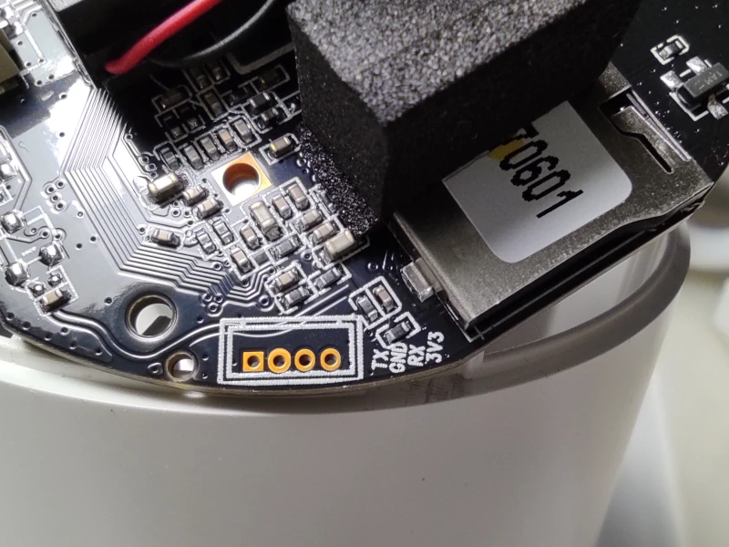

Cinnado D1
----------
- https://www.cinnado.com/D1
- https://www.amazon.com/gp/product/B0CBBT5RMP/
- Cloud: [AJCloud](https://www.ajcloud.net/)

### Hardware

- SoC: Ingenic T31L
- Sensor: SmartSens SC2336
- Flash: BoyaMicro 25Q64ESSIG
- Wi-Fi: Altobeam 6031
- Pan motor: ?
- Tilt motor: 24BYJ48 5V
- 4 x 940nm IR LEDs
- SD card slot
- Microphone
- Speaker
- Power: USB-C
- Blue/Red LED indicators
- Reset button

#### Sensor

    Part Number:    SC2336
    Manufacturer:   SmartSens Technology
    Resolution:     1928 (H) x 1088 (V)
    Mega Pixels:    2 MP
    Supply Voltage: 2.8 V (Analog), 1.8 V (I/O)
    Optical Format: 1/3 Inch
    Package Type:   CSP
    Chroma:         RGB
    Shutter Type:   Rolling Shutter
    Frame Rate:     30 Frames/sec
    ADC Resolution: 8 Bit, 10 Bit
    Pixel Size:     2.7 µm x 2.7 µm
    Pixel:          2 MP
    Dynamic Range:  74 dB
    Pixel Type:     DSI-2
    Sensitivity:    6594 mV/Lux-s
    SNR:            36 dB
    Note:           Output Format: RAW RGB, CRA: 12 Degrees
    Interface:      DVP, MIPI
    Package:        35 pin CSP package
    Dimensions:     5.718 mm x 3.663 mm

#### UART 

UART terminals are located near SD card slot and marked in a silk print.



#### OpenIPC installation 

Format an SD card to FAT and place the [firmware binary file](/dl/cinnado-d1-t31l-20240127.bin) 
and the following configuration files in the root directory of the card. Rename
the firmware binary file to `v4_all.bin` for flashing from stock firmware or to
`autoupdate-full.bin` for flashing from an older version of openipc firmware.

__autoconfig.sh__
```
cli -s .isp.blkCnt 1
```

__uEnv.txt__
```
gpio_default=7O 8O 9o 11o 14i 16I 17I 18O 47O 49o 50I 52o 53o 57o 58o 59o 61o 62o 63o 46o
gpio_wlan=47
gpio_mmc_cd=50
gpio_motor_h=49 63 62 61
gpio_motor_v=52 53 64 59
motor_maxstep_h=3700
motor_maxstep_v=1000
wlandev=atbm603x-generic
wlanssid=openipc
wlanpass=openipc12345
ircut_pins=58 57
ir940_led_pin=11
day_night_min=5000
day_night_max=15000
eth_disable=true
```

Use your Wi-Fi network SSID and password.

Place the card into your camera and reboot it.

`autoconfig.sh` file will be deleted from the card after run, `uEnv.txt` on the
other hand won't be deleted, so you might want to wipe the card clean as that 
file contains credentials for access to your wireless network!

Find the camera on the network checking DHCP leases on your router.

To make rebooting faster, run these commands in Linux shell on the camera:

```
fw_setenv sd_disable true
fw_setenv bootdelay 1
```

### Stock firmware analysis

#### Bootloader

Access to bootloader shell during system start is not guarded by anything.
Pressing Ctrl-C aborts a booting process and loads the shell.

```
isvp_t31# printenv
baudrate=115200
bootargs=tf=0 console=ttyS1,115200n8 mem=43520K@0x0 rmem=22016K@0x2A80000 init=/linuxrc rootfstype=squashfs root=/dev/mtdblock2 rw mtdparts=jz_sfc:256k(boot),1632k(kernel),2752k(rootfs),3136k(app),384k(syscfg),32k(flag),8M@0(all)
bootcmd=sf probe;sf read 0x80600000 0x40000 0x280000; bootm 0x80600000
bootdelay=1
ethact=Jz4775-9161
ethaddr=00:d0:d0:00:95:27
gatewayip=193.169.4.1
ipaddr=193.169.4.81
loads_echo=1
netmask=255.255.255.0
serverip=193.169.4.2
stderr=serial
stdin=serial
stdout=serial

Environment size: 542/16380 bytes
```

#### GPIO

```
[@Ingenic-uc1_1:root]# cat /sys/kernel/debug/gpio
GPIOs 0-31, GPIO A:
 gpio-7   (SPEAKER_EN          ) out hi
 gpio-8   (RED_LED             ) out hi
 gpio-9   (BLUE_LED            ) out lo
 gpio-11  (IR LED              ) out lo
 gpio-14  (BUTTON              ) in  hi
 gpio-16  (sda                 ) in  hi
 gpio-17  (scl                 ) in  hi
 gpio-18  (sc2336_reset        ) out hi

GPIOs 32-63, GPIO B:
 gpio-47  (sdio_wifi_power_on  ) out hi
 gpio-49  (PTZ-H Phase A       ) out lo
 gpio-50  (mmc_detect          ) in  lo
 gpio-52  (PTZ-V Phase C       ) out lo
 gpio-53  (PTZ-V Phase B       ) out lo
 gpio-57  (IRCUT 1             ) out lo
 gpio-58  (IRCUT 2             ) out lo
 gpio-59  (PTZ-V Phase D       ) out lo
 gpio-61  (PTZ-H Phase D       ) out lo
 gpio-62  (PTZ-H Phase C       ) out lo
 gpio-63  (PTZ-H Phase B       ) out lo

GPIOs 64-95, GPIO C:
 gpio-64  (PTZ-V Phase A       ) out lo
 ```

#### Motors
```
VM
[ 52 | 53 | 64 | 59 | xx ]

HM
[ 49 | 63 | 62 | 61 | xx ]
```

**Motors:**
 
`modprobe motor hmaxstep=3700 vmaxstep=1000 hst1=49 hst2=63 hst3=62 hst4=61 vst1=64 vst2=53 vst3=52 vst4=59`
