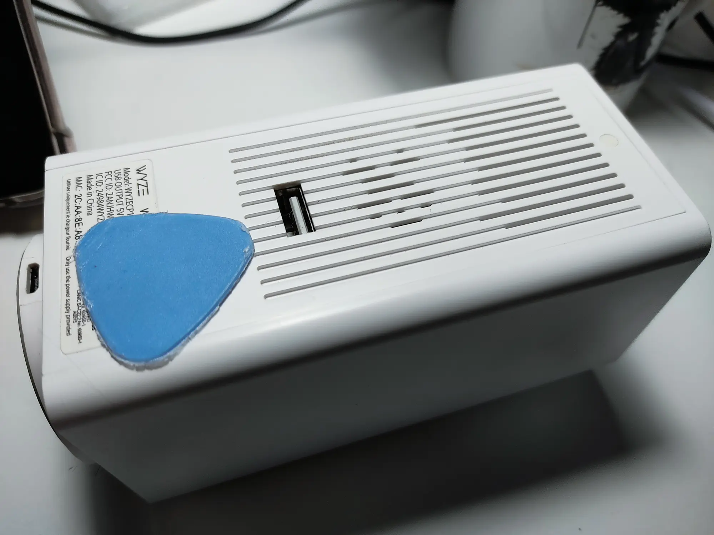
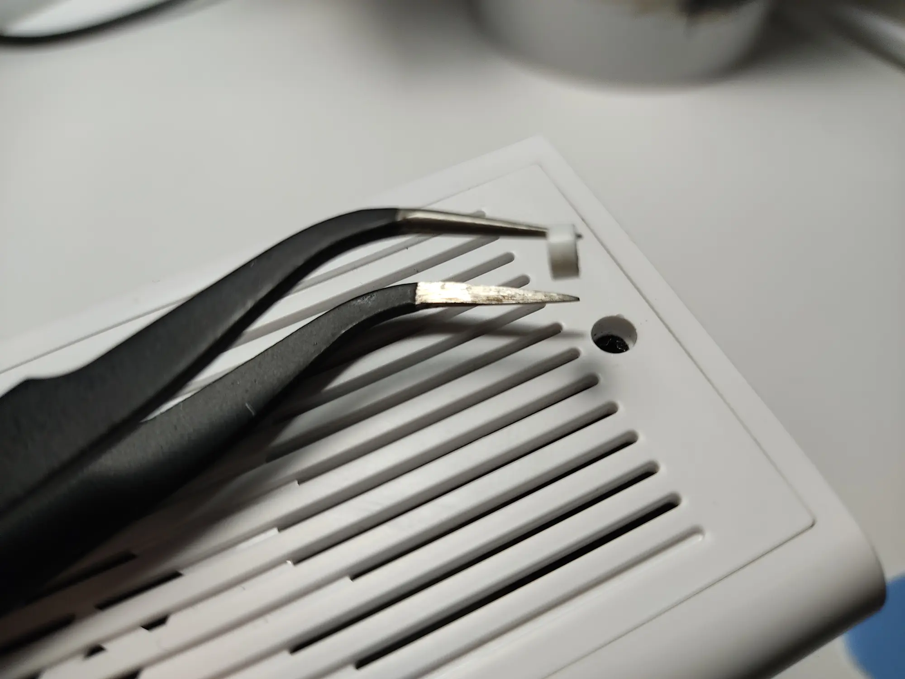
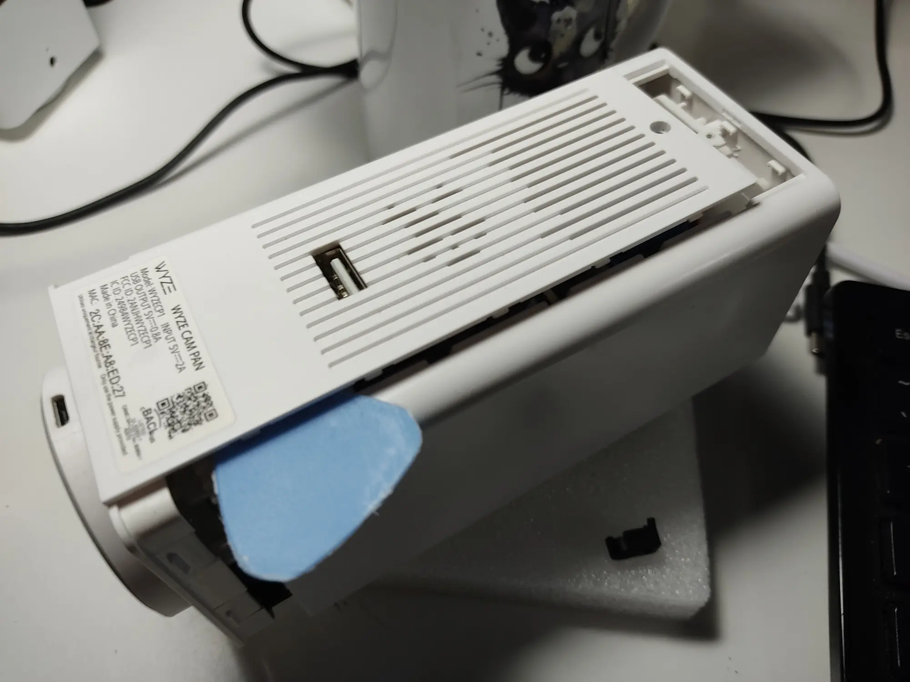
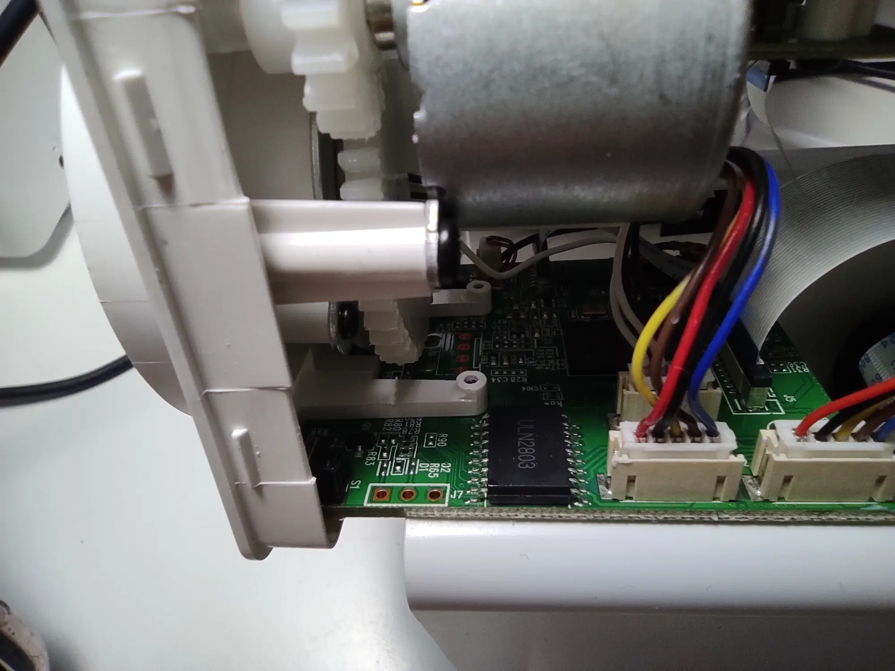
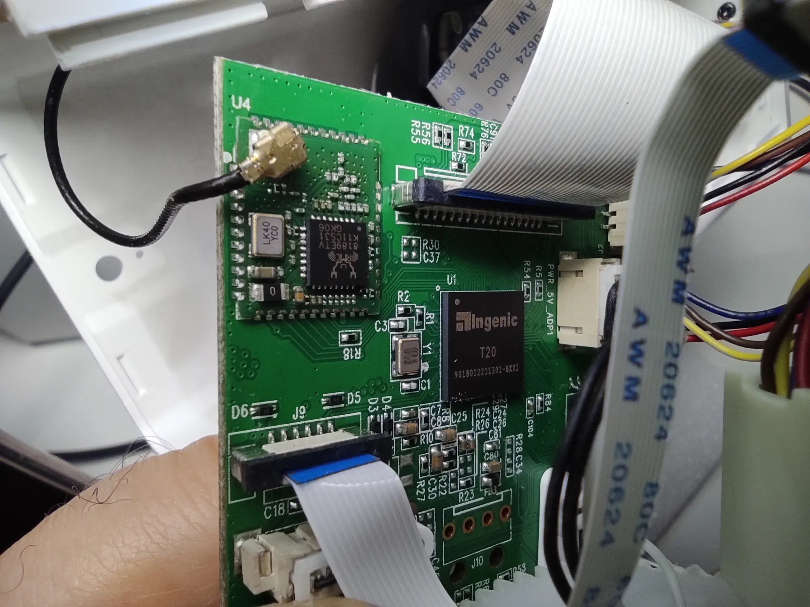
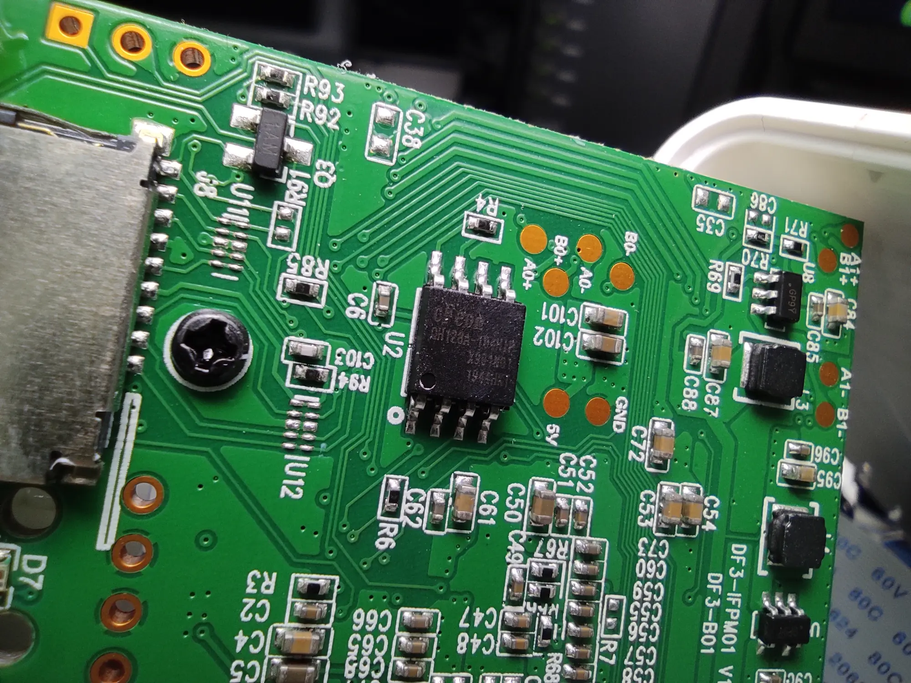

Wyze Cam Pan V1 / Xiaomi Dafang
-------------------------------

- Model: WYZECP1
- FCC ID: 2ANJHWYZECP1
- IC IC: 24984WYZECP1
- SoC: Ingenic T20X
- Sensor: JX-F22
- Flash: cFeon 25QH128A
- WiFi: RTL8189FTV or RTL8189ETV (8189es)

### Specs

- Resolution: 1920x1080
- Lens: F2.3
- Angle of view: 120°
- LED: 6 x 940 nm, 0.5 W
- Pan angle: 360°
- Tilt angle: 93°
- Voice: Two-way audio
- Wi-Fi: 802.11 b/g/n 2.4 GHz
- Storage: Micro SD card up to 32GB
- Power Supply: 5V DC 2A
- Dimensions: 127.5 x 60 x 60 mm
- Weight: 249 g

### Power consumption
- Stock:   5.01V x 0.28A = 1.4028W
- OpenIPC: 5.04V x 0.26A = 1.3104W

### Teardown










### UART

View from the front of the camera.

```
 |  o  <- G
 |  o  <- T
 | [o] <- R
 +----------
```
Pitch 2.0 mm.


### Stock firmware boot log

```
U-Boot SPL 2013.07 (Jul 05 2018 - 13:33:27)
pll_init:365
l2cache_clk = 375000000
pll_cfg.pdiv = 8, pll_cfg.h2div = 4, pll_cfg.h0div = 4, pll_cfg.cdiv = 1, pll_cfg.l2div = 3
nf=36 nr = 1 od0 = 1 od1 = 1
cppcr is 02404900
CPM_CPAPCR 0470890d
nf=42 nr = 1 od0 = 1 od1 = 1
cppcr is 02a04900
CPM_CPMPCR 07d0c90d
nf=50 nr = 1 od0 = 1 od1 = 1
cppcr is 03204900
CPM_CPVPCR 0320490d
cppcr 0x9a794410
apll_freq 860160000
mpll_freq 1000000000
vpll_freq = 1200000000
ddr sel mpll, cpu sel apll
ddrfreq 500000000
cclk  860160000
l2clk 286720000
h0clk 250000000
h2clk 250000000
pclk  125000000
DDRC_DLP:0000f003
```

```
U-Boot 2013.07 (Jul 05 2018 - 13:33:27)

Board: ISVP (Ingenic XBurst T20 SoC)
DRAM:  128 MiB
Top of RAM usable for U-Boot at: 84000000
Reserving 399k for U-Boot at: 83f9c000
Reserving 32784k for malloc() at: 81f98000
Reserving 32 Bytes for Board Info at: 81f97fe0
Reserving 124 Bytes for Global Data at: 81f97f64
Reserving 128k for boot params() at: 81f77f64
Stack Pointer at: 81f77f48
Now running in RAM - U-Boot at: 83f9c000
MMC:   msc: 0
the manufacturer 1c
SF: Detected FM25Q64

*** Warning - bad CRC, using default environment

In:    serial
Out:   serial
Err:   serial
misc_init_r before change the wifi_enable_gpio
gpio_request lable = wifi_enable_gpio gpio = 62
misc_init_r after gpio_request the wifi_enable_gpio ret is 62
misc_init_r after change the wifi_enable_gpio ret is 0
misc_init_r before change the yellow_gpio
gpio_request lable = yellow_gpio gpio = 38
misc_init_r after gpio_request the yellow_gpio ret is 38
misc_init_r after change the yellow_gpio ret is 0
misc_init_r before change the blue_gpio
gpio_request lable = blue_gpio gpio = 39
misc_init_r after gpio_request the blue_gpio ret is 39
misc_init_r after change the blue_gpio ret is 1
gpio_request lable = night_gpio gpio = 81
misc_init_r after gpio_request the night_gpio ret is 81
misc_init_r after change the night_gpio ret is 0
gpio_request lable = night_gpio gpio = 25
misc_init_r after gpio_request the night_gpio ret is 25
misc_init_r after change the night_gpio ret is 0
gpio_request lable = night_gpio gpio = 49
misc_init_r after gpio_request the night_gpio ret is 49
misc_init_r after change the night_gpio ret is 0
gpio_request lable = USB_able_gpio gpio = 47
misc_init_r after gpio_request the USB_able_gpio ret is 47
misc_init_r after change the USB_able_gpio ret is 1
gpio_request lable = TF_able_gpio gpio = 43
misc_init_r after gpio_request the TF_able_gpio ret is 43
misc_init_r after change the TF_able_gpio ret is 1
gpio_request lable = SPK_able_gpio gpio = 63
misc_init_r after gpio_request the SPK_able_gpio ret is 63
misc_init_r after change the SPK_able_gpio ret is 0
gpio_request lable = SD_able_gpio gpio = 48
misc_init_r after gpio_request the SD_able_gpio ret is 48
misc_init_r after change the SD_able_gpio ret is 0
misc_init_r before change the wifi_enable_gpio
gpio_request lable = wifi_enable_gpio gpio = 62
misc_init_r after gpio_request the wifi_enable_gpio ret is 62
misc_init_r after change the wifi_enable_gpio ret is 1
Hit any key to stop autoboot:  1 ... 0
jiabo_do_auto_update!!!!!!!!!!!!!!!!!!!!!!!!
gpio_request lable = sdupgrade gpio = 46
the manufacturer 1c
SF: Detected FM25Q64

jiabo_update_to_flash!!!!!!!!!!!!!!!!!!!!!!!!
jiabo_au_do_update!!!!!!!!!!!!!!!!!!!!!!!!
start=0
start=40000
len=40000
flash check read...
FWGRADEUP not find !!!!!!!!!
gradeup check fail!!!!!!!!!!!!!!!!!!!
the manufacturer 1c
SF: Detected FM25Q64

Erasing SPI flash...addr align as 10000 !
sfc erase error
the manufacturer 1c
SF: Detected FM25Q64

--->probe spend 4 ms
SF: 2621440 bytes @ 0x40000 Read: OK
--->read spend 381 ms
## Booting kernel from Legacy Image at 80600000 ...
   Image Name:   Linux-3.10.14
   Image Type:   MIPS Linux Kernel Image (lzma compressed)
   Data Size:    1844117 Bytes = 1.8 MiB
   Load Address: 80010000
   Entry Point:  803f7280
   Verifying Checksum ... OK
   Uncompressing Kernel Image ... OK

Starting kernel ...
```

```
[    0.000000] Initializing cgroup subsys cpu
[    0.000000] Initializing cgroup subsys cpuacct
[    0.000000] Linux version 3.10.14 (xiaoyongjian@xiaoyongjian-virtual-machine) (gcc version 4.7.2 (Ingenic r2.3.3 2016.12) ) #6 PREEMPT Mon Jun 22 14:42:59 CST 2020
[    0.000000] bootconsole [early0] enabled
[    0.000000] CPU0 RESET ERROR PC:FDA6FA81
[    0.000000] CPU0 revision is: 00d00101 (Ingenic Xburst)
[    0.000000] FPU revision is: 00b70000
[    0.000000] CCLK:860MHz L2CLK:430Mhz H0CLK:200MHz H2CLK:200Mhz PCLK:100Mhz
[    0.000000] Determined physical RAM map:
[    0.000000]  memory: 0053b000 @ 00010000 (usable)
[    0.000000]  memory: 00035000 @ 0054b000 (usable after init)
[    0.000000] User-defined physical RAM map:
[    0.000000]  memory: 06800000 @ 00000000 (usable)
[    0.000000] Zone ranges:
[    0.000000]   Normal   [mem 0x00000000-0x067fffff]
[    0.000000] Movable zone start for each node
[    0.000000] Early memory node ranges
[    0.000000]   node   0: [mem 0x00000000-0x067fffff]
[    0.000000] Primary instruction cache 32kB, 8-way, VIPT, linesize 32 bytes.
[    0.000000] Primary data cache 32kB, 8-way, VIPT, no aliases, linesize 32 bytes
[    0.000000] pls check processor_id[0x00d00101],sc_jz not support!
[    0.000000] MIPS secondary cache 128kB, 8-way, linesize 32 bytes.
[    0.000000] Built 1 zonelists in Zone order, mobility grouping off.  Total pages: 26416
[    0.000000] Kernel command line: console=ttyS1,115200n8 mem=104M@0x0 ispmem=8M@0x6800000 rmem=16M@0x7000000 init=/linuxrc rootfstype=squashfs root=/dev/mtdblock2 rw mtdparts=jz_sfc:256k(boot),2048k(kernel),3392k(root),640k(driver),4736k(appfs),2048k(ba
[    0.000000] PID hash table entries: 512 (order: -1, 2048 bytes)
[    0.000000] Dentry cache hash table entries: 16384 (order: 4, 65536 bytes)
[    0.000000] Inode-cache hash table entries: 8192 (order: 3, 32768 bytes)
[    0.000000] Memory: 99300k/106496k available (4032k kernel code, 7196k reserved, 1321k data, 212k init, 0k highmem)
[    0.000000] SLUB: HWalign=32, Order=0-3, MinObjects=0, CPUs=1, Nodes=1
[    0.000000] Preemptible hierarchical RCU implementation.
[    0.000000] NR_IRQS:418
[    0.000000] clockevents_config_and_register success.
[    0.000024] Calibrating delay loop... 858.52 BogoMIPS (lpj=4292608)
[    0.087751] pid_max: default: 32768 minimum: 301
[    0.092736] Mount-cache hash table entries: 512
[    0.097838] Initializing cgroup subsys debug
[    0.102100] Initializing cgroup subsys freezer
[    0.109193] regulator-dummy: no parameters
[    0.113482] NET: Registered protocol family 16
[    0.135531] bio: create slab <bio-0> at 0
[    0.141858] jz-dma jz-dma: JZ SoC DMA initialized
[    0.147118] SCSI subsystem initialized
[    0.151046] usbcore: registered new interface driver usbfs
[    0.156630] usbcore: registered new interface driver hub
[    0.162062] usbcore: registered new device driver usb
[    0.167368] i2c-gpio i2c-gpio.1: using pins 57 (SDA) and 58 (SCL)
[    0.173570]  (null): set:249  hold:250 dev=100000000 h=500 l=500
[    0.179716] media: Linux media interface: v0.10
[    0.184269] Linux video capture interface: v2.00
[    0.191069] Switching to clocksource jz_clocksource
[    0.196026] cfg80211: Calling CRDA to update world regulatory domain
[    0.203124] jz-dwc2 jz-dwc2: cgu clk gate get error
[    0.208062] jz-dwc2 jz-dwc2: regulator vbus get error
[    0.213146] DWC IN OTG MODE
[    0.366397] sft id =========================off
[    0.370996] dwc2 dwc2: Keep PHY ON
[    0.374385] dwc2 dwc2: Using Buffer DMA mode
[    0.578530] dwc2 dwc2: Core Release: 3.00a
[    0.582652] dwc2 dwc2: DesignWare USB2.0 High-Speed Host Controller
[    0.588982] dwc2 dwc2: new USB bus registered, assigned bus number 1
[    0.596372] hub 1-0:1.0: USB hub found
[    0.600111] hub 1-0:1.0: 1 port detected
[    0.604267] dwc2 dwc2: DWC2 Host Initialized
[    0.608759] NET: Registered protocol family 2
[    0.613738] TCP established hash table entries: 1024 (order: 1, 8192 bytes)
[    0.620765] TCP bind hash table entries: 1024 (order: 0, 4096 bytes)
[    0.627244] TCP: Hash tables configured (established 1024 bind 1024)
[    0.633698] TCP: reno registered
[    0.636895] UDP hash table entries: 256 (order: 0, 4096 bytes)
[    0.642850] UDP-Lite hash table entries: 256 (order: 0, 4096 bytes)
[    0.649464] NET: Registered protocol family 1
[    0.654183] RPC: Registered named UNIX socket transport module.
[    0.660116] RPC: Registered udp transport module.
[    0.664950] RPC: Registered tcp transport module.
[    0.669652] RPC: Registered tcp NFSv4.1 backchannel transport module.
[    0.676692] freq_udelay_jiffys[0].max_num = 10
[    0.681119] cpufreq  udelay  loops_per_jiffy
[    0.685586] dwc2 dwc2: ID PIN CHANGED!
[    0.689363] init DWC as A_HOST
[    0.692465] 12000     59885   59885
[    0.695688] 24000     119771  119771
[    0.699131] 60000     299428  299428
[    0.702766] 120000    598857  598857
[    0.706223] 200000    998095  998095
[    0.709754] 300000    1497142         1497142
[    0.713499] 600000    2994285         2994285
[    0.717171] 792000    3952457         3952457
[    0.720879] 1008000   5030400         5030400
[    0.724689] 1200000   5988571         5988571
[    0.734088] squashfs: version 4.0 (2009/01/31) Phillip Lougher
[    0.740947] jffs2: version 2.2. (NAND) © 2001-2006 Red Hat, Inc.
[    0.747543] msgmni has been set to 193
[    0.752781] io scheduler noop registered
[    0.756718] io scheduler cfq registered (default)
[    0.763398] jz-uart.1: ttyS1 at MMIO 0x10031000 (irq = 58) is a uart1
[    0.771589] console [ttyS1] enabled, bootconsole disabled
[    0.771589] console [ttyS1] enabled, bootconsole disabled
[    0.786822] brd: module loaded
[    0.792080] loop: module loaded
[    0.796229] zram: Created 2 device(s) ...
[    0.800476] logger: created 256K log 'log_main'
[    0.805872] jz SADC driver registeres over!
[    0.811195] jz TCU driver register completed
[    0.816440] the id code = 1c7018, the flash name is EN25QH128A
[    0.822534] JZ SFC Controller for SFC channel 0 driver register
[    0.828699] 11 cmdlinepart partitions found on MTD device jz_sfc
[    0.834959] Creating 11 MTD partitions on "jz_sfc":
[    0.840017] 0x000000000000-0x000000040000 : "boot"
[    0.845579] 0x000000040000-0x000000240000 : "kernel"
[    0.851233] 0x000000240000-0x000000590000 : "root"
[    0.856789] 0x000000590000-0x000000630000 : "driver"
[    0.862537] 0x000000630000-0x000000ad0000 : "appfs"
[    0.868151] 0x000000ad0000-0x000000cd0000 : "backupk"
[    0.873971] 0x000000cd0000-0x000000d70000 : "backupd"
[    0.879755] 0x000000d70000-0x000000f70000 : "backupa"
[    0.885597] 0x000000f70000-0x000000fb0000 : "config"
[    0.891338] 0x000000fb0000-0x000000ff0000 : "para"
[    0.896941] 0x000000ff0000-0x000001000000 : "flag"
[    0.902414] SPI NOR MTD LOAD OK
[    0.905788] tun: Universal TUN/TAP device driver, 1.6
[    0.911024] tun: (C) 1999-2004 Max Krasnyansky <maxk@qualcomm.com>
[    0.917587] usbcore: registered new interface driver zd1201
[    0.923437] usbcore: registered new interface driver r8152
[    0.929202] usbcore: registered new interface driver usb-storage
[    0.935578] usbcore: registered new interface driver usbserial
[    0.941662] usbcore: registered new interface driver usbserial_generic
[    0.948495] usbserial: USB Serial support registered for generic
[    0.954789] usbcore: registered new interface driver ch341
[    0.960503] usbserial: USB Serial support registered for ch341-uart
[    0.967053] usbcore: registered new interface driver cp210x
[    0.972875] usbserial: USB Serial support registered for cp210x
[    0.979054] usbcore: registered new interface driver ftdi_sio
[    0.985066] usbserial: USB Serial support registered for FTDI USB Serial Device
[    0.992761] usbcore: registered new interface driver pl2303
[    0.998567] usbserial: USB Serial support registered for pl2303
[    1.505713] i8042: i8042 controller selftest timeout
[    1.511356] jzmmc_v1.2 jzmmc_v1.2.0: vmmc regulator missing
[    1.552588] jzmmc_v1.2 jzmmc_v1.2.0: register success!
[    1.557978] jzmmc_v1.2 jzmmc_v1.2.1: vmmc regulator missing
[    1.603523] jzmmc_v1.2 jzmmc_v1.2.1: register success!
[    1.608993] hidraw: raw HID events driver (C) Jiri Kosina
[    1.614880] usbcore: registered new interface driver usbhid
[    1.620656] usbhid: USB HID core driver
[    1.624730] Netfilter messages via NETLINK v0.30.
[    1.629662] nf_conntrack version 0.5.0 (1551 buckets, 6204 max)
[    1.636423] ip_tables: (C) 2000-2006 Netfilter Core Team
[    1.642034] TCP: cubic registered
[    1.645520] NET: Registered protocol family 17
[    1.651157] input: gpio-keys as /devices/platform/gpio-keys/input/input0
[    1.658388] drivers/rtc/hctosys.c: unable to open rtc device (rtc0)
[    1.669060] VFS: Mounted root (squashfs filesystem) readonly on device 31:2.
[    1.676868] Freeing unused kernel memory: 212K (8054b000 - 80580000)
[    1.815805] dwc2 dwc2:  ++OTG Interrupt: A-Device Timeout Change++
mdev is ok......
*****************************************
*   root password updated Nov 03, 2023  *
*****************************************


Ingenic-uc1_1 login: Updating device time to:
Fri Nov  3 02:19:36 EDT 2023
################################
######## this is dafang ########
################################
[    3.573172] register all isp device successfully!
[    3.582599] @@@@ tx-isp-probe ok @@@@@
[    3.632225] exFAT: Version 1.2.9
[    3.673485] motor_probe [ChenX @ Hualai Technologies]
[    3.678729] Hualai motor driver version: MT20180918g
[    3.705554] jz_pwm_probe[198] d_name = tcu_chn0
[    3.722108] request pwm channel 0 successfully
[    3.729573] pwm-jz pwm-jz: jz_pwm_probe register ok !
[    3.769029] jz_codec_register: probe() successful!
[    4.122926] dma dma0chan24: Channel 24 have been requested.(phy id 7,type 0x06 desc a47a8000)
[    4.132182] dma dma0chan25: Channel 25 have been requested.(phy id 6,type 0x06 desc a4874000)
[    4.619010] RTL871X: module init start
[    4.622953] RTL871X: rtl8189es v4.3.18.3_20185.20161116_pmpinclu_mac_monitor_minMem_EDCA542B_pbyr
[    4.632150] RTL871X: build time: May 26 2020 12:44:31
[    4.637457] wlan power on
[    4.652986] RTL871X: module init ret=0
[    4.709930] mmc1: new SDIO card at address 0001
[    4.726242] bFWReady == _FALSE call reset 8051...
[    4.754408] RTL871X: rtw_ndev_init(wlan0) if1 mac_addr=34:75:63:c5:e3:30
ifconfig: SIOCSIFADDR: No such device
route: SIOCADDRT: Network is unreachable
kernel.core_pattern = |/system/bin/ucoredmp_collector.sh --pid %p --signal %s --name %e --time %t --output-dir /media/mmc/cores
kernel.core_pipe_limit = 1
net.unix.max_dgram_qlen = 128
[    9.453919] jffs2: warning: (54) jffs2_do_read_inode_internal: Truncating ino #67 to 576972 bytes failed because it only had 59908 bytes to start with!
iCamera is Running
[   17.132261] name : i2c-gpio1 nr : 1
[   17.136023] name : i2c0 nr : 0
[   17.200076]  sensor_read: addr=0xa value = 0xf
[   17.205108]  sensor_read: addr=0xb value = 0x22
[   17.270758]  sensor_read: addr=0xa value = 0xf
[   17.275901]  sensor_read: addr=0xb value = 0x22
[   17.280676] info: success sensor find : jxf22
[   17.285251] misc sinfo_release
[   18.075151] set sensor gpio as PA-low-10bit
[   18.108273] jxf22 0-0040: jxf22 chip found @ 0x40 (i2c0)
[   18.113805] tx_isp: Registered sensor subdevice jxf22 0-0040
[   19.012244] ###### image_tuning_v4l2_open 4219 #######
[   19.467152] &&& chan1  scaler.max_width = 1920 max_height = 1080  min_width = 128 min_height = 128 &&&
[   19.772648] &&& chan2  scaler.max_width = 800 max_height = 800  min_width = 128 min_height = 128 &&&
[   20.192511] codec_set_device: set device: MIC...
[   20.932519] codec_set_device: set device: speaker...
[   22.112788] ==> rtl8188e_iol_efuse_patch
[   23.980341] [motor_speed1090] speed:900, level:15
[   23.987458] motor_ops_reset948
[   29.293322] RTL871X: rtw_cmd_thread: DriverStopped(True) SurpriseRemoved(False) break at line 564
[   29.316704] RTL871X: rtw_dev_unload: driver not in IPS
[   30.232780] ==> rtl8188e_iol_efuse_patch
[   36.664919] RTL871X: rtw_set_802_11_connect(wlan0)  fw_state=0x00000008
[   36.738454] RTL871X: start auth
[   36.744681] RTL871X: auth success, start assoc
[   36.754865] RTL871X: assoc success
[   36.768307] RTL871X: recv eapol packet
[   36.868566] RTL871X: send eapol packet
[   36.888020] RTL871X: recv eapol packet
[   36.904500] RTL871X: send eapol packet
[   36.926798] RTL871X: set pairwise key camid:4, addr:8a:d8:1b:dd:3e:c8, kid:0, type:AES
[   36.941426] RTL871X: set group key camid:5, addr:8a:d8:1b:dd:3e:c8, kid:1, type:AES
```
### U-Boot Shell

`Ctrl-C` brings U-Boot shell, no password needed.

__help__
```
?       - alias for 'help'
base    - print or set address offset
boot    - boot default, i.e., run 'bootcmd'
boota   - boot android system
bootd   - boot default, i.e., run 'bootcmd'
bootm   - boot application image from memory
chpart  - change active partition
cmp     - memory compare
coninfo - print console devices and information
cp      - memory copy
crc32   - checksum calculation
echo    - echo args to console
env     - environment handling commands
fatinfo - print information about filesystem
fatload - load binary file from a dos filesystem
fatls   - list files in a directory (default /)
gettime - get timer val elapsed,

go      - start application at address 'addr'
help    - print command description/usage
loadb   - load binary file over serial line (kermit mode)
loads   - load S-Record file over serial line
loady   - load binary file over serial line (ymodem mode)
loop    - infinite loop on address range
md      - memory display
mm      - memory modify (auto-incrementing address)
mmc     - MMC sub system
mmcinfo - display MMC info
mtdparts- define flash/nand partitions
mw      - memory write (fill)
nm      - memory modify (constant address)
printenv- print environment variables
reset   - Perform RESET of the CPU
run     - run commands in an environment variable
saveenv - save environment variables to persistent storage
sdupdate- auto upgrade file from mmc to flash
setenv  - set environment variables
sf      - SPI flash sub-system
sleep   - delay execution for some time
source  - run script from memory
version - print monitor, compiler and linker version
```

__printenv__
```
baudrate=115200
bootargs=console=ttyS1,115200n8 mem=104M@0x0 ispmem=8M@0x6800000 rmem=16M@0x7000000 init=/linuxrc rootfstype=squashfs root=/dev/mtdblock2 rw mtdparts=jz_sfc:256k(boot),2048k(kernel),3392k(root),640k(driver),4736k(appfs),2048k(backupk),640k(backupd),2048k(backupa),256k(config),256k(para),-(flag)
bootcmd=sdupdate;sf probe;sf read 0x80600000 0x40000 0x280000; bootm 0x80600000
bootdelay=1
ethaddr=00:11:22:33:44:55
gatewayip=193.169.4.1
ipaddr=193.169.4.81
loads_echo=1
netmask=255.255.255.0
serverip=193.169.4.2
stderr=serial
stdin=serial
stdout=serial

Environment size: 596/16380 bytes
```

### GPIO

### LED light
```
pin 38 - Yellow LED (output, LOW on, HIGH off)
pin 39 - Blue LED   (output, LOW on, HIGH off)
```

### SD Card
```
pin 43 - MMC detect (input)
```

To make SD card work, you need to run 
```
echo 43 > /sys/class/gpio/export
echo in > /sys/class/gpio/gpio43/direction
```

#### Night Mode
```
pin 25 26 - IRCUT   (output, HIGH on, LOW off)
pin 49    - IR LEDs (output, HIGH on, LOW off)
```

#### Motors
```
J1 (horiz) 
            | Voltage to GND  |
 pin | GPIO |  HIGH  |   LOW  |
 ----|------|--------|--------|
  1  |      |       5V        |
  2  |  54  | 0.584V | 1.330V | 
  3  |  53  | 0.584V | 1.628V | 
  4  |  52  | 0.584V | 1.463V | 
  5  |  51  | 0.584V | 1.554V | 

J2 (vert)
            | Voltage to GND  |
 pin | GPIO |  HIGH  |   LOW  |
 ----|------|--------|--------|
  1  |      |       5V        |
  2  |  80  |   1.0V |   5.0V |
  3  |  79  |   1.0V |   5.0V |
  4  |  76  |   1.0V |   5.0V |
  5  |  75  |   1.0V |   5.0V |

hmaxstep 2590
vmaxstep 710
```

### USB disk
```
# set the GPIO PC13 to high, make the USB Disk can be used
echo 77 > /sys/class/gpio/export
echo out > /sys/class/gpio/gpio77/direction 
echo 0 > /sys/class/gpio/gpio77/active_low
echo 1 > /sys/class/gpio/gpio77/value
```

#### misc (unconfirmed)

- 46 - sdupgrade (from uboot)
- 47 - USB_able_gpio (from uboot)
- 48 - SD_able_gpio (from uboot)
- 61 - WiFI ???
- 62 - wifi_enable_gpio (from uboot)
- 63 - SPK_able_gpio (from uboot)
- 77 - USB drive enable ???
- 81 - night_gpio (from uboot) LDR input?


## Linux

```
root:$6$wyzecampan$iH01lm9SqCfUrc4.Jjp3BLUErTGiiB.pBk/60XuPYxQo7uZIoBjwUrCcoGeesbTa1EP5N/DC1a/GOMVW8qUVY1:10933:0:99999:7:::
```

## OpenIPC

Flashed OpenIPC T20 8MB Lite image via programming clip.


### U-Boot

ATTENTION! U-Boot energizes IRCUT pin and holds it until Linux takes over!

### Linux

__lsusb__
```
Bus 001 Device 001: ID 1d6b:0002
```

__mount -t debugfs debugfs /sys/kernel/debug; cat /sys/kernel/debug/gpio__
```
GPIOs 0-31, GPIO A:
 gpio-18  (jxf22_reset         ) out hi

GPIOs 32-63, GPIO B:
 gpio-59  (mmc_detect          ) in  hi
 gpio-63  (gpio_spk_en         ) in  lo

GPIOs 64-95, GPIO C:
 gpio-64  (home key            ) in  hi

GPIOs 96-127, GPIO D:

GPIOs 128-159, GPIO E:

GPIOs 160-191, GPIO F:
```

### Sideloading drivers and configuration from an SD card

Initial access to SD card requires additional GPIO adjustments:
```
echo 43 > /sys/class/gpio/export
echo in > /sys/class/gpio/gpio43/direction
```

Insert the SD card with extra drivers and run
```
/mnt/mmcblk0p1/install.sh
```

Create settings and connect to your wireless network
```
fw_setenv wlandev rtl8189es-t20-wyze-pan-v1
fw_setenv wlanssid mysuperfastwifi
fw_setenv wlanpass Lo0kMaImAk0oLhAk3r 

ifup wlan0
```

### OpenIPC boot log

```
[    0.000000] Initializing cgroup subsys cpu
[    0.000000] Initializing cgroup subsys cpuacct
[    0.000000] Linux version 3.10.14 (runner@fv-az773-122) (buildroot-gcc-12.2.0) #2 PREEMPT Tue Dec 12 08:00:42 UTC 2023
[    0.000000] bootconsole [early0] enabled
[    0.000000] CPU0 RESET ERROR PC:79AEFAA1
[    0.000000] CPU0 revision is: 00d00101 (Ingenic Xburst)
[    0.000000] FPU revision is: 00b70000
[    0.000000] CCLK:860MHz L2CLK:430Mhz H0CLK:200MHz H2CLK:200Mhz PCLK:100Mhz
[    0.000000] Determined physical RAM map:
[    0.000000]  memory: 0049d000 @ 00010000 (usable)
[    0.000000]  memory: 00033000 @ 004ad000 (usable after init)
[    0.000000] User-defined physical RAM map:
[    0.000000]  memory: 02800000 @ 00000000 (usable)
[    0.000000] Initrd not found or empty - disabling initrd
[    0.000000] Zone ranges:
[    0.000000]   Normal   [mem 0x00000000-0x027fffff]
[    0.000000] Movable zone start for each node
[    0.000000] Early memory node ranges
[    0.000000]   node   0: [mem 0x00000000-0x027fffff]
[    0.000000] On node 0 totalpages: 10240
[    0.000000] free_area_init_node: node 0, pgdat 804a7cd0, node_mem_map 81000000
[    0.000000]   Normal zone: 80 pages used for memmap
[    0.000000]   Normal zone: 0 pages reserved
[    0.000000]   Normal zone: 10240 pages, LIFO batch:1
[    0.000000] Primary instruction cache 32kB, 8-way, VIPT, linesize 32 bytes.
[    0.000000] Primary data cache 32kB, 8-way, VIPT, no aliases, linesize 32 bytes
[    0.000000] pls check processor_id[0x00d00101],sc_jz not support!
[    0.000000] MIPS secondary cache 128kB, 8-way, linesize 32 bytes.
[    0.000000] pcpu-alloc: s0 r0 d32768 u32768 alloc=1*32768
[    0.000000] pcpu-alloc: [0] 0 
[    0.000000] Built 1 zonelists in Zone order, mobility grouping off.  Total pages: 10160
[    0.000000] Kernel command line: mem=40M rmem=24M@0x2800000 console=ttyS1,115200n8 panic=20 root=/dev/mtdblock3 rootfstype=squashfs init=/init mtdparts=jz_sfc:256k(boot),64k(env),2048k(kernel),5120k(rootfs),-(rootfs_data) nogmac
[    0.000000] PID hash table entries: 256 (order: -2, 1024 bytes)
[    0.000000] Dentry cache hash table entries: 8192 (order: 3, 32768 bytes)
[    0.000000] Inode-cache hash table entries: 4096 (order: 2, 16384 bytes)
[    0.000000] Memory: 34960k/40960k available (3521k kernel code, 6000k reserved, 1201k data, 204k init, 0k highmem)
[    0.000000] SLUB: HWalign=32, Order=0-3, MinObjects=0, CPUs=1, Nodes=1
[    0.000000] Preemptible hierarchical RCU implementation.
[    0.000000] NR_IRQS:418
[    0.000000] clockevents_config_and_register success.
[    0.000024] Calibrating delay loop... 858.52 BogoMIPS (lpj=4292608)
[    0.087751] pid_max: default: 32768 minimum: 301
[    0.092742] Mount-cache hash table entries: 512
[    0.097850] Initializing cgroup subsys debug
[    0.102114] Initializing cgroup subsys freezer
[    0.108812] devtmpfs: initialized
[    0.114305] regulator-dummy: no parameters
[    0.118804] NET: Registered protocol family 16
[    0.129125] Skipping GMAC GPIO setup
[    0.161234] bio: create slab <bio-0> at 0
[    0.174244] jz-dma jz-dma: JZ SoC DMA initialized
[    0.181076] usbcore: registered new interface driver usbfs
[    0.187299] usbcore: registered new interface driver hub
[    0.192892] usbcore: registered new device driver usb
[    0.198650]  (null): set:249  hold:250 dev=100000000 h=500 l=500
[    0.205235] media: Linux media interface: v0.10
[    0.210003] Linux video capture interface: v2.00
[    0.216900] Switching to clocksource jz_clocksource
[    0.225330] dwc2 otg probe start
[    0.225369] jz-dwc2 jz-dwc2: cgu clk gate get error
[    0.230254] DWC IN OTG MODE
[    0.234244] dwc2 dwc2: Keep PHY ON
[    0.237618] dwc2 dwc2: Using Buffer DMA mode
[    0.242091] dwc2 dwc2: Core Release: 3.00a
[    0.246204] dwc2 dwc2: DesignWare USB2.0 High-Speed Host Controller
[    0.252644] dwc2 dwc2: new USB bus registered, assigned bus number 1
[    0.260428] hub 1-0:1.0: USB hub found
[    0.264316] hub 1-0:1.0: 1 port detected
[    0.268390] dwc2 dwc2: DWC2 Host Initialized
[    0.272762] dwc2 otg probe success
[    0.273130] NET: Registered protocol family 2
[    0.278224] TCP established hash table entries: 512 (order: 0, 4096 bytes)
[    0.285289] TCP bind hash table entries: 512 (order: -1, 2048 bytes)
[    0.291669] TCP: Hash tables configured (established 512 bind 512)
[    0.298031] TCP: reno registered
[    0.301230] UDP hash table entries: 256 (order: 0, 4096 bytes)
[    0.307210] UDP-Lite hash table entries: 256 (order: 0, 4096 bytes)
[    0.313812] NET: Registered protocol family 1
[    0.318479] RPC: Registered named UNIX socket transport module.
[    0.324480] RPC: Registered udp transport module.
[    0.329179] RPC: Registered tcp transport module.
[    0.333961] RPC: Registered tcp NFSv4.1 backchannel transport module.
[    0.341363] freq_udelay_jiffys[0].max_num = 10
[    0.345884] cpufreq  udelay  loops_per_jiffy
[    0.350233] dwc2 dwc2: ID PIN CHANGED!
[    0.354100] 12000     59885   59885
[    0.357289] 24000     119771  119771
[    0.360732] 60000     299428  299428
[    0.364292] 120000    598857  598857
[    0.367748] 200000    998095  998095
[    0.371279] 300000    1497142         1497142
[    0.375136] 600000    2994285         2994285
[    0.378769] 792000    3952457         3952457
[    0.382525] 1008000   5030400         5030400
[    0.386273] 1200000   5988571         5988571
[    0.404716] squashfs: version 4.0 (2009/01/31) Phillip Lougher
[    0.412519] jffs2: version 2.2. © 2001-2006 Red Hat, Inc.
[    0.418858] msgmni has been set to 68
[    0.424496] io scheduler noop registered
[    0.428432] io scheduler cfq registered (default)
[    0.443674] jz-uart.1: ttyS1 at MMIO 0x10031000 (irq = 58) is a uart1
[    0.451733] console [ttyS1] enabled, bootconsole disabled
[    0.475626] brd: module loaded
[    0.485488] loop: module loaded
[    0.489092] logger: created 256K log 'log_main'
[    0.513732] jz SADC driver registeres over!
[    0.523674] jz TCU driver register completed
[    0.529428] wait stable.[247][cgu_ssi]
[    0.533544] the id code = 1c7018, the flash name is GD25LQ128C
[    0.539596] #####unsupport ID is 1c7018 if the id not be 0x00,the flash can be ok,but the quad mode may be not support!!!!! 
[    0.751517] JZ SFC Controller for SFC channel 0 driver register
[    0.757689] 5 cmdlinepart partitions found on MTD device jz_sfc
[    0.763845] Creating 5 MTD partitions on "jz_sfc":
[    0.768831] 0x000000000000-0x000000040000 : "boot"
[    0.775309] 0x000000040000-0x000000050000 : "env"
[    0.781673] 0x000000050000-0x000000250000 : "kernel"
[    0.788395] 0x000000250000-0x000000750000 : "rootfs"
[    0.795139] 0x000000750000-0x000001000000 : "rootfs_data"
[    0.802384] SPI NOR MTD LOAD OK
[    0.805895] JZ GMAC disabled
[    0.808887] i2c /dev entries driver
[    0.814549] jzmmc_v1.2 jzmmc_v1.2.0: vmmc regulator missing
[    0.820788] jzmmc_v1.2 jzmmc_v1.2.0: register success!
[    0.826339] jzmmc_v1.2 jzmmc_v1.2.1: vmmc regulator missing
[    0.832543] jzmmc_v1.2 jzmmc_v1.2.1: register success!
[    0.838548] ipip: IPv4 over IPv4 tunneling driver
[    0.844369] TCP: cubic registered
[    0.849375] NET: Registered protocol family 10
[    0.855158] NET: Registered protocol family 17
[    0.861226] soc_vpu probe success,version:1.0.0-03203fd46d
[    0.867660] input: gpio-keys as /devices/platform/gpio-keys/input/input0
[    0.875636] drivers/rtc/hctosys.c: unable to open rtc device (rtc0)
[    0.887333] VFS: Mounted root (squashfs filesystem) readonly on device 31:3.
[    0.899724] devtmpfs: mounted
[    0.903361] Freeing unused kernel memory: 204K (804ad000 - 804e0000)
[    1.962188] jffs2: notice: (475) jffs2_build_xattr_subsystem: complete building xattr subsystem, 75 of xdatum (0 unchecked, 74 orphan) and 76 of xref (0 dead, 74 orphan) found.
[    2.488601] [resetd] GPIO undefined in /usr/sbin/resetd
[    2.511853] jzmmc_v1.2 jzmmc_v1.2.0: card inserted, state=0
[    2.889362] jzmmc_v1.2 jzmmc_v1.2.1: card insert via sysfs
[    2.991978] cfg80211: Calling CRDA to update world regulatory domain
[    3.063325] mmc1: new SDIO card at address 0001
[    3.751841] wait stable.[247][cgu_msc0]
[    3.791861] mmc0: new high speed SDHC card at address 0001
[    3.796649] mmcblk0: mmc0:0001 SD16G 29.1 GiB 
[    3.802376]  mmcblk0: p1
[    4.073269] RTW: module init start
[    4.073291] RTW: rtl8189es v5.8.9_35085.20190919
[    4.073360] RTW: rtw_inetaddr_notifier_register
[    4.074617] RTW: == SDIO Card Info ==
[    4.074651] RTW:   card: 821b3c00
[    4.074659] RTW:   clock: 24000000 Hz
[    4.074666] RTW:   timing spec: legacy
[    4.074678] RTW:   sd3_bus_mode: FALSE
[    4.074686] RTW:   func num: 1
[    4.074695] RTW:   func1: 82757200 (*)
[    4.074702] RTW: ================
[    4.074711] RTW: CHIP TYPE: RTL8188E
[    4.075443] RTW: Chip Version Info: CHIP_8188E_T4_1T1R_RomVer(0)
[    4.075464] RTW: =>_InitPowerOn_8188ES
[    4.075471] RTW: =>_CardEnable
[    4.084557] RTW: SetHwReg: bMacPwrCtrlOn=1
[    4.084573] RTW: <=_CardEnable
[    4.084764] RTW: <=_InitPowerOn_8188ES
[    4.084819] RTW: EEPROM type is E-FUSE
[    4.084855] RTW: _ReadPROMContent: 9346CR=0x20, Boot from EFUSE, Autoload OK
[    4.084970] RTW: =>_InitPowerOn_8188ES
[    4.084979] RTW: =>_CardEnable
[    4.084989] RTW: =>_CardEnable bMacPwrCtrlOn == _TRUE do nothing !!
[    4.084997] RTW: <=_CardEnable
[    4.086474] RTW: <=_InitPowerOn_8188ES
[    4.086564] bFWReady == _FALSE call reset 8051...
[    4.086817] RTW: =====> _8051Reset88E(): 8051 reset success .
[    4.105611] RTW: efuse_read_phymap_from_txpktbuf bcnhead:0
[    4.105763] RTW: efuse_read_phymap_from_txpktbuf len:162
[    4.107882] RTW: efuse_read_phymap_from_txpktbuf read count:160
[    4.108032] RTW: HW EFUSE
[    4.108044] RTW: 0x000: 29 81 00 6C  0B 00 00 00  00 0C 00 00  0A 00 00 00  
[    4.108096] RTW: 0x010: 2C 2C 2C 2C  2C 2C 31 31  31 31 31 02  FF FF FF FF  
[    4.108148] RTW: 0x020: FF FF FF FF  FF FF FF FF  FF FF FF FF  FF FF FF FF  
[    4.108199] RTW: 0x030: FF FF FF FF  FF FF FF FF  FF FF FF FF  FF FF FF FF  
[    4.108251] RTW: 0x040: FF FF FF FF  FF FF FF FF  FF FF FF FF  FF FF FF FF  
[    4.108303] RTW: 0x050: FF FF FF FF  FF FF FF FF  FF FF FF FF  FF FF FF FF  
[    4.108354] RTW: 0x060: FF FF FF FF  FF FF FF FF  FF FF FF FF  FF FF FF FF  
[    4.108406] RTW: 0x070: FF FF FF FF  FF FF FF FF  FF FF FF FF  FF FF FF FF  
[    4.108458] RTW: 0x080: FF FF FF FF  FF FF FF FF  FF FF FF FF  FF FF FF FF  
[    4.108510] RTW: 0x090: FF FF FF FF  FF FF FF FF  FF FF FF FF  FF FF FF FF  
[    4.108562] RTW: 0x0A0: FF FF FF FF  FF FF FF FF  FF FF FF FF  FF FF FF FF  
[    4.108614] RTW: 0x0B0: FF FF FF FF  FF FF FF FF  20 12 14 00  00 00 FF 00  
[    4.108665] RTW: 0x0C0: FF 00 00 10  00 00 00 55  00 03 FF FF  FF FF FF FF  
[    4.108716] RTW: 0x0D0: 3F 00 01 02  32 00 00 FC  20 04 4C 02  79 81 21 02  
[    4.108766] RTW: 0x0E0: 0C 00 22 04  00 08 00 32  FF 21 02 0C  00 22 2A 01  
[    4.108817] RTW: 0x0F0: 01 00 00 00  00 00 00 00  00 00 00 00  02 00 FF FF  
[    4.108868] RTW: 0x100: 00 00 00 00  00 00 00 00  00 00 00 00  00 00 00 00  
[    4.108918] RTW: 0x110: 00 EB 00 6E  01 00 00 00  00 FF 34 75  63 C5 E3 30  
[    4.108968] RTW: 0x120: FF FF FF FF  FF FF FF FF  FF FF FF FF  FF FF FF FF  
[    4.109020] RTW: 0x130: FF FF FF FF  FF FF FF FF  FF FF FF FF  FF FF FF FF  
[    4.109072] RTW: 0x140: FF FF FF FF  FF FF FF FF  FF FF FF FF  FF FF FF FF  
[    4.109124] RTW: 0x150: FF FF FF FF  FF FF FF FF  FF FF FF FF  FF FF FF FF  
[    4.109176] RTW: 0x160: FF FF FF FF  FF FF FF FF  FF FF FF FF  FF FF FF FF  
[    4.109228] RTW: 0x170: FF FF FF FF  FF FF FF FF  FF FF FF FF  FF FF FF FF  
[    4.109279] RTW: 0x180: FF FF FF FF  FF FF FF FF  FF FF FF FF  FF FF FF FF  
[    4.109331] RTW: 0x190: FF FF FF FF  FF FF FF FF  FF FF FF FF  FF FF FF FF  
[    4.109383] RTW: 0x1A0: FF FF FF FF  FF FF FF FF  FF FF FF FF  FF FF FF FF  
[    4.109435] RTW: 0x1B0: FF FF FF FF  FF FF FF FF  FF FF FF FF  FF FF FF FF  
[    4.109486] RTW: 0x1C0: FF FF FF FF  FF FF FF FF  FF FF FF FF  FF FF FF FF  
[    4.109538] RTW: 0x1D0: FF FF FF FF  FF FF FF FF  FF FF FF FF  FF FF FF FF  
[    4.109590] RTW: 0x1E0: FF FF FF FF  FF FF FF FF  FF FF FF FF  FF FF FF FF  
[    4.109642] RTW: 0x1F0: FF FF FF FF  FF FF FF FF  FF FF FF FF  FF FF FF FF  
[    4.109698] RTW: EEPROM ID=0x8129
[    4.109712] RTW: Hal_ReadPowerSavingMode88E...bHWPwrPindetect(0)-bHWPowerdown(0) ,bSupportRemoteWakeup(0)
[    4.109722] RTW: ### PS params=>  power_mgnt(0),usbss_enable(0) ###
[    4.109730] RTW: EEPROMRegulatory = 0x0
[    4.109745] RTW: hal_com_config_channel_plan chplan:0x20
[    4.109753] RTW: crystal_cap: 0x12
[    4.109761] RTW: EEPROM Customer ID: 0x 0
[    4.109770] RTW: pHalData->ExternalPA_2G = 0 , pHalData->ExternalLNA_2G = 0
[    4.109779] RTW: pHalData->TypeGLNA is 0x0
[    4.109787] RTW: pHalData->rfe_type is 0xff
[    4.109794] RTW: Board Type: 0x 0
[    4.109802] RTW: ThermalMeter = 0x14
[    4.109810] RTW: pHalData->EEPROMRFGainVal=0
[    4.109822] RTW: Hal_ReadRFGainOffset => EEPRORFGainOffset = 0x00,EEPROMRFGainVal=0x00,thermal_offset:0x00
[    4.109833] RTW: =>hal_poweroff_8188es
[    4.111543] RTW: SetHwReg: bMacPwrCtrlOn=0
[    4.117354] RTW: SetHwReg: bMacPwrCtrlOn=0
[    4.117370] RTW: <=hal_poweroff_8188es
[    4.117380] RTW: rtw_hal_read_chip_info in 40 ms
[    4.117432] RTW: [RF_PATH] ver_id.RF_TYPE:RF_1T1R, rf_reg_path_num:1, max_tx_cnt:1
[    4.117443] RTW: [RF_PATH] PG's trx_path_bmp:0x00, max_tx_cnt:0
[    4.117452] RTW: [RF_PATH] Registry's RF PATH:UNKNOWN
[    4.117461] RTW: [RF_PATH] HALDATA's trx_path_bmp:0x11, max_tx_cnt:1
[    4.117469] RTW: [RF_PATH] HALDATA's rf_type:RF_1T1R
[    4.117477] RTW: [RF_PATH] NumTotalRFPath:1
[    4.117488] RTW: rtw_hal_rfpath_init trx_path_bmp:0x11(RF_1T1R), NumTotalRFPath:1, max_tx_cnt:1
[    4.117499] RTW: [TRX_Nss] HALSPEC - tx_nss :1, rx_nss:1
[    4.117508] RTW: [TRX_Nss] Registry - tx_nss :0, rx_nss:0
[    4.117516] RTW: [TRX_Nss] HALDATA - tx_nss :1, rx_nss:1
[    4.117526] RTW: rtw_hal_trxnss_init tx_nss:1, rx_nss:1
[    4.117731] RTW: init_mlme_default_rate_set: support CCK
[    4.117748] RTW: init_mlme_default_rate_set: support OFDM
[    4.119276] RTW: rtw_alloc_macid((null)) if1, mac_addr:ff:ff:ff:ff:ff:ff macid:1
[    4.119302] RTW: rtw_init_pwrctrl_priv: IPS_mode=1, LPS_mode=0, LPS_level=1
[    4.120276] RTW: IQK FW offload:disable
[    4.120344] RTW: rtw_regsty_chk_target_tx_power_valid return _FALSE for band:0, path:0, rs:0, t:-1
[    4.120488] RTW: phy_ConfigBBWithPgParaFile(): No File PHY_REG_PG.txt, Load from HWImg Array!
[    4.120510] RTW: default power by rate loaded
[    4.121542] RTW: bDriverStopped:True, bSurpriseRemoved:False, bup:0, hw_init_completed:0
[    4.121619] RTW: rtw_wiphy_alloc(phy0)
[    4.121630] RTW: rtw_wdev_alloc(padapter=c0682000)
[    4.121644] RTW: rtw_wiphy_register(phy0)
[    4.126860] RTW: rtw_ndev_init(wlan0) if1 mac_addr=34:75:63:c5:e3:30
[    4.127645] RTW: rtw_ndev_notifier_call(wlan0) state:16
[    4.133460] F2FS-fs (mmcblk0p1): Magic Mismatch, valid(0xf2f52010) - read(0x0)
[    4.133479] F2FS-fs (mmcblk0p1): Can't find a valid F2FS filesystem in first superblock
[    4.134205] F2FS-fs (mmcblk0p1): Magic Mismatch, valid(0xf2f52010) - read(0x0)
[    4.134221] F2FS-fs (mmcblk0p1): Can't find a valid F2FS filesystem in second superblock
[    4.152401] RTW: rtw_ndev_notifier_call(wlan0) state:5
[    4.154829] FAT-fs (mmcblk0p1): Volume was not properly unmounted. Some data may be corrupt. Please run fsck.
[    4.165254] RTW: module init ret=0
[    4.745714] RTW: rtw_ndev_notifier_call(wlan0) state:13
[    4.745737] RTW: _netdev_open(wlan0) , bup=0
[    4.745749] RTW: +rtl8188es_hal_init
[    4.745824] RTW: FW does not exit before power on!!
[    4.745836] RTW: =>_InitPowerOn_8188ES
[    4.745844] RTW: =>_CardEnable
[    4.751594] RTW: SetHwReg: bMacPwrCtrlOn=1
[    4.751604] RTW: <=_CardEnable
[    4.751774] RTW: <=_InitPowerOn_8188ES
[    4.753074] RTW: sdio_power_on_check: val_mix:0x0000063f, res:0x0000063f
[    4.753090] RTW: sdio_power_on_check: 0x100 the result of cmd52 and cmd53 is the same.
[    4.753129] RTW: sdio_power_on_check: 0x1B8 test Pass.
[    4.753138] RTW: Power on ok!
[    4.753430] RTW: rtl8188e_FirmwareDownload fw:NIC, size: 15262
[    4.753447] RTW: rtl8188e_FirmwareDownload: fw_ver=1c fw_subver=0000 sig=0x88e1, Month=14, Date=27, Hour=7e, Minute=3b
[    4.804165] RTW: polling_fwdl_chksum: Checksum report OK! (1, 0ms), REG_MCUFWDL:0x00030005
[    4.804701] RTW: =====> _8051Reset88E(): 8051 reset success .
[    4.807543] RTW: _FWFreeToGo: Polling FW ready OK! (36, 0ms), REG_MCUFWDL:0x000300c6
[    4.807555] RTW: FWDL success. write_fw:1, 50ms
[    5.075025] RTW: HalDetectPwrDownMode(): PDN=0
[    5.075043] RTW: Set RF Chip ID to RF_6052 and RF type to 0.
[    5.076846] RTW: txpath=0x1, rxpath=0x1
[    5.076858] RTW: txpath_1ss:0x1, num:1
[    5.215490] RTW: DISABLE_BB_RF=0
[    5.215515] RTW: IS_HARDWARE_TYPE_8188ES=1
[    5.215553] RTW: -rtl8188es_hal_init
[    5.215565] RTW: rtl8188es_hal_init in 470ms
[    5.215584] RTW: rtw_hal_set_macaddr_port wlan0- hw port(0) mac_addr =34:75:63:c5:e3:30
[    5.215957] RTW: [HW_VAR_ENABLE_RX_BAR] 0x6A2=0x500
[    5.216701] RTW: wlan0- Port-0  set opmode = 2
[    5.216719] RTW: rtw_hal_set_macaddr_port wlan0- hw port(0) mac_addr =34:75:63:c5:e3:30
[    5.217204] RTW: Using the default RF gain.
[    5.217222] RTW: MAC Address = 34:75:63:c5:e3:30
[    5.217232] RTW: rtw_start_drv_threads(wlan0) enter
[    5.217241] RTW: rtw_start_drv_threads(wlan0) start RTW_XMIT_THREAD
[    5.217359] RTW: rtw_start_drv_threads(wlan0) start RTW_CMD_THREAD
[    5.217485] RTW: rtl8188e_start_thread(wlan0) start RTWHALXT
[    5.217651] RTW: rtw_cfg80211_init_wiphy:rf_type=0
[    5.217667] RTW: [HT] HAL Support STBC = 0x01
[    5.217683] RTW: -871x_drv - drv_open, bup=1
[    5.217771] IPv6: ADDRCONF(NETDEV_UP): wlan0: link is not ready
[    5.217796] RTW: cfg80211_rtw_set_power_mgmt(wlan0) enabled:0, timeout:-1
[    5.217821] RTW: rtw_ndev_notifier_call(wlan0) state:1
[    5.221129] RTW: start rtl8188es_xmit_thread
[    5.253582] RTW: cfg80211_rtw_flush_pmksa(wlan0)
[    5.354365] RTW: cfg80211_rtw_scan(wlan0)
[    5.355090] RTW: SetHwReg8188E:(HW_VAR_CHECK_TXBUF)TXBUF Empty(1) in 0 ms
[    5.355173] RTW: wlan0 sleep m0=0x00000002, ori reg_0x48c=0x00000000
[    6.652753] RTW: wlan0 wakeup m0=0x00000002, ori reg_0x48c=0x00000002
[    6.652796] RTW: survey done event(4b) band:0 for wlan0
[    6.652935] RTW: rtw_indicate_scan_done(wlan0)
[    6.658758] RTW: =>cfg80211_rtw_connect(wlan0) - Start to Connection
[    6.658783] RTW: privacy=1, key=  (null), key_len=0, key_idx=0, auth_type=0
[    6.658810] RTW: ssid=themactep, len=9
[    6.658823] RTW: bssid=8a:d8:1b:dd:3e:c8
[    6.658833] RTW: rtw_cfg80211_set_wpa_version, wpa_version=2
[    6.658843] RTW: rtw_cfg80211_set_auth_type, nl80211_auth_type=0
[    6.658853] RTW: cfg80211_rtw_connect, ie_len=41
[    6.658863] RTW: set wpa_ie(length:41):
[    6.658872] RTW: 30 14 01 00  00 0F AC 04  01 00 00 0F  AC 04 01 00  
[    6.658923] RTW: 00 0F AC 02  00 00 7F 0B  00 00 00 00  00 00 40 00  
[    6.658971] RTW: 00 00 20 3B  04 51 51 53  54 
[    6.659007] RTW: got wpa2_ie, wpa2_ielen:20
[    6.659078] RTW: rtw_cfg80211_set_cipher, ucast=1, cipher=0xfac04
[    6.659090] RTW: rtw_cfg80211_set_cipher, ucast=0, cipher=0xfac04
[    6.659100] RTW: rtw_cfg80211_set_key_mgt, key_mgt=0xfac02
[    6.659116] RTW: rtw_set_802_11_connect(wlan0)  fw_state=0x00000008
[    6.659146] RTW: [by_bssid:1][assoc_ssid:themactep][to_roam:0] new candidate: themactep(8a:d8:1b:dd:3e:c8, ch11) rssi:-36
[    6.659166] RTW: rtw_select_and_join_from_scanned_queue: candidate: themactep(8a:d8:1b:dd:3e:c8, ch:11)
[    6.659178] RTW: link to Artheros AP
[    6.659201] RTW: [HT] HAL Support STBC = 0x01
[    6.659211] RTW: [HT] Declare supporting RX STBC = 1
[    6.659222] RTW: rtw_restructure_ht_ie IEEE80211_HT_CAP_MAX_AMSDU is set
[    6.659240] RTW: set ssid:dot11AuthAlgrthm=2, dot11PrivacyAlgrthm=4, dot118021XGrpPrivacy=4
[    6.659251] RTW: <=cfg80211_rtw_connect, ret 0
[    6.659617] RTW: rtw_chk_start_clnt_join(wlan0) req: 11,0,0
[    6.659635] RTW: rtw_chk_start_clnt_join(wlan0) union: 11,0,0
[    6.659807] RTW: rtw_hal_set_bssid wlan0- hw port -0 BSSID: 8a:d8:1b:dd:3e:c8
[    6.878644] RTW: OnBeacon: beacon keys ready
[    6.878666] RTW: link to Artheros AP
[    6.878675] RTW: start auth
[    6.878691] RTW: issue_auth
[    6.884612] RTW: OnDisassoc(wlan0) - Start to Disconnect
[    6.884634] RTW: OnDisassoc(wlan0) reason=8, ta=8a:d8:1b:dd:3e:c8
[    6.884644] RTW: receive_disconnect
[    6.884658] RTW: report_join_res(-2, 8)
[    6.885009] RTW: rtw_hal_set_bssid wlan0- hw port -0 BSSID: 00:00:00:00:00:00
[    6.885024] RTW: =>mlmeext_joinbss_event_callback - End to Connection without 4-way
[    6.891814] RTW: rtw_join_timeout_handler, fw_state=8
[    6.891831] RTW: rtw_cfg80211_indicate_disconnect(wlan0) ,reason = 8
[    6.891841] RTW: pwdev->sme_state(b)=1
[    6.891852] RTW: rtw_cfg80211_indicate_disconnect(wlan0) call cfg80211_connect_result, reason:8
[    6.891872] RTW: pwdev->sme_state(a)=1
[    6.891900] RTW: rtw_cfg80211_indicate_disconnect(wlan0) ,reason = 8
[    6.891908] RTW: pwdev->sme_state(b)=1
[    6.891919] RTW: rtw_cfg80211_indicate_disconnect(wlan0) call cfg80211_connect_result, reason:8
[    6.891930] RTW: pwdev->sme_state(a)=1
[    6.892591] RTW: rtl8188e_set_FwJoinBssReport_cmd mstatus(0)
[    6.992913] RTW: cfg80211_rtw_scan(wlan0)
[    6.993534] RTW: SetHwReg8188E:(HW_VAR_CHECK_TXBUF)TXBUF Empty(1) in 0 ms
[    6.993616] RTW: wlan0 sleep m0=0x00000002, ori reg_0x48c=0x00000000
[    7.592782] RTW: wlan0 wakeup m0=0x00000002, ori reg_0x48c=0x00000002
[    7.592827] RTW: survey done event(30) band:0 for wlan0
[    7.592939] RTW: rtw_indicate_scan_done(wlan0)
[    7.598301] RTW: =>cfg80211_rtw_connect(wlan0) - Start to Connection
[    7.598325] RTW: privacy=1, key=  (null), key_len=0, key_idx=0, auth_type=0
[    7.598353] RTW: ssid=themactep, len=9
[    7.598366] RTW: bssid=30:de:4b:e2:0c:ea
[    7.598376] RTW: rtw_cfg80211_set_wpa_version, wpa_version=2
[    7.598386] RTW: rtw_cfg80211_set_auth_type, nl80211_auth_type=0
[    7.598396] RTW: cfg80211_rtw_connect, ie_len=41
[    7.598406] RTW: set wpa_ie(length:41):
[    7.598415] RTW: 30 14 01 00  00 0F AC 04  01 00 00 0F  AC 04 01 00  
[    7.598465] RTW: 00 0F AC 02  00 00 7F 0B  00 00 00 00  00 00 40 00  
[    7.598513] RTW: 00 00 20 3B  04 51 51 53  54 
[    7.598549] RTW: got wpa2_ie, wpa2_ielen:20
[    7.598604] RTW: rtw_cfg80211_set_cipher, ucast=1, cipher=0xfac04
[    7.598616] RTW: rtw_cfg80211_set_cipher, ucast=0, cipher=0xfac04
[    7.598627] RTW: rtw_cfg80211_set_key_mgt, key_mgt=0xfac02
[    7.598644] RTW: rtw_set_802_11_connect(wlan0)  fw_state=0x00000008
[    7.598671] RTW: [by_bssid:1][assoc_ssid:themactep][to_roam:0] new candidate: themactep(30:de:4b:e2:0c:ea, ch6) rssi:-45
[    7.598691] RTW: rtw_select_and_join_from_scanned_queue: candidate: themactep(30:de:4b:e2:0c:ea, ch:6)
[    7.598704] RTW: link to Ralink AP
[    7.598726] RTW: [HT] HAL Support STBC = 0x01
[    7.598737] RTW: [HT] Declare supporting RX STBC = 1
[    7.598747] RTW: rtw_restructure_ht_ie IEEE80211_HT_CAP_MAX_AMSDU is set
[    7.598765] RTW: set ssid:dot11AuthAlgrthm=2, dot11PrivacyAlgrthm=4, dot118021XGrpPrivacy=4
[    7.598776] RTW: <=cfg80211_rtw_connect, ret 0
[    7.599074] RTW: rtw_chk_start_clnt_join(wlan0) req: 6,0,0
[    7.599091] RTW: rtw_chk_start_clnt_join(wlan0) union: 6,0,0
[    7.599261] RTW: rtw_hal_set_bssid wlan0- hw port -0 BSSID: 30:de:4b:e2:0c:ea
[    7.716353] RTW: OnBeacon: beacon keys ready
[    7.716375] RTW: link to Ralink AP
[    7.716385] RTW: start auth
[    7.716401] RTW: issue_auth
[    7.729513] RTW: OnAuthClient
[    7.729529] RTW: auth success, start assoc
[    7.729555] RTW: network.SupportedRates[0]=82
[    7.729565] RTW: network.SupportedRates[1]=84
[    7.729574] RTW: network.SupportedRates[2]=8B
[    7.729583] RTW: network.SupportedRates[3]=96
[    7.729591] RTW: network.SupportedRates[4]=12
[    7.729601] RTW: network.SupportedRates[5]=24
[    7.729609] RTW: network.SupportedRates[6]=48
[    7.729618] RTW: network.SupportedRates[7]=6C
[    7.729627] RTW: network.SupportedRates[8]=0C
[    7.729636] RTW: network.SupportedRates[9]=18
[    7.729645] RTW: network.SupportedRates[10]=30
[    7.729653] RTW: network.SupportedRates[11]=60
[    7.729663] RTW: bssrate_len = 12
[    7.734701] RTW: OnAssocRsp
[    7.734735] RTW: report_join_res(14, 0)
[    7.734749] RTW: rtw_joinbss_update_network
[    7.734765] RTW: +rtw_update_ht_cap()
[    7.734801] RTW: rtw_alloc_macid(wlan0) if1, mac_addr:30:de:4b:e2:0c:ea macid:0
[    7.734811] RTW: rtw_joinbss_update_stainfo
[    7.734825] RTW: rtw_get_sta_tx_nss: 1 SS
[    7.734834] RTW: rtw_get_sta_rx_nss: 1 ss
[    7.734845] RTW: STA - MAC_ID:0, Tx - 1 SS, Rx - 1 SS
[    7.734853] RTW: STA - MAC_ID:0, SM_PS 3
[    7.734867] RTW: ### Set STA_(0) info ###
[    7.734883] RTW: rtw_xmit_queue_set(wlan0): enable queue TX for macid=0
[    7.734896] RTW: rtw_cfg80211_indicate_connect(wlan0)
[    7.734932] RTW: pwdev->sme_state(b)=1
[    7.734956] RTW: pwdev->sme_state(a)=1
[    7.734966] RTW: assoc success
[    7.735093] IPv6: ADDRCONF(NETDEV_CHANGE): wlan0: link becomes ready
[    7.735203] RTW: rtw_ndev_notifier_call(wlan0) state:4
[    7.735291] RTW: HW_VAR_BASIC_RATE: 0x15f->0x15f->0x15f
[    7.735539] RTW: WMM(0): 0, a42b
[    7.735567] RTW: WMM(1): 0, a44f
[    7.735591] RTW: WMM(2): 0, 5e4322
[    7.735615] RTW: WMM(3): 0, 2f3222
[    7.735624] RTW: wmm_para_seq(0): 0
[    7.735633] RTW: wmm_para_seq(1): 1
[    7.735641] RTW: wmm_para_seq(2): 2
[    7.735649] RTW: wmm_para_seq(3): 3
[    7.735659] RTW: HTOnAssocRsp
[    7.735779] RTW: ============ STA [30:de:4b:e2:0c:ea]  ===================
[    7.735789] RTW: mac_id : 0
[    7.735797] RTW: wireless_mode : 0x0b
[    7.735805] RTW: mimo_type : 0
[    7.735813] RTW: static smps : N
[    7.735822] RTW: bw_mode : 20MHz, ra_bw_mode : 20MHz
[    7.735830] RTW: rate_id : 0
[    7.735839] RTW: rssi : -1 (%), rssi_level : 0
[    7.735847] RTW: is_support_sgi : Y, is_vht_enable : N
[    7.735856] RTW: disable_ra : N, disable_pt : N
[    7.735864] RTW: is_noisy : N
[    7.735871] RTW: txrx_state : 0
[    7.735881] RTW: curr_tx_rate : MCS7 (L)
[    7.735889] RTW: curr_tx_bw : 20MHz
[    7.735897] RTW: curr_retry_ratio : 0
[    7.735905] RTW: ra_mask : 0x00000000000fffff
[    7.735905] 
[    7.736143] RTW: ### MacID(1),Set Max Tx RPT MID(2)
[    7.736246] RTW: wlan0 wakeup macid=0, ori reg_0x48c=0x00000000
[    7.736259] RTW: rtw_xmit_queue_clear(wlan0): disable queue TX for macid=0
[    7.736467] RTW: rtl8188e_set_FwJoinBssReport_cmd mstatus(1)
[    7.736693] RTW: _rtw_hal_set_fw_rsvd_page(wlan0) PageSize: 128, [ NOR ]-RsvdPageNUm: 8
[    7.736716] RTW: LocPsPoll: 4
[    7.736725] RTW: LocNullData: 5
[    7.736735] RTW: LocQosNull: 6
[    7.736747] RTW: _rtw_hal_set_fw_rsvd_page PageNum(7), pktlen(896)
[    7.736914] RTW: _rtw_hal_set_fw_rsvd_page: Set RSVD page location to Fw ,TotalPacketLen(896), TotalPageNum(7)
[    7.736931] RTW: RsvdPageLoc: ProbeRsp=0 PsPoll=4 Null=5 QoSNull=6 BTNull=0
[    7.737199] RTW: wlan0: 1 DL RSVD page success! DLBcnCount:1, poll:1
[    7.737276] RTW: Set RSVD page location to Fw.
[    7.737335] RTW: rtw_join_done_chk_ch(wlan0) union:6,0,0
[    7.738061] RTW: =>mlmeext_joinbss_event_callback - End to Connection without 4-way
[    7.739392] RTW: cfg80211_rtw_change_station(wlan0) mac:30:de:4b:e2:0c:ea
[    7.753579] RTW: OnAction_back
[    7.753601] RTW: OnAction_back, action=0
[    7.754709] RTW: issue_addba_rsp_wait_ack(wlan0) ra=30:de:4b:e2:0c:ea status:=0 tid=5 size:16, acked, 1/3 in 0 ms
[    7.844709] RTW: recv eapol packet 1/4
[    7.846498] RTW: send eapol packet 2/4
[    7.850640] RTW: recv eapol packet 3/4
[    7.851151] RTW: send eapol packet 4/4
[    7.851593] RTW: cfg80211_rtw_add_key(wlan0) adding key for 30:de:4b:e2:0c:ea
[    7.851614] RTW: cfg80211_rtw_add_key(wlan0) cipher=0xfac04
[    7.851625] RTW: cfg80211_rtw_add_key(wlan0) key_len=16, key_index=0
[    7.851635] RTW: cfg80211_rtw_add_key(wlan0) pairwise=1
[    7.851650] RTW: cfg80211_rtw_add_key(wlan0) seq_len:6, seq:0x0
[    7.851659] RTW: rtw_cfg80211_set_encryption
[    7.851675] RTW: rtw_cfg80211_set_encryption(wlan0) set CCMP PTK idx:0, len:16
[    7.851733] RTW: set pairwise key camid:4, addr:30:de:4b:e2:0c:ea, kid:0, type:AES
[    7.853413] RTW: rtw_cfg80211_set_encryption, ret=0
[    7.853834] RTW: cfg80211_rtw_add_key(wlan0) cipher=0xfac04
[    7.853853] RTW: cfg80211_rtw_add_key(wlan0) key_len=16, key_index=1
[    7.853863] RTW: cfg80211_rtw_add_key(wlan0) pairwise=0
[    7.853877] RTW: cfg80211_rtw_add_key(wlan0) seq_len:6, seq:0x0
[    7.853887] RTW: rtw_cfg80211_set_encryption
[    7.853903] RTW: rtw_cfg80211_set_encryption(wlan0) set CCMP GTK idx:1, len:16
[    7.853917] RTW: ==> rtw_set_key algorithm(4),keyid(1),key_mask(0)
[    7.853973] RTW: set group key camid:5, addr:30:de:4b:e2:0c:ea, kid:1, type:AES
[    7.854362] RTW: rtw_cfg80211_set_encryption, ret=0
[    7.854738] RTW: rtw_ndev_notifier_call(wlan0) state:4
[    7.854907] RTW: cfg80211_rtw_change_station(wlan0) mac:30:de:4b:e2:0c:ea
[    8.833499] RTW: OnAction_back
[    8.833520] RTW: OnAction_back, action=0
[    8.837628] RTW: issue_addba_rsp_wait_ack(wlan0) ra=30:de:4b:e2:0c:ea status:=0 tid=0 size:16, acked, 1/3 in 0 ms
[    8.933411] RTW: OnAction_back
[    8.933433] RTW: OnAction_back, action=0
[    8.934489] RTW: issue_addba_rsp_wait_ack(wlan0) ra=30:de:4b:e2:0c:ea status:=0 tid=2 size:16, acked, 1/3 in 0 ms
[    9.013392] RTW: OnAction_back
[    9.013414] RTW: OnAction_back, action=0
[    9.014493] RTW: issue_addba_rsp_wait_ack(wlan0) ra=30:de:4b:e2:0c:ea status:=0 tid=1 size:16, acked, 1/3 in 0 ms
[    9.212971] RTW: hw_rate_to_m_rate(): Non supported Rate [ff]!!!
[    9.212992] RTW: hw_rate_to_m_rate(): Non supported Rate [ff]!!!
[   10.749659] register all isp device successfully!
[   10.754070] @@@@ tx-isp-probe ok @@@@@
[   10.840358] request spk en gpio 63 ok!
[   10.840376] jz_codec_register: probe() successful!
[   10.840480] cgu_set_rate, parent = 860160000, rate = 2048000, n = 420, reg val = 0x000021a4
[   10.840493] cgu_enable,cgu_i2s reg val = 0x200021a4
[   11.182277] dma dma0chan24: Channel 24 have been requested.(phy id 7,type 0x06 desc a0b96000)
[   11.182737] dma dma0chan25: Channel 25 have been requested.(phy id 6,type 0x06 desc a09f9000)
[   12.752506] wait stable.[247][cgu_cim]
[   12.752527] set sensor gpio as PA-low-10bit
[   12.752540] probe ok ------->jxf22
[   12.778468] -----jxf22_detect: 432 ret = 0, v = 0x0f
[   12.778900] -----jxf22_detect: 440 ret = 0, v = 0x22
[   12.778913] jxf22 0-0040: jxf22 chip found @ 0x40 (i2c0)
[   12.778924] tx_isp: Registered sensor subdevice jxf22 0-0040
[   12.778964] do not support ctrl->cmd ====1
[   12.778980] do not support ctrl->cmd ====0
[   12.782907] do not support ctrl->cmd ====1
[   13.213241] RTW: hw_rate_to_m_rate(): Non supported Rate [ff]!!!
[   13.213262] RTW: hw_rate_to_m_rate(): Non supported Rate [ff]!!!
[   13.310085] do not support ctrl->cmd ====1
[   13.310815] jxf22 stream on
[   13.362580] ###### image_tuning_v4l2_open 4329 #######
[   13.483989] ##[apical_isp_temper_dns_g_attr 573] failed to temper set command(status = 2)
[   13.648377] &&& chan1  scaler.max_width = 1920 max_height = 1080  min_width = 128 min_height = 128 &&&
[   25.214987] RTW: hw_rate_to_m_rate(): Non supported Rate [ff]!!!
[   31.214772] RTW: Turbo EDCA =0x5ea42b
[   33.215045] RTW: Turbo EDCA =0xa42b
[   33.216274] RTW: hw_rate_to_m_rate(): Non supported Rate [ff]!!!
[   37.255509] usb 1-1: new high-speed USB device number 2 using dwc2
[   53.218117] RTW: hw_rate_to_m_rate(): Non supported Rate [ff]!!!
[   77.218457] RTW: hw_rate_to_m_rate(): Non supported Rate [ff]!!!
[  169.220727] RTW: hw_rate_to_m_rate(): Non supported Rate [ff]!!!
[  169.220749] RTW: hw_rate_to_m_rate(): Non supported Rate [ff]!!!
[  183.220757] RTW: Turbo EDCA =0x5ea42b
[  185.220365] RTW: Turbo EDCA =0xa42b
```

### Programs

__ipctool__
```
chip:
  vendor: Ingenic
  model: T20
board:
  vendor: OpenIPC
  version: 2.3.12.12
ethernet:
  mac: "34:75:63:c5:e3:30"
rom:
- type: nor
  block: 32K
  partitions:
    - name: boot
      size: 0x40000
      sha1: d3a7b559
    - name: env
      size: 0x10000
      sha1: dcd87eda
      contains:
        - name: uboot-env
          offset: 0x0
    - name: kernel
      size: 0x200000
      sha1: e896cd8f
    - name: rootfs
      size: 0x500000
      path: /,squashfs
      sha1: c6b7df08
    - name: rootfs_data
      size: 0x8b0000
      path: /overlay,jffs2,rw
  size: 16M
ram:
  total: 64M
  media: 24M
firmware:
  kernel: "3.10.14 (PREEMPT Tue Dec 12 08:00:42 UTC 2023)"
  toolchain: buildroot-gcc-12.2.0
  main-app: /usr/bin/majestic
sensors:
- vendor: Silicon Optronics
  model: JXF22
  control:
    bus: 0
    type: i2c
    addr: 0x80
```

__cat /proc/cpuinfo__
```
system type             : bull
machine                 : Unknown
processor               : 0
cpu model               : Ingenic Xburst V0.1  FPU V0.0
BogoMIPS                : 858.52
wait instruction        : yes
microsecond timers      : no
tlb_entries             : 32
extra interrupt vector  : yes
hardware watchpoint     : yes, count: 1, address/irw mask: [0x0fff]
isa                     : mips32r1
ASEs implemented        :
shadow register sets    : 1
kscratch registers      : 7
core                    : 0
VCED exceptions         : not available
VCEI exceptions         : not available

Hardware                : isvp
Serial                  : 00000000 00000000 00000000 00000000
```

### Processes


#### Audio

__cat /proc/jz/audio/audio_info__
```
The version of audio driver is V20-20170615a
audio replay status is closed
audio record status is closed
```

#### Clock

__ls -p /proc/jz/clock/__
```
aes/         cgu_isp/     cpu/         h2clk/       msc/         sclka/
ahb0/        cgu_lpc/     csi/         i2c0/        msc0/        sfc/
aic/         cgu_macphy/  ddr/         i2c1/        msc1/        ssi0/
apb0/        cgu_msc0/    des/         ipu/         otg1/        sys_ost/
apll/        cgu_msc1/    dmic/        isp/         otg_phy/     tcu/
cclk/        cgu_msc_mux/ ext0/        l2clk/       pclk/        uart0/
cgu_cim/     cgu_ssi/     ext1/        lcd/         pdma/        uart1/
cgu_ddr/     cgu_vpu/     gmac/        misc         rtc/         vpll/
cgu_i2s/     clocks       h0clk/       mpll/        sadc/        vpu0/
```

__cat /proc/jz/clock/clocks__
```
ID NAME       FRE        stat       count     parent
--------------------------------------------------------
1 ext0          0.032MHz  enable   1 root
2 ext1         24.000MHz  enable   9 root
3 otg_phy      48.000MHz  enable   0 root
--------------------------------------------------------
5 apll        860.160MHz  enable   1 ext1
6 mpll       1000.000MHz  enable   8 ext1
7 vpll       1200.000MHz  enable   1 ext1
8 sclka       860.160MHz  enable   5 apll
--------------------------------------------------------
10 cclk        860.160MHz  enable   0 sclka
11 l2clk       430.080MHz  enable   0 sclka
12 h0clk       200.000MHz  enable   0 mpll
13 h2clk       200.000MHz  enable   0 mpll
14 pclk        100.000MHz  enable   14 mpll
15 msc         100.000MHz  enable   2 pclk
--------------------------------------------------------
17 cgu_isp      83.333MHz  enable   1 mpll
18 cgu_cim      24.000MHz  enable   1 vpll
19 cgu_ssi      50.000MHz  enable   1 mpll
20 cgu_msc_mux  860.160MHz  enable   2 sclka
21 cgu_i2s       2.048MHz  enable   1 sclka
22 cgu_msc1     23.893MHz  enable   1 cgu_msc_mux
23 cgu_msc0     47.786MHz  enable   0 cgu_msc_mux
24 cgu_lpc       4.687MHz disable   0 vpll
25 cgu_macphy   50.000MHz  enable   0 mpll
26 cgu_vpu     333.333MHz  enable   1 mpll
27 cgu_ddr     500.000MHz  enable   0 mpll
--------------------------------------------------------
29 ddr         100.000MHz  enable   0 pclk
30 tcu         100.000MHz  enable   0 pclk
31 rtc           0.032MHz  enable   0 ext0
32 des         100.000MHz  enable   0 pclk
33 csi         100.000MHz  enable   1 pclk
34 lcd         200.000MHz disable   0 h0clk
35 isp         100.000MHz  enable   1 pclk
36 pdma        100.000MHz  enable   1 pclk
37 sfc         100.000MHz  enable   1 pclk
38 uart1        24.000MHz  enable   1 ext1
39 uart0        24.000MHz disable   0 ext1
40 sadc        100.000MHz  enable   1 pclk
41 dmic        100.000MHz disable   0 pclk
42 aic         100.000MHz  enable   1 pclk
43 i2c1        100.000MHz disable   0 pclk
44 i2c0        100.000MHz disable   0 pclk
45 ssi0        100.000MHz  enable   0 pclk
46 msc1        100.000MHz  enable   0 msc
47 msc0        100.000MHz  enable   0 msc
48 otg1        100.000MHz  enable   1 pclk
--------------------------------------------------------
50 cpu          24.000MHz  enable   0 ext1
51 apb0         24.000MHz  enable   0 ext1
52 sys_ost      24.000MHz  enable   2 ext1
53 ahb0         24.000MHz  enable   0 ext1
54 aes         100.000MHz disable   0 pclk
55 gmac        100.000MHz  enable   0 pclk
56 ipu         100.000MHz disable   0 pclk
57 vpu0        100.000MHz  enable   1 pclk
```

__root@openipc-t20:~# cat /proc/jz/clock/misc__
```
CLKGR   : 094f5780
CLKGR1  : 000023e6
LCR1    : 00000000
PGR     : 00000000
SPCR0   : 00000000
```

#### DDR

__cat /proc/jz/ddr/ddr_Register__
```
 --------------------dump the DDRC1---------------
DDRC_STATUS     :0x80000003     address :0xb34f0000
DDRC_CFG        :0x0a688a40     address :0xb34f0004
DDRC_CTRL       :0x0000d91c     address :0xb34f0008
DDRC_LMR        :0x00000000     address :0xb34f000c
DDRC_TIMING1    :0x040e0806     address :0xb34f0060
DDRC_TIMING2    :0x02170707     address :0xb34f0064
DDRC_TIMING3    :0x2007051e     address :0xb34f0068
DDRC_TIMING4    :0x1a240031     address :0xb34f006c
DDRC_TIMING5    :0xff060505     address :0xb34f0070
DDRC_TIMING6    :0x32170505     address :0xb34f0074
DDRC_REFCNT     :0x00f23401     address :0xb34f0018
DDRC_MMAP0      :0x000020fc     address :0xb34f0024
DDRC_MMAP1      :0x00002400     address :0xb34f0028
DDRC_REMAP1     :0x03020d0c     address :0xb34f009c
DDRC_REMAP2     :0x07060504     address :0xb34f00a0
DDRC_REMAP3     :0x0b0a0908     address :0xb34f00a4
DDRC_REMAP4     :0x0f0e0100     address :0xb34f00a8
DDRC_REMAP5     :0x13121110     address :0xb34f00ac
DDRC_AUTOSR_EN  :0x00000000     address :0xb34f0304
--------------------dump the DDRP---------------
DDRP_PIR        :0x00000000     address :0xb3011004
DDRP_PGCR       :0x01842e02     address :0xb3011008
DDRP_PGSR       :0x0000001b     address :0xb301100c
DDRP_PTR0       :0x00228019     address :0xb3011018
DDRP_PTR1       :0x064186a0     address :0xb301101c
DDRP_PTR2       :0x00000000     address :0xb3011020
DDRP_DSGCR      :0xfa00001f     address :0xb301102c
DDRP_DCR        :0x00000002     address :0xb3011030
DDRP_DTPR0      :0x3cb7779a     address :0xb3011034
DDRP_DTPR1      :0x003500b8     address :0xb3011038
DDRP_DTPR2      :0x1001a8c8     address :0xb301103c
DDRP_MR0        :0x00000e73     address :0xb3011040
DDRP_MR1        :0x00000002     address :0xb3011044
DDRP_MR2        :0x00000000     address :0xb3011048
DDRP_MR3        :0x00000000     address :0xb301104c
DDRP_ODTCR      :0x00010000     address :0xb3011050
DX0GSR0         :0x00006001     address :0xb30111c4
@pas:DXDQSTR(0) :0x3db01001     address :0xb30111d4
DX1GSR0         :0x00008001     address :0xb3011204
@pas:DXDQSTR(1) :0x3db01001     address :0xb3011214
DX2GSR0         :0x00000000     address :0xb3011244
@pas:DXDQSTR(2) :0x00000000     address :0xb3011254
DX3GSR0         :0x00000000     address :0xb3011284
@pas:DXDQSTR(3) :0x00000000     address :0xb3011294
```

__cat /proc/jz/ddr/ddr_monitor1__
```
```

__cat /proc/jz/ddr/ddr_monitor2__
```
```

__cat /proc/jz/ddr/ddr_monitor3__
```
```

#### GPIO

__cat /proc/jz/gpio/gpios__
```
INT             MASK            PAT1            PAT0
0x00000000      0x065c0c00      0x00580c00      0x1987f3ff
0x08000000      0xe67f8800      0xf6040800      0x08008000
0x00000001      0x00079800      0x00066302      0x00000000
0x00000000      0x00000000      0x00000000      0x00000000
0x00000000      0x00000000      0x00000000      0x00000000
0x00000000      0x00000000      0x00000000      0x00000000
```

#### ISP

__ls -1 /proc/jz/isp__
```
cmd
isp_de_hilight
isp_gamma
isp_info
```

__cat /proc/jz/isp/isp_de_hilight__
```
de_hilight_strength:0
hist0:15751
hist1:34551
hist3:2269
hist4:5413
```

__cat /proc/jz/isp/isp_gamma__
```
0 34 141 282 399 506 604 697 783 863 939 1012 1085 1155 1220 1284 1342 1397
1448 1495 1539 1581 1621 1659 1698 1736 1773 1812 1849 1887 1924 1960 1997
2032 2066 2101 2135 2167 2199 2231 2261 2292 2322 2351 2379 2407 2435 2463
2490 2516 2543 2569 2596 2621 2647 2672 2697 2722 2747 2771 2795 2819 2843
2866 2889 2913 2935 2958 2981 3003 3025 3047 3069 3090 3112 3133 3154 3175
3196 3217 3237 3258 3278 3298 3318 3338 3358 3378 3397 3417 3436 3455 3474
3493 3512 3530 3549 3567 3586 3604 3622 3640 3658 3676 3694 3712 3729 3747
3764 3782 3799 3816 3833 3850 3867 3884 3900 3917 3934 3950 3967 3983 3999
4016 4032 4048 4064 4080 4095
```

__cat /proc/jz/isp/isp_info__
```
****************** ISP INFO **********************
Software Version : H201712121018
Firmware Version : H01-380
SENSOR NAME : jxf22
SENSOR OUTPUT WIDTH : 1920
SENSOR OUTPUT HEIGHT : 1080
SENSOR OUTPUT RAW PATTERN : BGGR
SENSOR Integration Time : 1345 lines
ISP Top Value : 0x137ca593
ISP Runing Mode : Day
ISP OUTPUT FPS : 25 / 1
SENSOR analog gain : 84
MAX SENSOR analog gain : 144
SENSOR digital gain : 0
MAX SENSOR digital gain : 0
ISP digital gain : 3
MAX ISP digital gain : 70
ISP gain log2 id : 3
ISP total gain : 1685
ISP exposure log2 id: 860642
ISP AE strategy: AE_SPLIT_BALANCED
ISP Antiflicker : 0[0 means disable]
Evtolux Probability Enable  : 0
ISP WB Gain00 : 348
ISP WB Gain01 : 256
ISP WB Gain10 : 256
ISP WB Gain11 : 501
ISP WB rg : 214
ISP WB bg : 224
ISP WB Temperature : 3700
ISP Black level 00 : 62
ISP Black level 01 : 62
ISP Black level 10 : 63
ISP Black level 11 : 63
ISP LSC mesh module : enable
ISP LSC mesh blend mode : 2
ISP LSC mesh R table : 0
ISP LSC mesh G table : 0
ISP LSC mesh B table : 0
ISP LSC mesh R blend : 223
ISP LSC mesh G blend : 223
ISP LSC mesh B blend : 223
ISP LSC mesh shading strength : 2048
ISP Sinter thresh1h : 19
ISP Sinter thresh4h : 8
ISP Sinter thresh1v : 19
ISP Sinter thresh4v : 8
ISP Sinter thresh short : 26
ISP Sinter thresh long : 26
ISP Sinter strength1 : 255
ISP Sinter strength4 : 255
ISP Temper thresh module :disable
ISP Temper thresh short : 97
ISP Temper thresh long : 97
ISP Iridix strength : 37
ISP Defect pixel threshold : 92
ISP Defect pixel slope : 647
ISP sharpening directional : 88
ISP sharpening undirectional : 103
ISP FR sharpen strength : 10
ISP DS1 sharpen strength : 50
ISP DS2 sharpen strength : 70
ISP CCM R_R : 438
ISP CCM R_G : 32896
ISP CCM R_B : 32826
ISP CCM G_R : 32861
ISP CCM G_B : 32869
ISP CCM G_G : 446
ISP CCM B_R : 32799
ISP CCM B_G : 32964
ISP CCM B_B : 479
Saturation Target : 114
Saturation : 127
Sharpness : 128
Contrast : 127
Brightness : 127
```

#### Reset

__cat /proc/jz/reset/reset__
```
wdt     hibernate       recovery
```

__cat /proc/jz/reset/wdt_control__
```
>off<on
```

__cat /proc/jz/reset/wdt_time__
```
3000 msecs
```

#### Sinfo

__echo 1 >/proc/jz/sinfo/info && cat /proc/jz/sinfo/info__
```
 sensor :jxf22
```

#### VIC (Video capture?)

__cat /proc/jz/vic/isp_vic_frd__
```
17044
```

#### Watchdog
__cat /proc/jz/watchdog/reset__
```
```

### USB port

After inserting a USB stick there dmesg reads:

```
[   37.255509] usb 1-1: new high-speed USB device number 2 using dwc2
```


## Issues

### Motors control

### Audio speaker

Majestic cannot initialize the audio speaker with GPIO pin 63.

__majestic__
```
02:26:40  <       majestic> [    main] main@190                      Majestic Lite for Ingenic, version master+d991f86, built on 2023-12-12
02:26:40  <       majestic> [app_conf] load_config@106               Using /etc/majestic.yaml as main configuration
02:26:40  <       majestic> [app_conf] parse_app_config@310          Main audio codec is ulaw (other options: opus, aac, pcm, alaw)
02:26:40  <       majestic> [   httpd] new_http_server@371           HTTP server started on :::80
02:26:40  <       majestic> [app_conf] load_config@106               Using /etc/majestic.yaml as main configuration
02:26:40  <       majestic> [app_conf] parse_app_config@310          Main audio codec is ulaw (other options: opus, aac, pcm, alaw)
02:26:40  <       majestic> [sns_conf] try_sensor_config@13          SENSOR=jxf22
02:26:40  <       majestic> [sns_conf] load_sensor_config@44         Using /etc/sensor/jxf22.yaml as sensor config
02:26:40  <       majestic> [sns_conf] parse_sensor_config@125       VI: jxf22 @ 0x40 [1920x1080]
02:26:40  <       majestic> [     sdk] start_sdk@1261                CPU T20, SDK SYSUTILS-3.12.0, model bull, devID 
02:26:41  <       majestic> [     sdk] imp_system_init@446           ImpSystemInit success
i264e[info]: profile High, level 4.0
02:26:41  <       majestic> [     sdk] start_sdk@1426                [0] H.264 1920x1080 25fps 4096Kbit [VB:1]
02:26:42  <       majestic> [   audio] init_audio_in@173             Audio initialized
02:26:42  <       majestic> [    gpio] setup_gpio@91                 Cannot switch GPIO direction 63
02:26:42  <       majestic> [    gpio] set_gpio@25                   set_gpio(63, 0)
02:26:42  <       majestic> [    gpio] set_gpio@30                   set_gpio(63, 0) error
02:26:42  <       majestic> [     log] printf@268                    [chn0] scaler->outwidth = 1920 scaler->outheight = 1080, sscaler.outwidth = 0 sscaler.outheight = 0
02:26:42  <       majestic> [     sdk] start_sdk@1534                Ingenic SDK started
02:26:42  <       majestic> [    rtsp] rtsp_init@31                  RTSP server started on port 554
02:26:42  <       majestic> [    gpio] set_gpio@25                   set_gpio(49, 0)
02:26:42  <       majestic> [    gpio] set_gpio@25                   set_gpio(25, 1)
02:26:42  <       majestic> [    gpio] set_gpio@25                   set_gpio(26, 0)
02:26:42  <       majestic> [    gpio] set_gpio@25                   set_gpio(25, 0)
02:26:42  <       majestic> [    gpio] set_gpio@25                   set_gpio(26, 1)
02:26:42  <       majestic> [    gpio] set_gpio@25                   set_gpio(25, 0)
02:26:42  <       majestic> [    gpio] set_gpio@25                   set_gpio(26, 0)
02:26:55  <       majestic> [  levent] signal_hup_cb@61              Signal is not supported on this platform
^C
02:26:58  <       majestic> [     log] printf@268                    Interrupt signal received
02:26:58  <       majestic> [    gpio] set_gpio@25                   set_gpio(25, 0)
02:26:58  <       majestic> [    gpio] set_gpio@25                   set_gpio(26, 0)
02:26:58  <       majestic> [    gpio] set_gpio@25                   set_gpio(49, 0)
i264e[info]: kb/s:3925.42
02:27:01  <       majestic> [     sdk] stop_sdk@1676                 Stop Ingenic SDK
02:27:01  <       majestic> [    main] main@252                      Shutdown main thread
```

### Majestic crashes

__majestic__
```
02:40:08  <       majestic> [    main] main@190                      Majestic Lite for Ingenic, version master+d991f86, built on 2023-12-12
02:40:08  <       majestic> [app_conf] load_config@106               Using /etc/majestic.yaml as main configuration
02:40:08  <       majestic> [   httpd] new_http_server@371           HTTP server started on :::80
02:40:08  <       majestic> [app_conf] load_config@106               Using /etc/majestic.yaml as main configuration
02:40:08  <       majestic> [sns_conf] try_sensor_config@13          SENSOR=jxf22
02:40:08  <       majestic> [sns_conf] load_sensor_config@44         Using /etc/sensor/jxf22.yaml as sensor config
02:40:08  <       majestic> [sns_conf] parse_sensor_config@125       VI: jxf22 @ 0x40 [1920x1080]
02:40:08  <       majestic> [     sdk] start_sdk@1261                CPU T20, SDK SYSUTILS-3.12.0, model bull, devID 
02:40:09  <       majestic> [     sdk] imp_system_init@446           ImpSystemInit success
i264e[info]: profile High, level 4.0
02:40:09  <       majestic> [     sdk] start_sdk@1426                [0] H.264 1920x1080 25fps 4096Kbit [VB:1]
02:40:09  <       majestic> [     log] printf@268                    [chn0] scaler->outwidth = 1920 scaler->outheight = 1080, sscaler.outwidth = 0 sscaler.outheight = 0
02:40:09  <       majestic> [     sdk] start_sdk@1534                Ingenic SDK started
02:40:09  <       majestic> [    rtsp] rtsp_init@31                  RTSP server started on port 554
02:40:09  <       majestic> [    gpio] set_gpio@25                   set_gpio(49, 0)
02:40:09  <       majestic> [    gpio] set_gpio@25                   set_gpio(25, 1)
02:40:09  <       majestic> [    gpio] set_gpio@25                   set_gpio(26, 0)
02:40:09  <       majestic> [    gpio] set_gpio@25                   set_gpio(25, 0)
02:40:09  <       majestic> [    gpio] set_gpio@25                   set_gpio(26, 1)
02:40:10  <       majestic> [    gpio] set_gpio@25                   set_gpio(25, 0)
02:40:10  <       majestic> [    gpio] set_gpio@25                   set_gpio(26, 0)
Failed to parse the request: String mismatch: expected `RTSP/`, found `HTTP/`.
02:40:20  <       majestic> [  client] RtspClient_on_closed_conn@654 RTSP connection closed.
02:40:30  <       majestic> [  client] RtspClient_before@402         RTSP OPTIONS rtsp://192.168.1.177:554/stream=0 CSeq=1 from 192.168.1.153:38860
02:40:30  <       majestic> [  client] RtspClient_before@402         RTSP OPTIONS rtsp://192.168.1.177:554/stream=0 CSeq=2 from 192.168.1.153:38860
02:40:30  <       majestic> [  client] RtspClient_before@402         RTSP DESCRIBE rtsp://192.168.1.177:554/stream=0 CSeq=3 from 192.168.1.153:38860
02:40:30  <       majestic> [     nal] NalCodec_describe@127         RTSP chn 0 sps_len 0
02:40:30  <       majestic> [     nal] NalCodec_describe@130         RTSP chn 0 pps_len 0
02:40:30  <       majestic> [     nal] NalCodec_describe@138         RTSP chn 0 profile_level_id 000000
02:40:30  <       majestic> [  client] RtspClient_before@402         RTSP SETUP rtsp://192.168.1.177:554/stream=0/video CSeq=4 from 192.168.1.153:38860
02:40:30  <       majestic> [  client] RtspClient_setup@313          TCP RTSP SETUP done, stream_id=0 from 192.168.1.153:38860
02:40:30  <       majestic> [  client] RtspClient_before@402         RTSP PLAY rtsp://192.168.1.177:554/stream=0 CSeq=5 from 192.168.1.153:38860
Segmentation fault
```

__logcat__
```
...
E/base    ( 9935): Get Dev ID, open /proc/jz/efuse/efuse_chip_id failed
I/OSD     ( 9935): IMP_OSD_SetPoolSize:524288
D/IMP-ISP ( 9935): ~~~~~~ IMP_ISP_Open[267] ~~~~~~~
I/NCU     ( 9935): NCU Debug mode:0
E/NCU     ( 9935): open /etc/sensor/jxf22_nd.bin failed: No such file or directory
D/System  ( 9935): IMP_System_Init SDK Version:3.12.0-6f2a7d4 built: Mar 20 2018 18:53:49
D/System  ( 9935): system_init()
D/System  ( 9935): Calling DSystem
D/System  ( 9935): Calling FrameSource
D/System  ( 9935): [ignored]read /proc/cpuinfo ret is NULL
D/System  ( 9935): Calling IVS
D/System  ( 9935): Calling OSD
I/Alloc Manager( 9935): MEM Alloc Method is kmalloc
D/KMEM Method( 9935): CMD Line Rmem Size:25165824, Addr:0x02800000
D/KMEM Method( 9935): alloc->mem_alloc.method = kmalloc
D/KMEM Method( 9935):                   alloc->mem_alloc.vaddr = 0x75d35000
D/KMEM Method( 9935):                   alloc->mem_alloc.paddr = 0x02800000
D/KMEM Method( 9935):                   alloc->mem_alloc.length = 25165824
I/Alloc Manager( 9935): MEM Manager Method is continuous
D/System  ( 9935): Calling Encoder
I/Encoder ( 9935): IMP Alloc BS Buf size:2073600
E/Encoder ( 9935): init_ispmem_info fread (/proc/cmdline) error
D/System  ( 9935): Calling Decoder
D/System  ( 9935): Calling FB
E/IMP-ISP ( 9935): IMP_ISP_Tuning_SetISPVflip(1894), set VIDIOC_S_CTRL failed
E/IMP-ISP ( 9935): IMP_ISP_Tuning_SetISPVflip(1906), set VIDIOC_S_CTRL failed
E/IMP-ISP ( 9935): IMP_ISP_Tuning_SetISPVflip(1914), set VIDIOC_S_CTRL failed
E/IMP-ISP ( 9935): IMP_ISP_Tuning_SetISPHflip(1819), set VIDIOC_S_CTRL failed
E/IMP-ISP ( 9935): IMP_ISP_Tuning_SetISPHflip(1830), set VIDIOC_S_CTRL failed
E/IMP-ISP ( 9935): IMP_ISP_Tuning_SetISPHflip(1837), set VIDIOC_S_CTRL failed
D/Encoder ( 9935): channel-0 buffer malloc size=9343872 addr=0x753a55d0
E/Encoder ( 9935): channel-0: picture size is too large
W/Encoder ( 9935): Channel-0 ncu off
D/Encoder ( 9935): channel-4 buffer malloc size=3114624 addr=0x74cd4610
D/System  ( 9935): system_bind(): bind DST-Encoder-0(1.0.0) to SRC-Framesource-0(0.0.0)
I/Framesource( 9935): [chn0]: width = 1920 height = 1080
E/VBM     ( 9935): VBMCreatePool()-0: w=1920 h=1080 f=842094158
E/VBM     ( 9935): VBMCreatePool()-0: pool->config.fmt.fmt.pix.sizeimage=3110400 sizeimage=3133440
E/VBM     ( 9935): VBMCreatePool()-0: sizeimage=3133440
I/VBM     ( 9935): PoolId:0, frame=0x77615f20, frame->priv=0x77615f48, frame[0].virAddr=76615000, frame[0].phyAddr=30e0000
I/Encoder ( 9935): framePriv->i_fps_num=25, framePriv->i_fps_den=1
```
