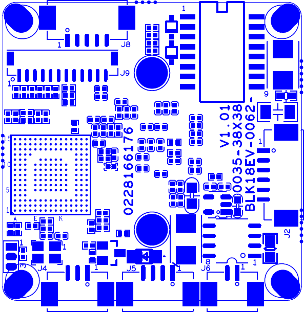

IPG-50HV10PV-S
--------------

- Manufacturer: Xiongmai
- Board: BLK18EV-0062-0035-38x38 V1.01
- SoC: HiSilicon Hi3518EV100
- Sensor: 

#### Blueprint

### Terminals

| Socket | Pin | GPIO Name      | Function        |
|--------|-----|----------------|-----------------|
| J2     | 1   | ETHTR-         | Ethernet signal |
|        | 2   | ETHTR+         | Ethernet signal |
|        | 3   | LED/PHY_AD3    | LED             |
|        | 4   | ETHTX-         | Ethernet signal |
|        | 5   | ETHTX+         | Ethernet signal |
|        | 6   | LED/PHY_AD0    | LED             |
| J3     | 1   | UART0_RXD      |                 |
|        | 2   | UART0_TXD      |                 |
|        | 3   | GND            |                 |
| J4     | 1   | Infrared input | Infrared input  |
|        | 2   | GND            | GND             |
|        | 3   | NC             | NC              |
| J5     | 1   | NC             | Undefined       |
|        | 2   | NC             | Undefined       |
|        | 3   | GND            | GND             |
|        | 4   | +12V           | 12V DC input    |
| J6     | 1   | IRCUT_A        | IRCUT output    |
|        | 2   | IRCUT_B        | IRCUT output    |
| J8     | 1   | AC_OUT         | AC_OUT          |
|        | 2   | MIC_P          | MIC_P           |
|        | 3   | AGND           | GND             |
|        | 4   | ALARM_IN       | ALARM_IN        |
|        | 5   | GND            | GND             |
