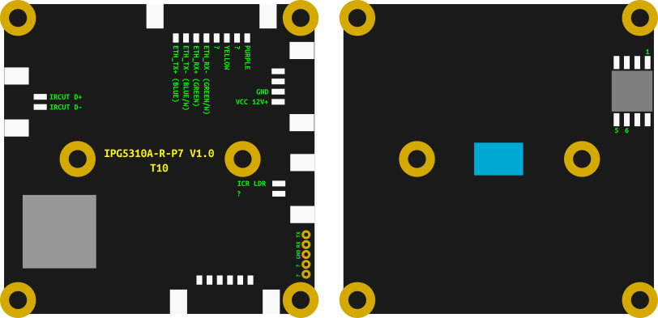

IPG-5310A-R-P7
--------------



- Manufacturer: Xiongmai
- Board: IPG5310A-R-P7 V1.0 T10
- SoC: Ingenic T10
- Sensor: Silicon Optronics JXH42 

### boot log
```
U-Boot SPL 2013.07 (Aug 09 2016 - 09:38:15)
pll_init:347
l2cache_clk = 450000000
pll_cfg.pdiv = 8, pll_cfg.h2div = 4, pll_cfg.h0div = 4, pll_cfg.cdiv = 1, pll_cfg.l2div = 2
nf=36 nr = 1 od0 = 1 od1 = 1
cppcr is 02404900
CPM_CPAPCR 0470890d
nf=50 nr = 1 od0 = 1 od1 = 1
cppcr is 03204900
CPM_CPMPCR 0320490d
cppcr 0x9a7b5510
apll_freq 860160000 
mpll_freq 1200000000 
ddr sel mpll, cpu sel apll
ddrfreq 400000000
cclk  860160000
l2clk 430080000
h0clk 300000000
h2clk 300000000
pclk  150000000
CPM_DDRCDR(0000002c) = a0000002


U-Boot 2013.07 (Aug 09 2016 - 09:38:15)

Board: ISVP (Ingenic XBurst T10 SoC)
DRAM:  64 MiB
Top of RAM usable for U-Boot at: 84000000
Reserving 696k for U-Boot at: 83f50000
Reserving 32784k for malloc() at: 81f4c000
Reserving 32 Bytes for Board Info at: 81f4bfe0
Reserving 124 Bytes for Global Data at: 81f4bf64
Reserving 128k for boot params() at: 81f2bf64
Stack Pointer at: 81f2bf48
Now running in RAM - U-Boot at: 83f50000
MMC:   msc: 0
the manufacturer 1c
SF: Detected EN25QH64

In:    serial
Out:   serial
Err:   serial
gpio_request lable = PHY RESET gpio = 60
gpio_request lable = ir cuta gpio = 26
gpio_request lable = ir cutb gpio = 25
gpio_request lable = led board gpio = 81
Net:   CPM_MACCDR(54) = a0000017
Jz4775-9161
Hit any key to stop autoboot:  0 
isvp# 
```

### bootloader help
```
isvp# help
?       - alias for 'help'
base    - print or set address offset
boot    - boot default, i.e., run 'bootcmd'
boota   - boot android system
bootd   - boot default, i.e., run 'bootcmd'
bootm   - boot application image from memory
bootp   - boot image via network using BOOTP/TFTP protocol
chpart  - change active partition
cmp     - memory compare
coninfo - print console devices and information
cp      - memory copy
crc32   - checksum calculation
dhcp    - boot image via network using DHCP/TFTP protocol
echo    - echo args to console
env     - environment handling commands
fatinfo - print information about filesystem
fatload - load binary file from a dos filesystem
fatls   - list files in a directory (default /)
gettime - get timer val elapsed,

go      - start application at address 'addr'
help    - print command description/usage
loadb   - load binary file over serial line (kermit mode)
loads   - load S-Record file over serial line
loady   - load binary file over serial line (ymodem mode)
loop    - infinite loop on address range
md      - memory display
mii     - MII utility commands
mm      - memory modify (auto-incrementing address)
mmc     - MMC sub system
mmcinfo - display MMC info
mtdparts- define flash/nand partitions
mw      - memory write (fill)
netupdate- net update, MODEL just like JVS-HI3518C. 
nm      - memory modify (constant address)
ping    - send ICMP ECHO_REQUEST to network host
printenv- print environment variables
reset   - Perform RESET of the CPU
run     - run commands in an environment variable
saveenv - save environment variables to persistent storage
sdupdate- auto upgrade file from mmc to sfc
setenv  - set environment variables
sf      - SPI flash sub-system
sleep   - delay execution for some time
source  - run script from memory
tftpboot- boot image via network using TFTP protocol
version - print monitor, compiler and linker version

isvp# version

U-Boot 2013.07 (Aug 09 2016 - 09:38:15)
mips-linux-gnu-gcc (Ingenic 2015.02) 4.7.2
GNU ld (Ingenic 2015.02) 2.24.51.20140512
```


```
root@openipc-t10:~# ipctool
The ipctool installed as remote GitHub plugin
---
chip:
vendor: Ingenic
model: T10
board:
vendor: OpenIPC
version: 2.3.05.28
ethernet:
mac: "e0:62:90:99:82:3e"
rom:
- type: nor
  block: 32K
  partitions:
    - name: boot
      size: 0x40000
      sha1: e0d25117
    - name: env
      size: 0x10000
      sha1: 99907036
      contains:
        - name: uboot-env
          offset: 0x0
    - name: kernel
      size: 0x200000
      sha1: b04ebbf2
    - name: rootfs
      size: 0x500000
      path: /,squashfs
      sha1: f67b1802
    - name: rootfs_data
      size: 0xb0000
      path: /overlay,jffs2,rw
      size: 8M
      ram:
      total: 64M
      media: 24M
      firmware:
      kernel: "3.10.14 (PREEMPT Sun May 28 16:27:38 UTC 2023)"
      toolchain: gcc version 8.4.0 (Buildroot -gc24a4943)
      sensors:
- vendor: Silicon Optronics
  model: JXH42
  control:
  bus: 0
  type: i2c
  addr: 0x60
```
