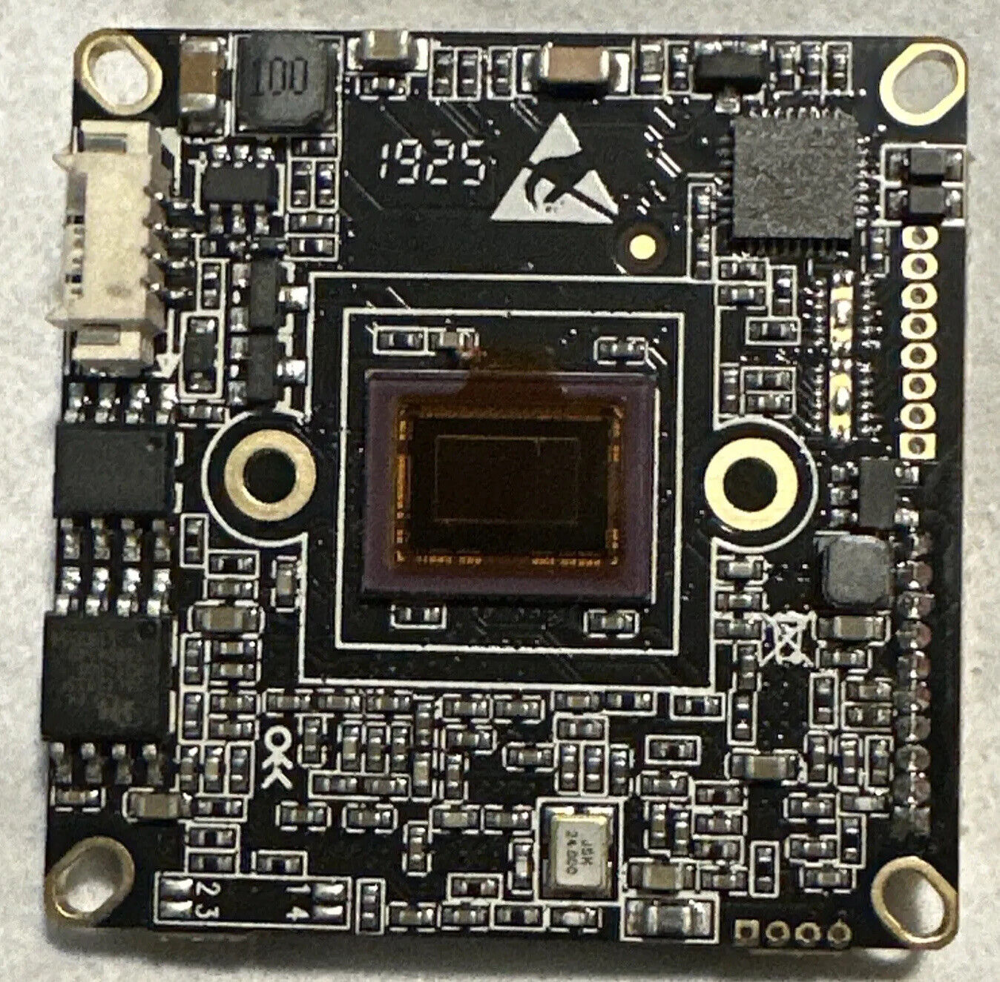
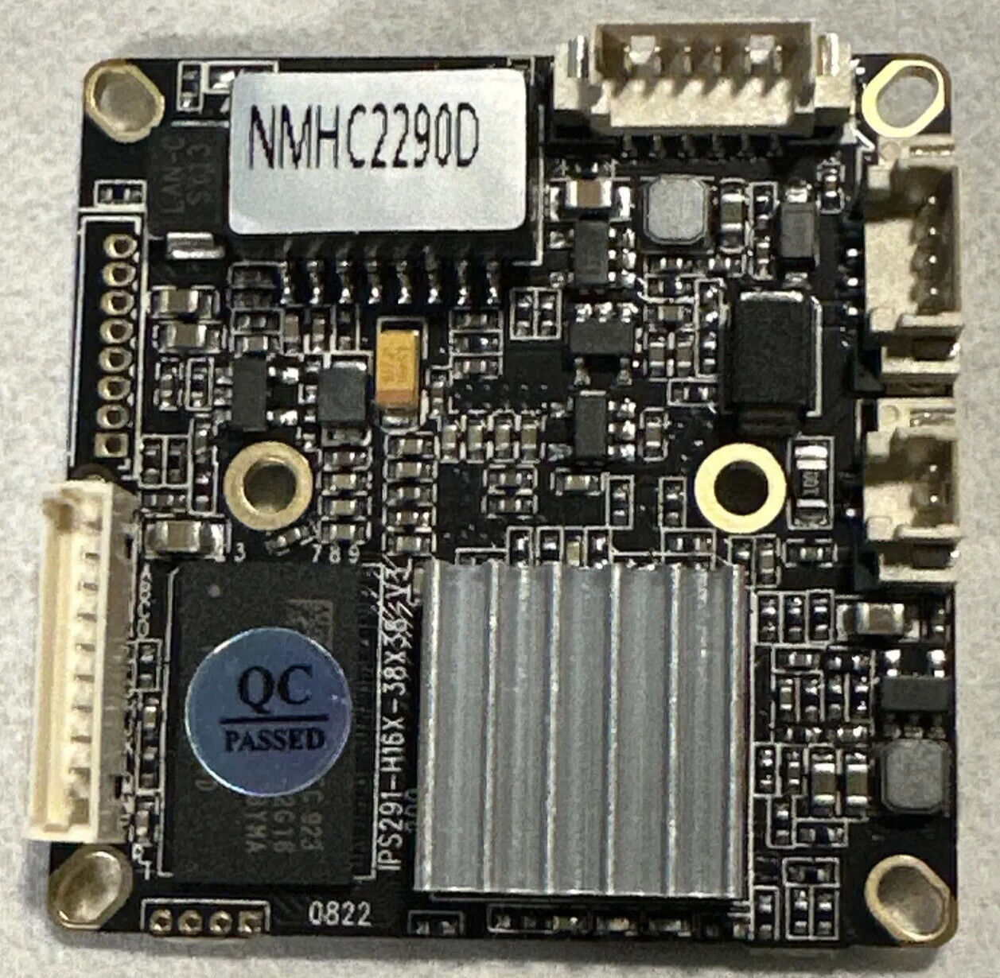

Pacidal NMHC2290D
-----------------
[product page](http://www.pacidal.com/H.265_IP_camera_module_1080p_Sony_IMX290_NMHC2290D.html)





### Specification

- SoC: Hi3516C V300
- Image Sensor: 1/2.8" SONY IMX290/IMX291 CMOS
- Minimum Illumination: 0.001 Lux/F1.2 (color); 0.0005 Lux/F1.2 (B/W)
- HDR: True HDR. 100dB
- Video Codec: H.265, H.264, MJPEG
- Resolution: 1920x1080 to 480x272
- Frame Rate: Up to 30 fps
- Video Streaming: triple streaming simultaneously
- Rate Control: VBR, CBR, fixed QP
- Standards: ONVIF Profile S
- Memory: 256 MB RAM, 16 MB flash
- Network Interface: 100 Mbps Ethernet
- Supported Protocols: IPv4, IPv6, ICMP, IGMP, QoS, TCP, UDP, DHCP, DNS, DDNS, mDNS, Zeroconf, HTTP, HTTPS, NTP, RTP, RTCP, RTSP, TLS, UPP, ARP
- Supported Protocols (optional) FTPS, RTMP, SIP, SMB/CIFS, SMTP, SNMPv3, WebRTC, P2P, 802.1X, PPPOE
- Audio Coding: G.711 PCM, G.726 ADPCM, MP3 (optional), AAC LC (optional)
- Audio Interface: Microphone in, line out
- Software integration: ONVIF, CGI, embedded applications (optional)
- System Integration: 1 alarm in, 1 alarm out
- Power Source: DC 12V, Power over Ethernet (optional)
- Power Consumption: Typical 1.5W
- Operation Conditions: -20~50°C
- Dimensions: 38mm x 38mm x 9.5mm
- Weight: 26g

#### Stock Firmware

Module comes with pre-installed firmware based on HiLinux.

#### Flash Chip

```
Check Flash Memory Controller v100 ... Found
SPI Nor(cs 0) ID: 0xc2 0x20 0x18
Block:64KB Chip:16MB Name:"MX25L128XX"
SPI Nor total size: 16MB
```

#### Ethernet

```
pin 1: TX+ (G/W)
pin 2: TX- (G)
pin 3: RX+ (O/W)
pin 4: RX- (O)
```

####  UART

UART is four holes at the edge of the board, near DRAM.

```
|       1.25mm pitch
|     VCC GND  TX  RX
| ( )  *   *   *   *
|______________________
```

U-Boot offers to press Ctrl+q/Q, but it never worked for me.
Shorting pins 5 and 6 on the flash chip during boot brings bootloader shell though.

```
hi3516cv300 System startup


U-Boot 2010.06 (Sep 21 2017 - 18:01:31)

Check Flash Memory Controller v100 ... Found
SPI Nor(cs 0) ID: 0xc2 0x20 0x18
Block:64KB Chip:16MB Name:"MX25L128XX"
SPI Nor total size: 16MB
MMC:
EMMC/MMC/SD controller initialization.
Card did not respond to voltage select!
No EMMC/MMC/SD device found !
In:    serial
Out:   serial
Err:   serial
Press Ctrl+q/Q to stop autoboot:  0
16384 KiB hi_fmc at 0:0 is now current device

Wrong Image Format for bootm command
ERROR: can't get kernel image!
hisilicon #
```

##### help
```
hisilicon # help
?       - alias for 'help'
base    - print or set address offset
bootm   - boot application image from memory
bootp   - boot image via network using BOOTP/TFTP protocol
bootss  - boot from snapshot image
cmp     - memory compare
cp      - memory copy
crc32   - checksum calculation
ddr     - ddr training function
ext2load- load binary file from a Ext2 filesystem
ext2ls  - list files in a directory (default /)
fatinfo - print information about filesystem
fatload - load binary file from a dos filesystem
fatls   - list files in a directory (default /)
getinfo - print hardware information
go      - start application at address 'addr'
help    - print command description/usage
loadb   - load binary file over serial line (kermit mode)
loady   - load binary file over serial line (ymodem mode)
loop    - infinite loop on address range
md      - memory display
mii     - MII utility commands
mm      - memory modify (auto-incrementing address)
mmc     - MMC sub system
mmcinfo - mmcinfo <dev num>-- display MMC info
mtest   - simple RAM read/write test
mw      - memory write (fill)
nand    - NAND sub-system
nboot   - boot from NAND device
nm      - memory modify (constant address)
ping    - send ICMP ECHO_REQUEST to network host
printenv- print environment variables
rarpboot- boot image via network using RARP/TFTP protocol
reset   - Perform RESET of the CPU
saveenv - save environment variables to persistent storage
setenv  - set environment variables
sf      - SPI flash sub-system
tftp    - tftp  - download or upload image via network using TFTP protocol
ugzip   - Compress gzipfile with hardware IP
version - print monitor version
```
##### version
```
U-Boot 2010.06 (Sep 21 2017 - 18:01:31)
```
##### printenv
```
hisilicon # printenv
bootdelay=1
baudrate=115200
bootfile="uImage"
filesize=986E8C
fileaddr=82000000
netmask=255.255.255.0
ipaddr=192.168.1.168
serverip=192.168.1.2
bootcmd=sf probe 0; sf read 0x82000000 0x80000 0x300000; bootm 0x82000000
dram=256MB
ethaddr=c0:f1:c4:a0:0d:c4
bootargs=mem=128M console=ttyAMA0,115200 root=/dev/mtdblock2 rootfstype=jffs2 rw mtdparts=hi_sfc:512K(uboot),3M(kernel),11264K(rootfs),1536K(data) mac=c0:f1:c4:a0:0d:c4
stdin=serial
stdout=serial
stderr=serial
verify=n
ver=U-Boot 2010.06 (Sep 21 2017 - 18:01:31)

Environment size: 518/131068 bytes
```

#### Saving stock firmware backup
```
setenv baseaddr 0x82000000
setenv flashsize 0x1000000
setenv ipaddr 192.168.1.10
setenv serverip 192.168.1.254

mw.b ${baseaddr} 0xff ${flashsize}
sf probe 0
sf lock 0
sf read ${baseaddr} 0x0 ${flashsize}
tftp ${baseaddr} backup-${ethaddr}.bin ${flashsize}
```

#### Flashing OpenIPC
```
tftp ${baseaddr} openipc-${soc}-lite-16mb.bin;
sf probe 0
sf lock 0
sf erase 0x0 ${flashsize}
sf write ${baseaddr} 0x0 ${filesize}
reset
```
After the camera reboots for the first time, get into bootloader shell and run:
```
run setnor16m
```

#### ipctool
```
---
chip:
  vendor: HiSilicon
  model: 3516CV300
board:
  vendor: OpenIPC
  version: 2.3.10.17
ethernet:
  mac: "c0:f1:c4:a0:0d:c4"
  u-mdio-phyaddr: 1
  phy-id: 0x001cc816
  d-mdio-phyaddr: 0
rom:
- type: nor
  block: 64K
  partitions:
    - name: boot
      size: 0x40000
      sha1: b9e93d92
    - name: env
      size: 0x10000
      sha1: 8aed4d7f
      contains:
        - name: uboot-env
          offset: 0x0
    - name: kernel
      size: 0x300000
      sha1: 1b79c7fe
    - name: rootfs
      size: 0xa00000
      path: /,squashfs
      sha1: 6bfe84d1
    - name: rootfs_data
      size: 0x2b0000
      path: /overlay,jffs2,rw
  size: 16M
  addr-mode: 3-byte
ram:
  total: 256M
  media: 224M
firmware:
  u-boot: "2010.06 (Nov 14 2022 - 19:27:03)"
  kernel: "3.18.20 (Tue Oct 17 22:16:51 UTC 2023)"
  toolchain: buildroot-gcc-12.2.0
  sdk: "Hi3516CV300_MPP_V1.0.4.0 B050 Release (Jun  3 2018, 21:42:04)"
sensors:
- vendor: Sony
  model: IMX291
  control:
    bus: 0
    type: i2c
    addr: 0x34
  params:
    bitness: 12
    databus: LVDS 4 ch
    fps: 30
  vicap-state: down
```
