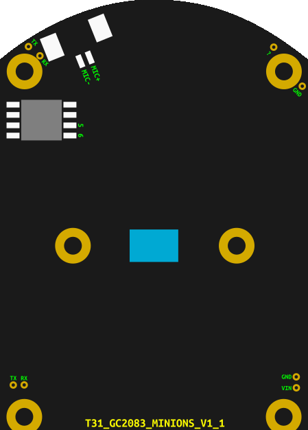

VH-NM-H33C
----------

- Manufacturer: [Vanhua](https://vanhua.en.alibaba.com/)
- Board: T31_GC2083_MINIONS_V1_1
- SoC: Ingenic T31L
- Sensor: Galaxycore GC2083
- Flash: XMC 25QH64CHIQ
- Dimensions: 38 × 53 mm (1.50 × 2.09 inch)
- ODM: https://www.ezhdt.com/
- App/Cloud: http://antsvision.com/




### Ports

#### HD port (Horizontal motion motor)

5-pin Molex PicoBlade

#### VD port (Vertical motion motor)

5-pin Molex PicoBlade

#### IRCUT port

2-pin Molex PicoBlade

#### Ethernet port + Power

8-pin Molex PicoBlade

#### IR/White light port

5-pin Molex PicoBlade

#### Speaker port

2-pin Molex PicoBlade, 90 deg.

#### Microphone port

2-pin Molex PicoBlade

#### USB port (unpopulated)

Unpopulated USB port also has contacts for a USB Wi-Fi module.

#### MMC port (unpopulated)

Unpopulated MMC port also has contacts for an SD card slot.

#### Reset button (unpopulated)

#### UART

UART TX and RX contacts are located in the top left corner, between the microphone terminal
and the flash memory chip, next to a mounting hole. GND contact is located on the opposite
side of the module, but it is easier to connect to ground at the mounting hole.


### ipctool
```
root@openipc-t31:~# ipctool
---
chip:
  vendor: Ingenic
  model: T31L
board:
  vendor: OpenIPC
  version: 2.3.10.16
ethernet:
  mac: "12:e0:17:a0:7c:25"
rom:
- type: nor
  block: 32K
  partitions:
    - name: boot
      size: 0x40000
      sha1: c16e0c5b
    - name: env
      size: 0x10000
      sha1: 49f5ca8f
      contains:
        - name: uboot-env
          offset: 0x0
    - name: kernel
      size: 0x200000
      sha1: 2a5e1bdb
    - name: rootfs
      size: 0x500000
      path: /,squashfs
      sha1: 52e8521c
    - name: rootfs_data
      size: 0xb0000
      path: /overlay,jffs2,rw
  size: 8M
ram:
  total: 64M
  media: 24M
firmware:
  kernel: "3.10.14__isvp_swan_1.0__ (PREEMPT Mon Oct 16 16:31:27 UTC 2023)"
  toolchain: buildroot-gcc-12.2.0
  main-app: /usr/bin/majestic
sensors:
- vendor: GalaxyCore
  model: GC2083
  control:
    bus: 0
    type: i2c
    addr: 0x6e
```

#### ISP
```
root@openipc-t31:~# cat /proc/jz/isp/isp-fs 
############## framesource 0 ###############
chan status: running
output pixformat: NV12
output resolution: 1920 * 1080
scaler : disable
crop : disable
the state of buffers:
queue count: 1
queue addr: 0x0394b400
done count: 0
the output buffers is: 0
the losted buffers is: 0
ch0_pre_dequeue_drop is: 0
ch0_pre_dequeue_intc_ahead_cnt is: 0
pdq cnt: 0, pdq intc cnt:0, pdq intc cnt1:0
---------------------------
buf:0, state:0, buf_state:102, buf_qcnt:419517, buf_dqcnt:419517
buf:1, state:3, buf_state:30, buf_qcnt:419517, buf_dqcnt:419516
############## framesource 1 ###############
chan status: stop
############## framesource 2 ###############
chan status: stop
```

```
root@openipc-t31:~# cat /proc/jz/isp/isp-m0
****************** ISP INFO **********************
Software Version : H20221206a
SENSOR NAME : gc2083
SENSOR OUTPUT WIDTH : 1920
SENSOR OUTPUT HEIGHT : 1080
ISP OUTPUT FPS : 25 / 1
SENSOR OUTPUT RAW PATTERN : RGGB
ISP Top Value : 0xb5742a49
ISP Runing Mode : Day
ISP Custom Mode : Disable
ISP WDR Mode : Disable
SENSOR Integration Time : 1342 lines
SENSOR Max Integration Time : 1342 lines
SENSOR analog gain : 32
MAX SENSOR analog gain : 222
SENSOR digital gain : 0
MAX SENSOR digital gain : 0
ISP digital gain : 2
MAX ISP digital gain : 26
ISP Tgain DB : 1
ISP EV value: 2846
ISP EV value log2: 752023
ISP EV value us: 39762
ISP EV min int: 2
ISP EV min again: 1024
ISP WB weighted rgain: 420
ISP WB weighted bgain: 508
ISP WB color temperature: 4686
ISP AWB Start rgain 221: bgain 301
Saturation : 127
Saturation : 127
Sharpness : 128
Contrast : 127
Brightness : 127
Antiflicker : 0
Mirror: Disable, Flip: Disable
debug : ch0 done 837065,ip done 837067,0,0,0,0,0,0
debug1 : 0,0,900
```

#### GPIO

##### Stock

###### Pan
 
- GPIO 63 (Hex: 0x3F)
- GPIO 62 (Hex: 0x3E)
- GPIO 61 (Hex: 0x3D)
- GPIO 60 (Hex: 0x3C)

###### Tilt

- GPIO 59 (Hex: 0x3B)
- GPIO 52 (Hex: 0x34)
- GPIO 53 (Hex: 0x35)
- GPIO 49 (Hex: 0x31)

##### OpenIPC

```
root@openipc-t31:~# mount -t debugfs none /sys/kernel/debug
root@openipc-t31:~# cat /sys/kernel/debug/gpio
GPIOs 0-31, GPIO A:
 gpio-18  (gc2083_reset        ) out hi

GPIOs 32-63, GPIO B:
 gpio-59  (mmc_detect          ) in  lo
 gpio-63  (gpio_spk_en         ) in  lo

GPIOs 64-95, GPIO C:
```
