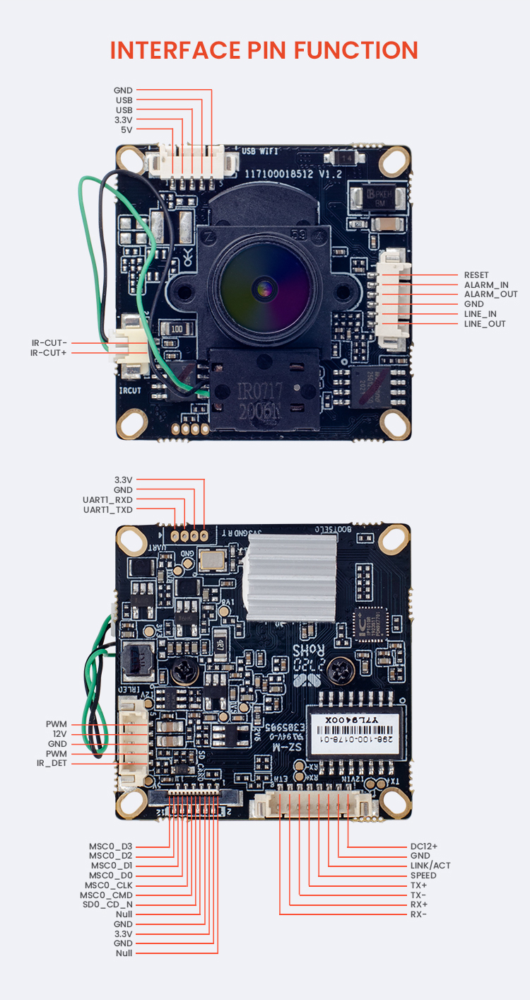

WS-M04
-----------------
- [Buy on Alibaba](https://www.alibaba.com/product-detail/High-quantity-1080P-T31X-SC4335-Cmos_1600134011610.html)

- Manufacturer:
- Board:
- SoC: Ingenic T31X
- Sensor: SC4335, 1/2.7" 4MP CMOS

### Specification

- Effective Pixels: 2560(H)×1440(V)
- Video Standard: PAL/NTSC
- Min. illumination: Color: 0.01 Lux @ (F1.2, AGC ON), B/W: 0 Lux @ (IR LED ON)
- Electronic Shutter: Auto/Manual, 1/5 to 1/20,000s
- S/N Ratio: 55dB
- Noise Reduction: 2D/3D DNR
- Wide Dynamic: D-WDR
- Video Compression: H.265/H.264
- Stream/Frame Rate
- Stream1: 2560×1440, 2304×1520, 1920×1080, 1280×720 @ 25fps
- Stream2: 704×576, 640×360, 480×360, 352×288 @ 25/30fps
- Bit Rate
- Stream1: 512kbps ~ 4096kbps
- Stream2: 128kbps ~ 1536kbps
- Audio Compression: G.711 (64kbps)
- Network Interface: 1 RJ45 10/100M adaptive Ethernet port
- Network Protocols: IPv4, RTSP/RTP/RTCP, TCP/UDP, HTTPS, DHCP, DNS, DDNS, UPNP, NTP, SNMP
- Extension Interface: 1-ch Audio input, 1-ch Audio output, 1-ch Alarm input, 1-ch Alarm output, SD card, Reset
- Signal Interface: 1 x LED lamp interface, 1 x IR-CUT interface, Support photo resistance signal and IR-CUT links to IR
- Power Supply: DC12V/1A, Max 3W
- Working Environment: -20°C ~ 50°C (-4°F ~ 122°F), Less than 90% RH
- Surge protection: Network Interface 4KV, Power 2KV
- Dimensions: 38 × 38 mm (1.50 × 1.50 inch)
